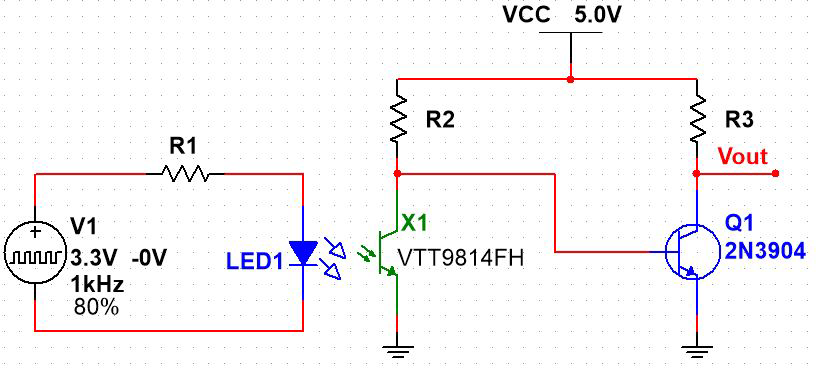
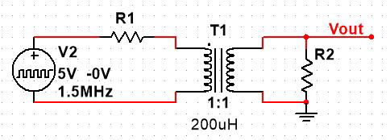
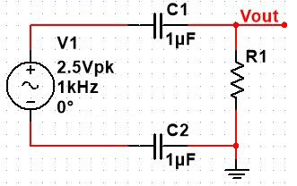
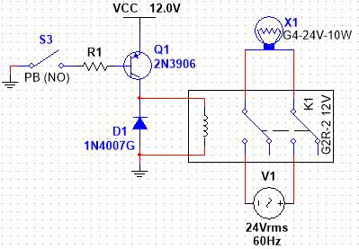

## Optical Isolation

{width="375"}

For this circuit, note the following:

-   V1 is a signal generator (preferably the Analog Discovery 2 without the BNC Breakout board -- see next part of this exercise) set to produce a pulse with the following characteristics:
    -   Low voltage is $0 V$, High voltage is $3.3 V$
    -   Frequency is $1 kHz$
    -   Duty cycle is $80\%$
-   The LED is Yellow (check the [spec sheet for the phototransistor](https://www.excelitas.com/product/vtt9814fh-si-phototransistor-0192mm2-high-gain) to see why) with a forward drop of $1.8 V$
-   The phototransistor, VTT9814FH, in in your CNT Year 2 Kit. It has the Collector marked by a flat spot in the plastic case; again, check the spec sheet to verify this.
-   The 2N3904 has a minimum beta of $100$, and an "on" $V_{BE}$ of $0.7 V$
    1.  Determine a standard 10% resistor value for $R_1$ that will provide approximately $10 mA$ of current to the LED: \_\_\_\_\_\_\_\_\_\_ $Ω$.
    2.  Determine a standard 10% resistor value for $R_3$ that will draw approximately $10 mA$ (go for slightly less current if necessary) through $Q_1$ when it is saturated. Assume that $V_{CEsat}$ is essentially $0 V$: \_\_\_\_\_\_\_\_\_\_ $Ω$.
    3.  When $X_1$ is off, $R_2$ simply becomes the Base resistor for $Q_1$. Determine the maximum value for this resistor required to saturate the transistor, based upon a collector current of $10 mA$, a $V_{BE}$ of $0.7 V$, and a beta of $100$ for $Q_1$. Now, choose a standard $10\%$ resistor value that's approximately half of your calculated value: \_\_\_\_\_\_\_\_\_\_ $kΩ$.

### Build and Test

Build the circuit. You will need to physically arrange the LED and the photo transistor so they practically touch "top to top" -- in other words, the light from the LED must be closely coupled into the photo transistor. To do this, you will have to bend the leads of both of them $90^{\circ}$.

To maintain proper isolation, you should use your Analog Discovery 2 with the BNC breakout board removed so you can use the fly-wires directly. (The BNC breakout board provides common grounds for the scope channels and waveform generators, whereas the fly-wires allow the scope channels to be self-referenced. For each channel, you will need to use the "+" wire for the signal and the "-" wire as the reference -- "GND" won't work, since it's not the channel reference in this mode of operation.) If you don't have access to an AD2, you can use bench equipment, you just won't have the two sides of the circuit completely isolated.

For a grade out of three marks, set up your oscilloscope to display your input and output and ask your instructor to grade your work in class. \_\_\_\_\_\_\_\_\_\_\_ /3

Remove the signal generator, the oscilloscope, and the DC power supply. Using a DMM as an ohmmeter, check if the resistance between the two halves of your circuit is practically infinite for any of the points in the two circuits: \_\_\_\_\_\_\_\_\_\_(True or False)

## Electromagnetic Isolation

Consider the circuit diagram below when answering the questions that follow:

{width="375"}

For this circuit:

-   $V_2$ is a signal generator set to produce a pulse with the following characteristics:
    -   Low voltage is $0 V$, High voltage is $5.0 V$
    -   Duty cycle is $50\%$
    -   Frequency is $1.5 MHz$
-   The transformer is a 78601/3C from your CNT Year 2 Kit
-   Pin 1 is marked by a dot in both the schematic and on the transformer, and should be located in the bottom left corner when you install the device on your breadboard; this way, the other end of the primary coil will be beside it (pin "3"), and the two pins for the secondary will be on the other side of the midline of your breadboard

1.  R1 and the primary of the transformer ($200 μH$) form a High Pass Filter (HPF). Determine a value for $R_1$ that will put the cutoff frequency for this filter one decade below the fundamental frequency of the signal source. Pick the closest standard $10\%$ resistor value: \_\_\_\_\_\_\_\_\_\_ $Ω$
2.  Use the same value for $R_2$. In this configuration, the transformer is set up to provide maximum power transfer to the load resistor, $R_2$. This means that the primary of $T_1$, which has a $1:1$ turns ratio, will appear as a resistor with a value equal to $R_2$, and a voltage divider has been established. From this, determine what peak-to-peak voltage is expected across $R_2$:\_\_\_\_\_\_\_\_\_\_ $V_{p-p}$
3.  What DC offset do you expect to see across $R_2$? \_\_\_\_\_\_\_\_\_\_ $V_{DC}$

### BuiLd and Test

Build this circuit, again preferably using the Analog Discovery 2 without the BNC breakout board for both the function generator and the oscilloscope.

For a grade out of three marks, set up your oscilloscope to display your input and output and ask your instructor to grade your work in class. \_\_\_\_\_\_\_\_\_\_\_ /3

Remove the signal generator, the oscilloscope, and the DC power supply. Using a DMM as an ohmmeter, check if the resistance between the two halves of your circuit is practically infinite for any of the points in the two circuits: \_\_\_\_\_\_\_\_\_\_ (True or False)

## Electrostatic Isolation

Consider the following schematic diagram to answer the questions that follow.

{width="375"}

-   V1 is a signal generator set to produce the following:
    -   a Sine Wave
    -   with an amplitude of $2.5 V_p$
    -   and a frequency of $1 kHz$
    -   with no DC offset
-   The two capacitors are effectively in series

The two capacitors and the resistor form a High Pass Filter (HPF) at $V_{out}$. Determine the resistance which would provide a cutoff frequency one decade below the signal generator frequency, and pick the closest standard $10\%$ resistor value: \_\_\_\_\_\_\_\_\_\_ $kΩ$.

### Build and Test

Build this circuit, again preferably using the Analog Discovery 2 without the BNC breakout board for both the function generator and the oscilloscope.

For a grade out of three marks, set up your oscilloscope to display your input and output and ask your instructor to grade your work in class. \_\_\_\_\_\_\_\_\_\_\_ /3

Remove the signal generator, the oscilloscope, and the DC power supply. Using a DMM as an ohmmeter, check if the resistance between the two halves of your circuit is practically infinite for any of the points in the two circuits: \_\_\_\_\_\_\_\_\_\_ (True or False)

## Electromechanical Isolation

Consider the schematic diagram below to answer the questions that follow:

{width="375"}

-   The switch, $S_3$, is a normally-open pushbutton switch from your CNT Year 1 Kit. Verify with an ohmmeter that is is actually normally open, and closes when pressed.
-   The G2R-2 $12 V$ relay is in your CNT Year 1 kit. Use either the spec-sheet for it or the picture printed on its side to determine the pinout before you attempt to wire it up.
-   The lamp is in your CNT Year 2 kit. Don't bend its leads! You'll break the glass! Instead, place it diagonally across the pins in two adjacent rows of your breadboard -- it fits that way.
-   The lamp is a halogen bulb, and will get very hot! Don't leave in on for long at any given time!
-   The $24 V_{AC}$ power supply is in your CNT Year 2 kit. It's got a barrel connector, but you can use the screw terminal adapter in the kit to convert its outputs to two pieces of wire you can use on your breadboard.

1.  Don't forget the 1N400x diode! It's there to protect the \_\_\_\_\_\_\_\_\_\_\_\_\_\_\_\_\_\_\_\_ (relay, transistor, switch, or lamp)
2.  From the data sheet for the relay, the current drawn by the relay coil is $43.6 mA$ If the 2N3906 has a minimum beta of 100 and a $V_{BE}$ of $-0.7 V$, determine a value for $R_1$ that will just saturate the transistor, then pick a standard $10\%$ resistor value that is about half the calculated value to ensure the transistor saturates: \_\_\_\_\_\_\_\_\_\_ kΩ

### Build and Test

Wire up the circuit, and verify that you can turn the light on by pressing the pushbutton switch. Try this a few times to ensure that the diode is protecting the circuit as expected.

For a grade out of three marks, demonstrate your circuit and ask your instructor to grade your work in class. \_\_\_\_\_\_\_\_\_\_\_ /3

With the $+12 V_{DC}$ power supply and the $24 V_{AC}$ power supply disconnected, use a DMM as an ohmmeter to verify that the resistance between the two parts of the circuit is practically infinite at all points in the two circuits: \_\_\_\_\_\_\_\_\_\_ (True or False)

::: content-hidden


::: border
## Answers

### Phototransistor Optoisolation

-   150
-   560
-   20

#### Build and Test

-   True

### Electromagnetic Isolation

-   180
-   2.5
-   0

#### Build and Test

-   True

### Electrostatic Isolation

-   3.3

#### Build and Test

-   True

### Electromechanical Isolation

-   Transistor
-   12

#### Build and Test

-   True
:::
:::
