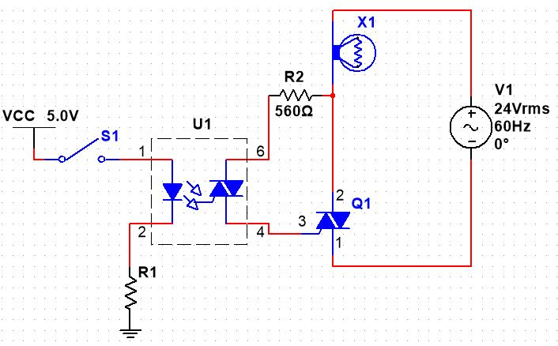

## Optoisolated TRIAC for AC Control

1.  Using the parts listing for the CNT Year 2 Kit, determine which components $U_1$ and $Q_1$ would have to be for you to build the circuit below:

    -   $U_1$:\_\_\_\_\_\_\_\_\_\_

    -   $Q_1$: \_\_\_\_\_\_\_\_\_\_

{width="400"}

2.  On the manufacturer's specification sheet for $U_1$, locate the Typical forward voltage of the LED and, using the current shown for the test condition of the LED's forward voltage, pick a suitable 10% standard resistor value for $R_1$ (select a value that allows slightly more than required if you have to choose between two): \_\_\_\_\_\_\_\_\_\_ $Ω$

3.  Using the manufacturer's specification sheet for $Q_1$, determine the pinout for $Q_1$. It won't likely match what you would guess from the schematic symbol!

4.  Build this circuit far to the right side of your breadboard (to leave space for project components later), using:

    -   a normally-open pushbutton switch (PB-NO) for $S_1$,

    -   the $24 V_{AC}$ transformer from the CNT Year 2 Kit as $V_1$,

    -   the $24 V$ halogen light bulb from the CNT Year 2 Kit,

    -   if you don't have a bench power supply available, use $+5V_{DC}$ from the input of one of your PowerBRICKs or your CNT power supply board for $V_{CC}$.

        ::: callout-warning
        Recall that this is directly connected to the $5 V$ supply of your USB port, so make sure your circuit is wired correctly in order to prevent possible damage to your computer.
        :::

5.  Wearing your safety glasses, verify that the lamp lights and goes off when you cycle the switch—don't leave it on for very long at a time, as it will get hot enough to burn you and melt any plastic nearby, including your breadboard. It will also be quite bright, so try to avoid looking at it for long.

## Build and Test

Once you are satisfied, build your circuit using the parts from your kit and demonstrate it for your instructor during class: \_\_\_\_\_\_\_\_\_\_
