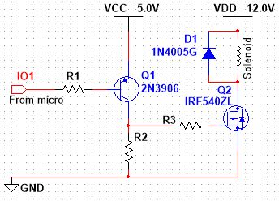

## Solenoid Actuator

In this activity you will design and construct a circuit that controls current (on and off) to a small DC-powered solenoid actuator. Solenoids are devices that generate mechanical force using a magnetic field produced by a coil. Although some solenoids will operate with AC current, the one in our kit is designed to work only with DC current.

From an electrical perspective, solenoids have similar characteristics to the coil of an electromechanical relay. When a solenoid is energized with an appropriate voltage, the resulting current creates a magnetic field that moves a metal plunger, thereby doing mechanical work. The plunger works against the force of a spring, so it returns to the normal position when current is not flowing.

Although the data sheet for the solenoid in your kit is not available, some tests and research were done to discover the following specifications:

-   Operating Voltage: $12 V_{DC}$

-   Resistance: $55 Ω$

-   Maximum temperature rise: $65°C$ If operated with a duty cycle of $50\%$ at a relatively low frequency (i.e. $500 mHz$), the solenoid does not appear to undergo significant temperature rise, but it is only rated for $65°C$ maximum internal temperature which should not be exceeded.

### Design Specification

This exercise requires you to write a short program for your 9S12XDP512 microcontroller that does the following:

Pressing the middle pushbutton will activate a circuit that activates the solenoid for approximately one second. Whether or not the middle pushbutton has been released, after approximately one second the solenoid will return to its inactive state. Make sure the logic is correct -- more on that to come. The controlling circuit is to consist of the following:

-   A power N-Channel MOSFET to drive the solenoid

-   A BJT to drive the Gate of the MOSFET (more on that later)

-   A protection diode across the solenoid to protect the transistor. Power for the solenoid must be relatively high-current $12 V_{DC}$.

-   Your PowerBRICK, and likely the CNT breadboard power supply, cannot produce nearly enough current to run the solenoid reliably, and attempting to use it may cause permanent damage.

Use a DC power supply in the lab. If you can't be on-campus, you could design your own $+12 V_{DC}$ regulated power supply using the $24 V_{AC}$ transformer, a rectifier, a filter capacitor, and the LM317; however, that will probably be more work than the rest of the exercise put together! You will need to establish a "common" connection between your 9S12XDP512 board and the control circuit.

Select any available GPIO pin on the 9S12XDP512 for your control program.

### Build and Test

The following is a partially-completed schematic diagram for your circuit.

When designing for a Power MOSFET like the IRF540, the capacitance of the Gate becomes significant, so we'll begin by determining what resistance we need for R3 to limit the inrush current.

Access the [manufacturer's data sheet for the IRF540](https://www.infineon.com/dgdl/irf540npbf.pdf?fileId=5546d462533600a4015355e39f0d19a1), which is a component in your CNT Year 1 Kit.

Locate the typical "input capacitance". Using the simplified (non-calculus) calculation for the current required to charge a capacitor, $I_C=\frac{ΔV \cdot C}{t}$ , determine the charge current required to activate the Gate in $1.0 μs$. Assume that the activation voltage for the Gate will be $5.0 V$.

From the previous information and calculation, calculate the ideal resistance for $R_3$. Since the capacitor will actually be charging exponentially rather than linearly, which in this case means a slower charge, choose the next smaller standard $10\%$ resistor from your kit for $R_3$. Use the same value for $R_2$.

Notice that we have chosen a PNP transistor to drive the Gate of the FET. This has been done for two reasons:

1.  The BJT transistor can supply the instantaneous inrush current for the FET, whereas the microcontroller's GPIO pin could potentially be damaged. The BJT is referred to as a "FET Driver". If an NPN transistor was used, inadvertently leaving the microcontroller disconnected would result in a HIGH at the Gate, turning the FET ON as the resting condition. However, with the PNP, the result would be a LOW at the Gate, turning the FET OFF as the resting condition. There are two slight down-sides to the use of the PNP BJT as a driver:
2.  The logic is inverted -- an input LOW is required to activate the BJT, which activates the FET to activate the solenoid. The BJT needs to be powered at the same voltage as the input logic signal: the transistor can only be shut OFF (put into cut-off) by driving the Base to a voltage higher than $V_E - 0.7 V$. The best way to provide the appropriate $V_{CC}$ for the transistor is to use the $+5 V_{DC}$ rail available on the microcontroller board.

Draw a complete schematic and attach it here for your instructor to grade out of five marks. If your instructor grades your work in class, record the grade assigned below instead. \_\_\_\_\_\_\_\_\_\_

### Notes

Provide suitable resistor values for $R_1$, $R_2$, and $R_3$ Show interconnections to the microcontroller for $+5 V_{DC}$, Ground, and the GPIO pin you've selected -- include its pin number. Just use the symbol for an inductor, relabeled, to represent the Solenoid.

Once you are satisfied, build your circuit using the parts from your kit and demonstrate it for your instructor during class: \_\_\_\_\_\_\_\_\_\_

## Permanent Magnet DC (PMDC) Motor

For this project, we want to design and build a motor control circuit that does the following:

Uses a $+6 V_{DC}$ battery pack to power a PMDC motor Uses an H-Bridge to establish forward/reverse/stopped conditions using $5 V$ TTL logic levels Controls motor speed using Pulse Width Modulation (PWM). For a subsequent Project, we'll program a microcontroller to control the motor while monitoring its speed of rotation and completing a simple control loop; however, for this project we will use a logic level generator and signal generator, such as the Analog Discovery 2, to establish control.

Review the [information for the PMDC motor](https://www.pololu.com/product/4797) in your CNT Year 2 kit.

You will also need information on the [293D H-Bridge IC](https://www.pololu.com/product/4797) in your CNT Year 2 Kit. Note that we’re using the L293D, not the L293. *The L293D has internal protection diodes, so you don’t need to add any external protection diodes as you would need to do with the L293.*

The L293D contains four half-bridges. We only need one full H-Bridge, so we'll use two of the half-bridges. For consistency, let's use Pins 1 through 7.

The L293D requires two power sources:

1.  $V_{CC1}$ needs to be $+5 V_{DC}$ for the internal logic circuitry

2.  $V_{CC2}$ is the high-current $+6 V_{DC}$ circuit needed to drive the motor

3.  The two power sources need to share a common ground, and share that with the logic controller, as wel.

In the manufacturer's data sheet for the L293D, locate T*able 3: Bidirectional DC Motor Control* (and ignore the typo in the title!) Note that there are two different "Motor stop" modes, which we will investigate below:

1.  Fast motor stop

2.  Free-running motor stop

In order to exercise full control over the motor, according to this table, we will need three logic control lines:

-   1A

-   2A

-   Enable

### Schematic

Draw a suitable schematic to help you with building your circuit. Here are some notes:

-   The motor is powered through the WHITE and RED wires -- with RED connected to positive and WHITE as the return, the motor should turn clockwise when activated. (The other four wires are for the encoder, which we will revisit later.)

-   Multisim doesn't have the L293D H-bridge in its library. You can create a reasonable facsimile using a "rectangle" and some wires to look like a component (with appropriate labeling), or you could build up the guts of the L293D using enabled buffers (e.g. 74126) and 1N4005 diodes. If you do this, you might be able to get a simplistic simulation to run. Just make sure you use $DGND$ and $V_{CC}$ symbols for the logic side, as those will be connected to the hidden power pins in the logic device symbols.

-   The motors available in the Multisim library are also not suited to our design. You can make a model of the motor using a $20 Ω$ resistance in series with a $1 mH$ inductor, and draw a box around it, properly labelled to represent the motor part number.

-   Indicate your connections to the Analog Discovery 2 (or other logic controller) each using an "Input connector", appropriately labelled to indicate which of the AD2 outputs you've chosen for each control line. Also show a connection for the Common Ground between your circuit and the off-page logic controller.

    -   Make 1A and 2A both logic outputs

    -   Use Waveform Generator 1 for the Enable, as that will prepare you for both the first and second parts of the circuit build. If you want to try a simulation, use an "INTERACTIVE_DIGITAL_CONSTANT" for each logic input.

Your instructor will grade your schematic out of five marks. If your work is graded in class, indicate the grade awarded below; otherwise, attach your schematic here. \_\_\_\_\_\_\_\_\_\_

### Circuit Investigation

Start with the Enable set to $5 V$ (high), so that to begin with motor control will be strictly dependent upon the logic pins activating the two half-bridges.

Complete the last column of the following table by selecting the appropriate descriptions (Off, Forward, or Reverse):

| 1A  | 2A  | Motor                |
|-----|-----|----------------------|
| L   | L   | \_\_\_\_\_\_\_\_\_\_ |
| L   | H   | Forward              |
| H   | L   | \_\_\_\_\_\_\_\_\_\_ |
| h   | H   | \_\_\_\_\_\_\_\_\_\_ |

Now, modify the "Enable" to run as a very slow unipolar pulse—HIGH = $5 V$, LOW = $0 V$, frequency = $0.2 Hz$. Pay attention to how the motor stops when the Enable goes LOW, and compare that to how the motor stops under control of inputs 1A and 2A. Describe your observations by selecting *two* of the following statements:

-   [ ] Enable stops the motor slowly.

-   [ ] Enable stops the motor instantly.

-   [ ] H-Bridge logic stops the motor slowly.

-   [ ] H-Bridge logic stops the motor instantly.

### Speed Control using PWM

The speed of a PMDC motor is largely dependent upon the amount of energy supplied to the motor----more energy results in higher speed.

In the previous investigation, you simply controlled the presence or absence of energy, resulting in either full speed in either direction or stopped.

The amount of energy supplied to the motor can be controlled in two ways:

-   Reduce the DC voltage (and therefore the current) applied to the motor.

-   Reduce the effective average voltage applied to the motor by turning the power supplied to the motor on and off at a rate higher than what the motor can immediately respond to.

This last technique is referred to as pulse width modulation (PWM).

For a repetitive pulse, the effective average voltage is directly related to the duty cycle, or the percentage of time that the signal is active to the period of the signal:

$$d=\frac{t}{τ}⋅100\%$$

For a $0$ to $5 V$ unipolar pulse, if the duty cycle is $0$, the signal spends all of its time at $0 V$, so the motor will be OFF. if the duty cycle is at $100\%$, the signal spends all of its time at $5 V$, so the motor will be ON at full speed. As the duty cycle increases, so should the motor speed.

In Waveforms or the controls for whatever you are using for the Enable line, set up a unipolar pulse ($0 V$ to $5 V$) with the frequency set to $10 kHz$. (Documentation indicates that a suitable frequency for most PMDC motors would be between $5 kHz$ and $20 kHz$; if you can hear the "chopping" frequency in the motor's rotation, increase it to a point where it is outside your audible range.)

If you are using the AD2, select the "Basic" controls instead of the usual "Simple" controls so that you can adjust the duty cycle (called "Symmetry" in Waveforms) with a slider.

Once you are satisfied that your system can control the speed of rotation through the full range for both forward and reverse, ask your instructor to grade your work out of five marks. Record the assigned grade below. If your instructor is not available, attach a video demonstrating full range motion in both directions of rotation. \_\_\_\_\_\_\_\_\_\_

::: callout-note
If possible, save this circuit and control system setup, as you will be using it again for a subsequent Self Assessment and the final motor-related Project.
:::
