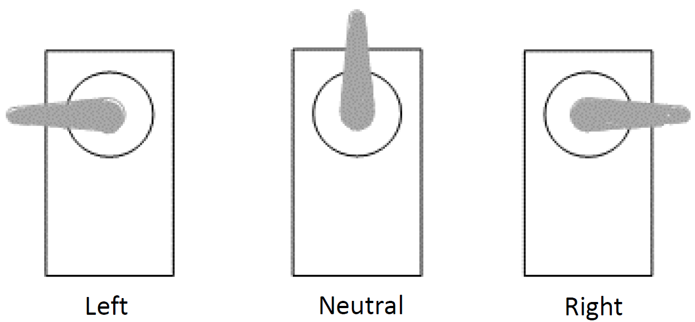
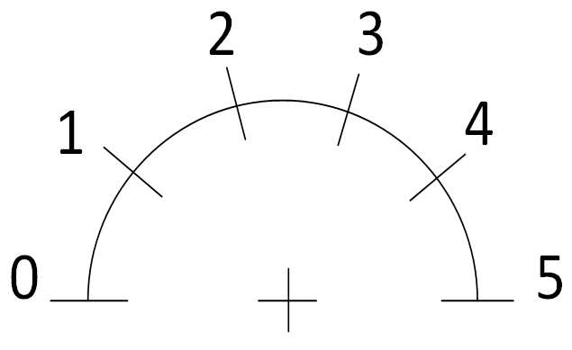

In this activity you will implement a fairly simple analog voltmeter using an A to D converter and a servo motor. Many years ago, digital multimeters didn't exist, and technologists relied on analog meters to do measurements. Here's what the display of one looked like:

 license](images/analogmultimeter.jpg){width="400"}

If you look carefully at the bottom of the analog meter (called a mechanical meter movement), you may see some small coils of magnet wire mounted on a mechanical device that rotates on bearings around a small permanent magnet – the result is essentially a small permanent magnet DC motor working against the force of a spring, such that net force was proportional to the amount of current flowing in the movement’s coil.

Similar types of indicators are used in some vehicles. Prior to the advent of the digital age, a very similar PMDC motor arrangement would have been used. At present, such "analog" displays are usually in the form of a small servo motor or stepper motor that moves a readout needle to indicate road speed or motor RPM. (If you own a Ford, it may also contain a 9S12 processor on the back side of the speedometer panel!).

### Overview

In this exercise, you will participate in the grand tradition of analog meter movements by making an analog voltmeter using the servo motor in your kit and your 9S12 microcontroller board.

You will use your 9S12 board's ADC and PWM systems to measure the applied voltage and generate the correct deflection of a servomotor to display a voltage in the range $0 V$ to $5 V$.

Hobbyist servo motors are usually packaged with small plastic arms that fit onto the shaft which can be used, in this case, as a pointer on an analog meter.

{width="400"}

We can create a suitable Voltage Scale for our "analog meter" that looks like the following:

{width="400"}

Place this over the shaft of the servo motor, then install the single arm so that it can be used as the meter pointer.

### Specifications

-   Use one of the A to D channels on your microcontroller kit as the input to your "analog meter". If you wish, you can connect this to a potentiometer to provide voltages between 0 V and +5 V, or you can simply supply a known voltage to the A to D channel input.

-   Use the sixteen-bit PWM channel on your microcontroller kit that you used in the associated Self Assessment to control the servo motor.

-   Power the servo motor using the 6 VDC battery pack.

-   In software, mathematically manipulate the values received from the A to D input to provide the matching range of PWM duty cycles to drive the servo motor.

-   Verify that your "analog meter" works by comparing the output voltage it displays to readings on a DMM connected to the input signal.

You already have software to control the PWM duty cycle, but it will need to be adapted to respond to the values received from the A to D converter.

You may not, at this point, have sufficient knowledge about the A to D module in the 9S12XDP512. The following brief instructions should get you up and running with reading values from pin 67 (AN0 input) of the microcontroller.

::: callout-note
If you have an A to D library created in another class, use it instead of the two subroutines in this document—your instructors will likely have asked you to work with more recent information than was used in these subroutines.
:::

### Analog to Digital Converter

To get accurate values from the A to D converter, the "VRef" on your microcontroller kit must be set to 5.120 VDC. If you're not sure about this, ask your instructor for assistance.

To start up and run the A to D Converter, it must first be initialized. A suitable initialization routine, *ATD0_Init*, is included in the next section. The comments, in conjunction with the [9S12XDP512 Data Sheet](https://www.nxp.com/docs/en/data-sheet/MC9S12XDP512RMV2.pdf) should help explain this initialization if you're interested.

::: callout-note
This assumes a bus clock of 20 MHz, but it should also run with the slower 8 MHz bus clock.
:::

To read values from the A to D Converter, you can use the simple blocking routine, *ATD0_CH*, also included in the next section. Simply enter the channel number you want to read in the brackets (for pin 67, that would be 0), and place the contents returned into an INT variable.

The step size for the A to D converter is $5\frac{mV}{step}$ -- use this in the conversions to determine what duty cycle you need to send to the servo motor through the PWM.

### Sample Code

Below (possibly on a later page) are some sample code snippets that you may use if you do not already have libraries for ADC or PWM interaction.

``` {.c filename="ATD0_Init.c"}
void ATD0_Init(void)        //This routine enables all eight A to D channels
{
    DDR1AD0  = 0b00000000;  //enable all channels as inputs
    ATD0DIEN = 0b00000000;  //ensure they are Analog
    
/*                ---------ATD power up
                 | --------fast flag -- clears on read
                 || -------ATD continues in wait mode
                 ||| ------external trigger interrupt disabled
                 |||| -----external trigger polarity (don't care)
                 ||||| ----external trigger disabled
                 |||||| ---interrupt enabled
                 ||||||| --interrupt flag (input - don't care)
                 ||||||||   */
    ATD0CTL2 = 0b11000010;
                         
    asm LDX #333;   //need a 50 us delay before continuing: 50 ns x 3 x 333 = 50 us
    asm DBNE X,*;
    
/*                ---------dont care
                 | --------\
                 || ------- \ 8 conversions per sequence
                 ||| ------ /
                 |||| -----/
                 ||||| ----result maps into corresponding register
                 |||||| ---\ finish conversion before freezing
                 ||||||| --/
                 ||||||||   */
    ATD0CTL3 = 0b00000010;


/*                ---------10-bit resolution
                 | --------\ 8 A/D conversion clock periods per sample for Phase 2
                 || -------/
                 ||| ------ \  bus clock divide by 10 (500 ns period)
                 |||| -----  \ with 1 clock per bit * 10 bits + 2 for Phase 1 + 8 for Phase 2
                 ||||| ----  / = 10 us per sample, 80 us for eight channels
                 |||||| --- /
                 ||||||| --/
                 ||||||||   */
    ATD0CTL4 = 0b01000100;


/*                ---------right-justified
                 | --------unsigned (single quadrant)
                 || -------Continuous scan conversion
                 ||| ------sample multiple channels 
                 |||| -----(don't care)
                 ||||| ----\
                 |||||| --- \ 
                 ||||||| -- / put in Register 0 through 7
                 ||||||||   */
    ATD0CTL5 = 0b10110000;
}
```

``` {.c filename="ATD0_CH.c"}
unsigned int ATD_CH(char cChan)
{
	while ((ATD0STAT0&0b10000000)==0);	//wait for the conversion complete flag
	switch (cChan)
	{
		case 0:
		return ATD0DR0;
		break;
		case 1:
		return ATD0DR1;
		break;
		case 2:
		return ATD0DR2;
		break;
		case 3:
		return ATD0DR3;
		break;
		case 4:
		return ATD0DR4;
		break;
		case 5:
		return ATD0DR5;
		break;
		case 6:
		return ATD0DR6;
		break;
		case 7:
		return ATD0DR7;
		break;
		default:
		return 0;
	}
}
```

### Grading

Ask your instructor to grade your work out of five possible marks: \_\_\_\_\_\_\_\_\_\_

This will cover the relative accuracy and operation of the servo, along with a checkoff for your software. If your instructor isn't available, attach the following:

-   a short video showing your "servo meter" side-by-side with a DMM to validate the accuracy of your system

-   your main.c file
