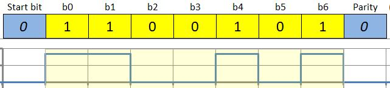
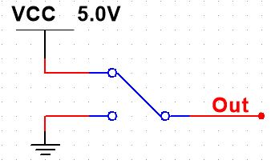
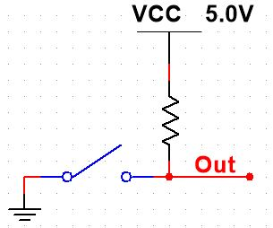
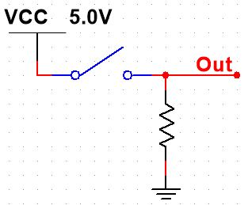
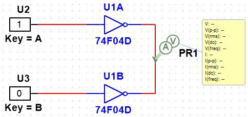
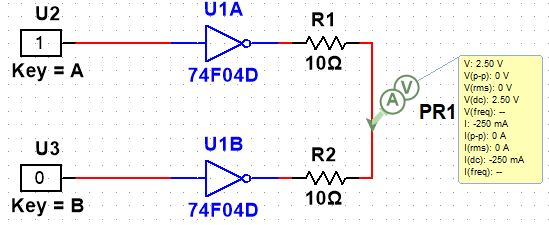
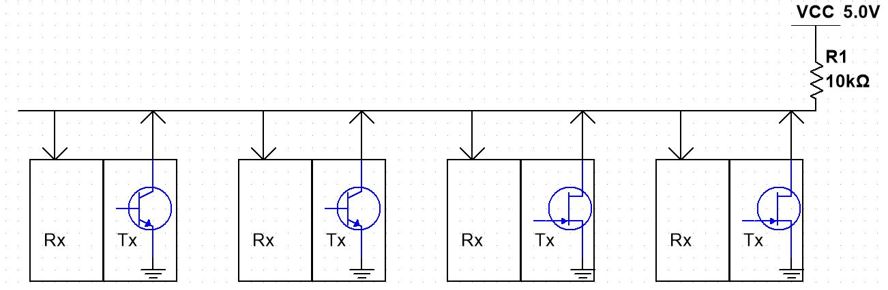
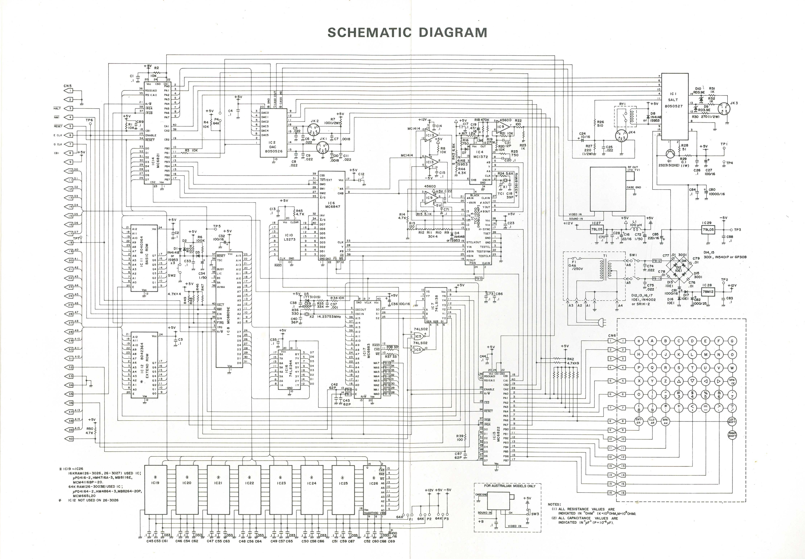
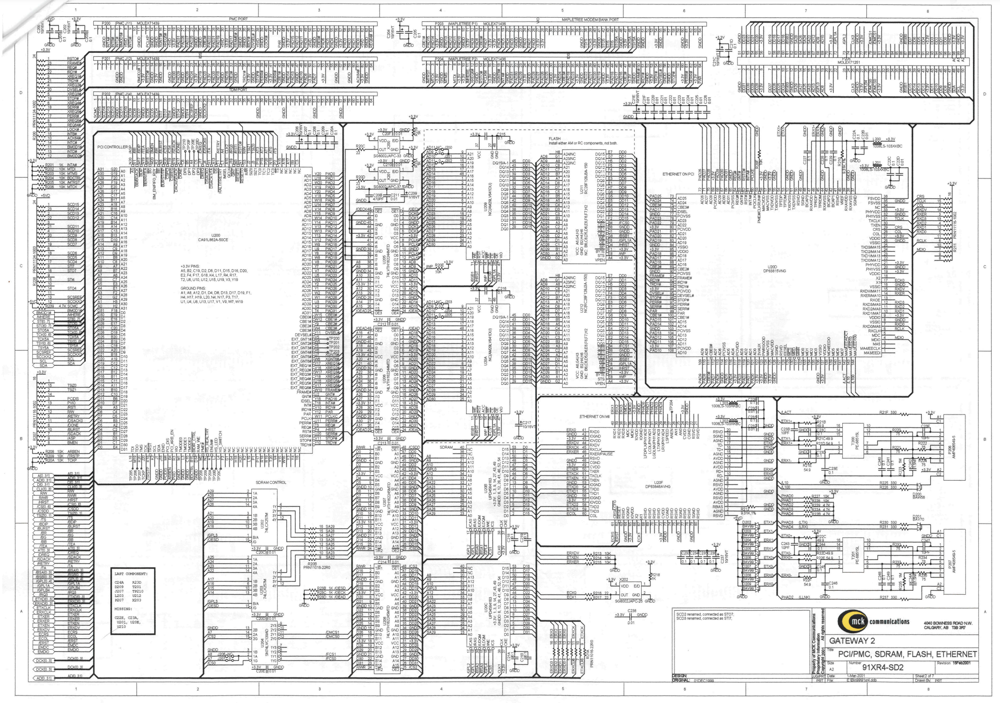

Electronic circuit components are usually connected together so that a source generates a recognizable electrical signal that is processed by the circuit component, then frequently the output of this first component is connected to the input of another device or to the inputs of multiple devices which respond in turn and drive other components.  Each component has its own specifications for expected input and output signals, so care must be taken to meet these requirements.

Typically, in previous courses, you have worked with circuits in which the input characteristics were pre-defined and relatively simple, and in which there was only one device output to work with.  However, there are a number of other possible configurations commonly used in electronics, which we will now investigate.

### Inputs

The incoming signal may be either analog or digital.  Analog signals are typically processed using amplifier circuits like the operational amplifier circuits studied earlier.  Digital signals may be binary (two voltage levels) or they may be a number of other, more complex signals such as 2B1Q, AMI, ASK, FSK, PSK, QAM, Trellis, etc.  (These will not be discussed here, but if you're interested you can look them up.) 

In this discussion, we will focus on binary signals, particularly signals referred to as "unipolar".

*Unipolar Signal*—a signal that uses zero volts and a single, non-zero voltage to represent the two binary signals 0 and 1. 

In your digital logic course, you worked primarily with what is typically called "TTL Signals", where $0$ is represented by $0 V$ and $1$ is represented by $+5 V$.  Even this simple scheme can be complicated by using voltages other than $+5 V$ and by assigning $0$ and $1$ to the opposite voltages.

Here's an example of a serial data stream of unipolar TTL-level electrical symbols:

{width="450"}

### Logic Switches

In your digital logic course, you likely worked with a system where switches were used to generate logic levels. There are two main ways in which this can be done, with two variants of the second way.

{width="200"}

The switch in this circuit is SPDT---Single Pole Double Throw, meaning that the single output can be connected to two possible inputs. In this configuration, the logic signal generated will be either $+5.0 V$ or $0.0 V$, producing the necessary binary options.

However, there are reasons why you may not want to use this configuration:

-   availability---SPDT switches are not as readily available or available in as many forms as SPST (single pole single throw) switches

-   cost---SPDT switches are likely to be more expensive than SPST switches

-   *hard* output---the output is directly connected to a power supply, so this switch cannot be directly wired in parallel with another switch: two such switches wired together and flipped the opposite way would short the power supply to ground, resulting in damage to the circuit.

Of course, if your application only calls for a single binary input to a circuit, the third consideration isn't a problem. Problems arise if multiple signal sources need to be connected together.

{width="200"}

In this circuit, if the switch is open and no current is drawn through the resistor, the output will be \_\_\_\_\_\_\_\_\_\_ $V$, or a logical \_\_\_\_\_\_\_\_\_\_ (High or Low) . (*Hint: what is the voltage drop or change across a resistor with no current going through it?*)

If the switch is closed, the output will be connected directly to ground and will therefore be \_\_\_\_\_\_\_\_\_\_ $V$, or a logical \_\_\_\_\_\_\_\_\_\_ (High or Low) .

This configuration is *Active LOW*, as activating (closing) the switch results in a Logic LOW.

Its HIGH output is also "soft", in that connecting it to another switch, to ground, or to a load will result in a controlled and predictable current through the resistor, and therefore a predictable result at the Output. The LOW output is, however, "hard", so care must be taken never to have this type of switch connected together with another source that has a "hard" HIGH output.\

{width="200"}

In this circuit, if the switch is open and no current is drawn through the resistor, the output will be \_\_\_\_\_\_\_\_\_\_ $V$, or a logical \_\_\_\_\_\_\_\_\_\_ (High or Low) .

If the switch is closed, the output will be directly connected to $V_{CC}$ so the output will be \_\_\_\_\_\_\_\_\_\_ $V$, or a logical \_\_\_\_\_\_\_\_\_\_ (High or Low) .

This configuration is *Active HIGH*, as activating (closing) the switch results in a Logic HIGH.

Its LOW output is "soft", but the HIGH output is "hard".

### Outputs

In the previous discussion, there has been reference to the nature of the output of each of these "input" devices.  What you have learned there continues to be significant in the analysis of IC outputs, with the addition of further material also required.

**"Hard" Outputs**

A general rule is:  Never connect "hard" outputs together.  If one IC is trying to connect the output to +5 V and the other is trying to connect it to ground, there will be:

-   excessive current generated, likely resulting in damage to the equipment

-   an indeterminate signal produced, depending upon which output driver is more powerful (closest to an ideal voltage source)

If you try to simulate the following circuit, Multisim will generate a *Simulation Error*, because there is no predictable output voltage or current using the model of the 74F04 IC.  If you build it on a breadboard, you will likely get a very hot IC and likely one or the other of the outputs will be rendered useless.

{width="350"}

::: callout-warning
Do not tie hard outputs together, at least outside a simulator! It is a good way to convert your electronic device into something purely decorative, or in extreme cases to a dangerous cloud of fast-moving fragments.
:::

If, instead, you insert some resistance between the two outputs to represent the non-ideal voltage source behaviour of the gates, as shown, you will see a relatively large current and a voltage that is neither HIGH nor LOW.

{width="350"}

Note that the output voltage is $2.5 V$ and the current between devices is $250 mA$.  Since this IC is rated to handle no more than $15.3 mA$, it will not likely survive this experiment for long.

Hard outputs, then, are simple and useful for ***connecting a single driving device to one or more input devices***, and as such get used in many point-to-point wiring applications, such as ones you've built in previous courses.

### Bus Communication

In many circuits and in many communication systems, multiple devices are connected together and, following established systems of rules (protocols), can communicate with each other.  This is referred to as "bus communication", or sometimes as "multi-drop communication".

Of course, this means that multiple outputs are somehow connected together in ways that don't destroy the connected devices.  This means that:

-   no more than one output can be "hard", so that as one device drives the bus the others do not interfere

-   only one device is allowed to talk at a time, otherwise the differing output signals would interfere with each other resulting in incorrect messaging.  This is referred to as bus contention and the result is called collision.

There are two commonly-used architectures used for bus communication: Wired-OR and Tristate.

#### Wired-Or Bus

The Wired-OR Bus is typically used for serial communication, with a single conductor being used as a communication channel by multiple devices.  In actual applications, it is almost always a "Wired-NOR" bus, but the "Wired-OR" name has caught on, so we'll continue to use it.

"One-Wire" and IIC (Inter-Integrated Circuit) are two examples of systems that use this communication system, although IIC has two communication bus wires—one for a clock, one for the actual data.

{width="450"}

In this circuit, the *Rx* (receive) inputs are all connected to the bus, and can all listen at the same time.  In the protocol governing communication, there will be some form of addressing so that the intended device will be the only one to respond.

More significantly to our discussion, all of the *Tx* (transmit) outputs are also connected to the bus.  However, all of them are either Open Collector for BJT transistor outputs or Open Drain for FET transistor outputs.  It works this way:

If none of the output transistors are activated, they will all appear as open circuits to the bus wire, and no current will flow.  In this condition, no voltage drop will appear across the resistor, and the bus wire will be at \_\_\_\_\_\_\_\_\_\_ $V$, or a logical \_\_\_\_\_\_\_\_\_\_ (High or Low).  This is sometimes referred to as *Mark Idle*, because, in old communication language, a $1$ is a *Mark* and a $0$ is a *Space*.  The "idle" reference means this is the signal when none of the devices are active.

If any one of the output transistors is activated, it will short the bus wire to ground (i.e. \_\_\_\_\_\_\_\_\_\_ $V$), resulting in a logical \_\_\_\_\_\_\_\_\_\_ (High or Low) .

Although a second or third device could pull the bus wire LOW at the same time, to do so would interfere with subsequent communication of the first device, which will release the line whenever it intends to communicate a HIGH. Therefore, the protocol must establish means by which only one device is allowed to talk at any given time.

If the pullup resistor is not installed, the line will never go HIGH, and communication will be impossible.

### Tristate Bus

Tristate (three states: HIGH, LOW, HI-Z) devices are usually used for parallel communication buses. The third state, HI-Z, essentially means that the internal circuitry of the device is disconnected from the bus when this mode is selected. The device is therefore only connected to the bus when it is Enabled using external logic circuitry. If the enable circuitry is designed correctly, only one output device will ever be connected to the bus at any given time, and it may even be possible to have none of the devices be connected at certain times.

In your computer, you likely have a 48-bit address bus and a 64-bit data bus. That's a lot of side-by-side conductors between ICs---one for each address line and each data line, for a total of 112 wires between components (plus a few more, as we'll soon see)! The two buses will be used to connect the microprocessor to memory and peripheral control ICs. The address bus, along with additional control lines, will select one of billions of possible registers or memory locations, and, when enabled, the contents of that single register or memory location will appear on the data bus.

The actual schematic for your computer is incredibly complex, as a result of all the bus connections. Here's a link to just one page of the schematic for a historical 1980-era computer[^1]:

[^1]: This is for a Radio Shack TRS-80---a noble computer, but far inferior to the `Apple-][` that I (AJ) ran a BBS on in my parents' basement.

[{width="700"}](TRS80Schematic.jpg)

Here's another example that shows more complex buses from a design worked on by this author. This is just page 3 of a 7-page schematic!

[{width="700"}](MCKGatewayP3of8Rotated.pdf)

Parallel bus communication is hardware-intensive, but it is very fast for short-distance communication such as that needed on a motherboard.

Parallel bus communication in a microprocessor-centric design typically has the following components:

-   Address bus---usually a unidirectional bus with the addresses generated by a microprocessor; provides access to each location in the memory map, which may be actual memory or registers connected to peripherals

-   Data bus---bidirectional bus used by the microprocessor to either read the contents of, or write new contents to, the memory location selected by the address bus

-   Enable line or lines---activates the device containing the address selected by the address bus: for a data write operation, this latches the contents of the data bus into the memory location; for a data read operation, this takes the device out of tristate mode so that its contents appear on the data bus

-   Clock line or lines---provides precise timing so that memory access occurs when the microprocessor and the device to be accessed are both ready to execute the transaction

*Check your knowledge by answering **microprocessor**, **data bus**, **address bus**, or **memory IC** for each blank in the description below.*

In order for a microprocessor to read data from a memory IC, the \_\_\_\_\_\_\_\_\_\_ places the desired memory location address on the \_\_\_\_\_\_\_\_\_\_, the \_\_\_\_\_\_\_\_\_\_ drives the appropriate enable line, and when the appropriate clock edge occurs, the outputs on the \_\_\_\_\_\_\_\_\_\_ are taken out of tristate mode so that the contents of the selected memory location appear on the \_\_\_\_\_\_\_\_\_\_ where they will be read by the microprocessor.

In order for a microprocessor to write data to a memory IC, the \_\_\_\_\_\_\_\_\_\_ places the desired memory location address on the \_\_\_\_\_\_\_\_\_\_ , the \_\_\_\_\_\_\_\_\_\_places the desired contents onto the \_\_\_\_\_\_\_\_\_\_ , the \_\_\_\_\_\_\_\_\_\_ activates the appropriate enable line, and when the appropriate clock edge occurs, the data will be latched into the \_\_\_\_\_\_\_\_\_\_ and stored for later use.

*Fill in the correct numerical answers for the blanks below.*

If there are 200,000 possible memory locations in a parallel bus system, the number of address lines required would be \_\_\_\_\_\_\_\_\_\_. If a particular data word contains 24 bits but the data bus is eight-bit, the microprocessor would need to perform \_\_\_\_\_\_\_\_\_\_ reads or writes to \_\_\_\_\_\_\_\_\_\_ individually-addressed memory locations (usually sequentially addressed).



::: border
### Answers to Self Tests

#### Logic Switches

-   $5V$ or logical High

-   $0V$ or logical Low

-   $0V$ or logical Low

-   $5V$ or logical High

#### Wired-Or Bus

-   $5V$ or logical High

-   $0V$ or logical Low

#### Tristate Bus

-   microprocessor, address bus, microprocessor, memory IC, data bus

-   microprocessor, address bus, microprocessor, data bus, microprocessor, memory IC

-   18, 3, 3
:::
