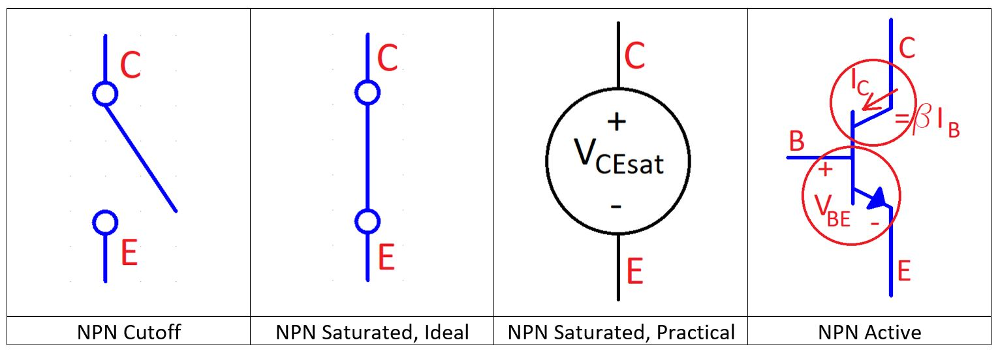
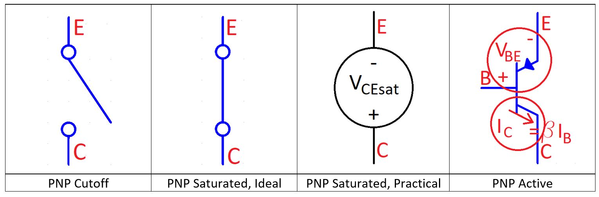
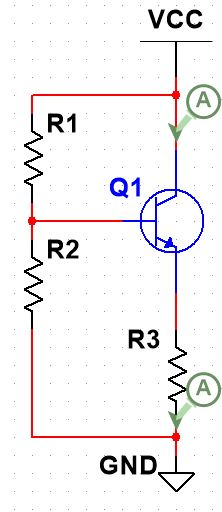
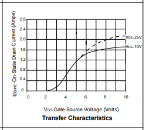

Discrete semiconductors come as diodes in their various flavours, Bipolar Junction Transistors (BJT) and Field-Effect Transistors (FET).

All these devices require proper circuit biasing in order to allow them to function within their specified limits and to perform the tasks we require of them.

For some circuits, that simply means selecting suitable current-limiting resistors; for other circuits, we may need to provide negative feedback to achieve finer control of the device's operation.

## BJT Switching Circuits

BJTs are current-controlled current sources -- a small current at the Base allows the transistor to control a large current at the Collector, and the Base and Collector currents combine at the Emitter.

$I_E = I_{­C} + I_B$

Simplified models of the transistor can be used to help with suitable biasing of BJT circuits.

For switching applications, the intent is to design a circuit that will switch from Cutoff (open) to Saturation (closed).

Cutoff is achieved by reducing the Base-to-Emitter voltage to less than the On condition, usually less than approximately $0.7 V$ for a silicon transistor.

Saturation is achieved by injecting more Base current than is required to drop the voltage between the Collector and Emitter to essentially zero.  This is achieved differently for different circuits, but the most common way is to try to create a Collector current that would theoretically make the voltage drop across a Collector-biasing resistor greater than the available supply voltage.  At that point, the actual current would be controlled by the resistor, not the transistor.

### Worked Example

An NPN transistor with a beta of 100 is to be used as a switch to control a current of approximately $15 mA$ from a $5.0 V$ supply.  Determine suitable biasing resistors, assuming that the input signal switches between $0 V$ and $+3.3 V$.

Start by connecting the Emitter to common or ground.  This provides solid switching, as raising the Base to $0.7 V$ will activate the transistor.

Next, using the simple saturation model, we can determine a suitable Collector resistor:  $R = \frac{V}{I}$, $\frac{5.0V}{15 mA} = 333 Ω$.  Since we want the current to saturate the transistor, we pick the next larger resistor:  $390 Ω$.

Determine the minimum Base current required:  $I_B = \frac{I_C}{β} = \frac{15 mA}{100} = 150 μA$.

Since we want sufficient Base current to ensure saturation, we'll either double the Base current and pick a suitable resistor, or we'll determine the maximum Base resistor and pick something about half its size.  Either way, using $R_B = \frac{(V_{in} - V_{BE})}{I_B}$, we arrive at a suitable value of $8.2 kΩ$.

### Self Test 2.1

Let's verify our work, and prove that the transistor can effectively switch from cutoff to saturation.

Determine the Base current available from the HIGH (3.3 V) input, keeping in mind the Base to Emitter voltage drop, which we'll assume to be 0.7 V:  \_\_\_\_\_\_\_\_\_\_\_\_\_\_\_

From the Base current, determine what the Active Model would predict the Collector current to be: \_\_\_\_\_\_\_\_\_\_\_\_\_\_\_.

The maximum current that could flow through the Collector resistor if the transistor were a complete short would be: \_\_\_\_\_\_\_\_\_\_\_\_\_\_\_.

Since the Active Model predicts a current that is greater than possible for the biasing components, the transistor must be in \_\_\_\_\_\_\_\_\_\_\_\_\_\_\_ (Cutoff, Saturation, or Active).

If the input voltage was LOW (0.0 V), how much Base current could flow? \_\_\_\_\_\_\_\_\_\_\_\_\_\_\_.

From this, the Collector current would be \_\_\_\_\_\_\_\_\_\_\_\_\_\_\_, and the transistor would be in \_\_\_\_\_\_\_\_\_\_\_\_\_\_\_(Cutoff, Saturation, or Active).

## BJT Constant Current Source

Occasionally, we want to use a transistor as a constant current source, which makes sense, since we model transistors as current-controlled current sources. However, the characteristics of transistors vary so greatly from one to the next that it's a challenge to make a predictable circuit.

One of the most predictable transistor biasing circuits that operates in the Active Mode uses negative feedback in the form of an Emitter resistor, and stabilizes the Base voltage using a voltage divider.

Here's the circuit, and the controlled current can be accessed either at the Collector or the Emitter.

{width="150"}

In order for this circuit to behave predictably, $R_2$ should be approximately ten times larger than $R_3$, so that the current through the voltage divider resistors ( $R_1$ and $R_2$) will be so much larger than the Base current that the Base current will have little effect on the calculations.  Also, beta for the transistor should be more than $100$.

As a worked example, consider a situation in which a current-driven device is to be inserted between VCC, which is $12 V$, and the Collector.  The current required is $10 mA$.

We could start by choosing a value of $100 Ω$ for $R_3$.  This would give us an Emitter voltage of $1.00 V$ when the current is the required $10 mA$.

Adding $V_{BE}$ to $V_E$ gives us a $V_B$ of $1.7 V$.  $R_2$ should be about $1.0 kΩ$ (ten times the size of $R_3$).  Reworking the voltage divider to solve for $R_1$ produces a value for $R1$ of $6.06 kΩ$.  This can be achieved using a $4.7 kΩ$ fixed resistor and a $2 kΩ$ trim pot.

Having a trim pot provides us with a means of overcoming one more of the variable characteristics of the transistor:  $V_{BE}$, which could vary considerably around the $0.7 V$ we've used in our theoretical design.

### Self Test 2.2

Let's check our work.

Assuming all the current through $R_1$ also goes through $R_2$ (i.e. simple series circuit), we can use the voltage divider to determine VB.  Assume $R_1$ is a $4.7 kΩ$ fixed resistor and $2 kΩ$ potentiometer set to $6.059 kΩ$ and $R_2$ is $1.0 kΩ$. 

$V_B$ = \_\_\_\_\_\_\_\_\_\_\_\_\_\_\_ $V$. 

$V_E = V_B - V_{BE} =$ \_\_\_\_\_\_\_\_\_\_\_\_\_\_\_ $V$. 

$I_C=I_E=\frac{V_E}{R_3}=$ \_\_\_\_\_\_\_\_\_\_\_\_\_\_\_ $mA$.

Since we set $V_E$ to be $1.0 V$, that means that whatever device is inserted in series with the Collector could have as much as $11 V$ across it before the current will be affected, so over a wide range of loads, the transistor will produce a constant current of $10 mA$.

## FET Switching Circuits

FETs, being non-linear devices, are best used as switches.

Recall that a FET is activated by a voltage between the Gate and Source, $V_{GS}$.

Although there are a variety of types of FETs, the most generally-useful FET is the Enhancement-only MOSFET, or E-MOSFET.  Both N-Channel and P-Channel devices are available.

To turn on these devices, an N-Channel E-MOSFET requires a positive $V_{GS}$ greater than its threshold voltage, $V_{TH}$; a P-Channel E-MOSFET requires a negative $V_{GS}$ "greater" (i.e. more negative) than its $V_{TH}$.

The greater the $V_{GS}$, the more current can be controlled by the E-MOSFET, in a parabolic relationship.  In a given transistor's data sheet, there will be characteristic curves which will help the designer determine how much current will be made available for a given setting of $V_{GS}$.

### Self Test 2.3

Here's a circuit from a previous course that we'll analyze slightly differently than we did before.

{width="400"}

The coil on the relay to be controlled by the E-MOSFET is rated at $43.6 mA$ when powered by $12 V_{DC}$.  Here's a graph from the datasheet of the ZVN2110A:

{width="220"}

The two options we have for activating the FET are $3.3 V$ logic and $5.0 V$ logic.  A quick look at the graph indicates that, at $V_{GS} = 3.3 V$, the Drain current is on the order of $200 mA$, and at $5.0 V$, the Drain current is on the order of $1.1 A$.  In either case, there will be sufficient current to turn on the FET to activate the relay.

In this circuit, there are a number of other components, each with its own function.  Let's investigate.

The diode, reverse-biased across the coil (choose one):

-   [ ] limits the inrush current that charges or discharges the Gate capacitance.

-   [ ] limits the Gate current that is responsible for controlling the Collector current.

-   [ ] provides a path for coil current that could otherwise damage the transistor.

-   [ ] ensures that the input will be held LOW in the event of a missing signal source.

-   [ ] ensures that the input will be held HIGH if the signal source is not attached.

R1, in series with the Gate (choose one):

-   [ ] limits the inrush current that charges or discharges the Gate capacitance.

-   [ ] limits the Gate current that is responsible for controlling the Collector current.

-   [ ] provides a path for coil current that could otherwise damage the transistor.

-   [ ] ensures that the input will be held LOW in the event of a missing signal source.

-   [ ] ensures that the input will be held HIGH if the signal source is not attached.

R2, between the input and ground (choose one):

-   [ ] limits the inrush current that charges or discharges the Gate capacitance.

-   [ ] limits the Gate current that is responsible for controlling the Collector current.

-   [ ] provides a path for coil current that could otherwise damage the transistor.

-   [ ] ensures that the input will be held LOW in the event of a missing signal source.

-   [ ] ensures that the input will be held HIGH if the signal source is not attached.



::: border
## Answers to Self Tests

### Self Test 2.1

-   317 μA.

-   31.7 mA

-   12.8 mA

-   Saturation

-   0 μA

-   0 mA

-   Cutoff

### Self Test 2.2

-   1.7 V

-   1.0 V

-   10 mA

### Self Test 2.3

-   provides a path for coil current that could otherwise damage the transistor.

-   limits the inrush current that charges or discharges the Gate capacitance.

-   ensures that the input will be held LOW in the event of a missing signal source.
:::
