Circuit Isolation, often called *Galvanic Isolation* after early electricity researcher Luigi Galvani, refers to the prevention of a direct path for electric current flow between two or more locations. This means that there will be an insulator between these two locations.

Typically, circuit isolation involves activating one circuit in response to another circuit without a direct electrical connection between the two circuits. The insulator or dielectric between the two circuits will be rated according to the voltage required to break down the electrical barrier and cause a current to flow between the two circuits. Many circuit isolation techniques will have isolation ratings -- ratings in the thousands of volts, ensuring that, under normal operation, there will be no direct current path between the two circuits.

Why is this so important?

In many cases, the two circuits will be operating at, or could be subjected to, different voltages. For example, a $3.3 V$ logic circuit may be expected to turn on a 600 VAC three-phase motor in a factory; or a $5.0 V$ logic circuit may be expected to respond to signals on a telephone circuit, which could be exposed to lightning strikes.

In many cases, legislation requires Galvanic isolation ratings between infrastructure equipment and user equipment. One example of this is the land-line telephone system, which has strict isolation ratings, primarily so that user equipment will not damage the telephone infrastructure.

## Types of Isolation

Circuit Isolation can be categorized in terms of the means of activating one circuit by another circuit with no direct electrical connection.

There are four main categories:

**Electrostatic Isolation** -- this refers to systems using capacitance to allow varying voltage signals to charge and discharge metal plates separated by a dielectric, while preventing a direct electrical connection.

**Electromagnetic isolation** -- this is the use of transformers or coupled inductors which allow varying current signals to pass through by means of inducing currents in coupled coils separated by wire insulation, while again preventing a direct electrical connection.

**Optical isolation** -- in an optically-isolated system, light produced by one circuit activates sensors in another circuit across a transparent gap, which could be a vacuum, air, or some other transparent insulator which prevents a direct electrical connection.

**Electromechanical isolation** -- this refers to the use of a magnetic field electrically induced by one circuit to physically activate a switch in the other circuit. Electromechanically-activated switches are called relays.

In this Ross Taylor's previous work in the telecommunications sector, all four of these isolation techniques were used in devices connected to the telephone land-line system. To ensure that there was no possibility of a direct electrical connection between the "Telco" side and the "User" side, printed circuit boards had a grounded trace completely surrounding the "Telco" side, with an air gap on both sides of the ground trace. Then, the different signals were brought across this barrier through circuit isolation devices:

-   Audio signals (voice) were brought across through a capacitor in some designs.

-   Data signals (digital pulses) were brought across using pulse transformers.

-   The presence of a ring tone (high amplitude, low frequency AC signal) was brought across using an optocoupler.

-   Line control (on hook/off hook DC current loop make/break) was accomplished using a relay.

## Electrostatic Isolation

Capacitors are made by separating two metallized plates by a dielectric which allows an electrical field generated by one plate to charge or discharge the other plate. A changing charge on one plate results in a changing charge on the other plate, so AC signals on one side generate matching AC signals on the other side.

The circuit isolation for a capacitor is based upon the characteristics of the dielectric. All capacitors have a voltage rating. This rating indicates the voltage above which the dielectric is no longer guaranteed to prevent the flow of current.

Locate your ETC Component Kit's parts list. What is the circuit isolation for the $100 nF$ capacitor? \_\_\_\_\_\_\_\_\_\_ $V$.

According to the parts list, what is the circuit isolation for the $10 μF$ electrolytic capacitor in the ETC component kit? \_\_\_\_\_\_\_\_\_\_ $V$.

Using the Internet, locate a $10 μF$ $600 V$ electrolytic capacitor. TThis capacitor is much larger than the $10 μF$ capacitor in the ETC kit: \_\_\_\_\_\_\_\_\_\_ (True or False) .

Capacitors are sometimes used specifically to block DC (direct current). For example, in one amplifier this author owned, the speakers were directly coupled to the power amplifier which, at times, could generate damaging amounts of DC current. Large blocking capacitors could have prevented this current, as shown in the figure below. The capacitance would have to be determined to meet the cut-off frequency requirements for the circuit.

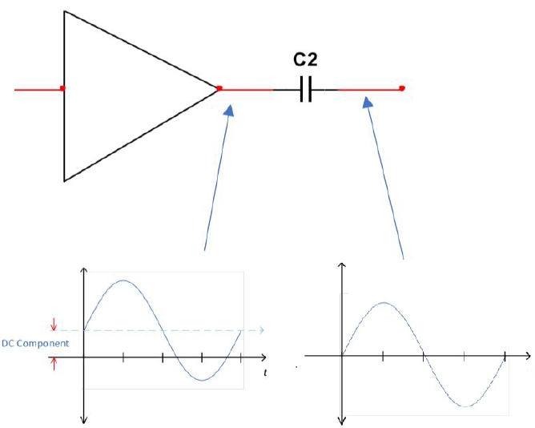{width="375"}

If the stereo sound system used $4 Ω$ speakers and was expected to pass frequencies greater than $10 Hz$, what would be the minimum capacitance for the DC-blocking capacitors? \_\_\_\_\_\_\_\_\_\_ $mF$. That's a pretty big capacitor, particularly since it would need to be non-polarized and would have to handle up to $40 V_{RMS}$!

## Electromagnetic Isolation

Electromagnetic isolation involves the use of transformers, in which a changing current in one coil electromagnetically induces a current in another coil, with no physical electrical connection between the two coils. The circuit isolation for a transformer is determined by the insulation on the wire in the coupled coils. The higher the circuit isolation, the thicker the insulation, which results in a greater separation between coils and therefore poorer coupling, requiring more wire ... so high values for circuit isolation means somewhat large transformers.

The type of transformer chosen depends upon it use:

### Audio/Power (Sinusoidal) Transformers

If the signal to be coupled through the transformer contains only one or a limited number of sinusoidal components, then the transformer will be chosen to pass the desired signals as a band-pass filter, taking into account the other components in the circuits for the primary and secondary coils.

One advantage of using a transformer over using a capacitor or other means of isolation is that the turns ratio of the transformer can be chosen to amplify or attenuate the signal at the same time as providing isolation.

Another advantage of using a transformer over using other means of isolation is that the transformer turns ratio can be used for impedance matching, since the impedance reflected across a transformer is based upon the turns ratio:

$\frac{Z_s}{Z_p} = \left(\frac{n_s}{n_p}\right)^2$

Power transformers are somewhat unique in that they are designed specifically to work efficiently with frequencies in the $50 Hz$ to $60 Hz$ range.

Audio transformers must be designed to cover a much larger range of frequencies -- typically from $20 Hz$ to $20 kHz$, or, if their application is for only one part of the audio spectrum, frequencies in the Bass, Midrange, or Treble ends of the audio spectrum. Other specialty transformers may also be chosen or designed to handle frequency ranges other than the audio range.

### Pulse Transformers

Pulse transformers are not designed to handle a lot of power. Instead, they are designed to handle the high-frequency components present in square-edged pulses, with the intent of producing something as close as possible to a square pulse at the output. From your work with Fourier Series, you know this requires all frequency components to infinity, which isn't possible; however, tightly-coupled transformers with few windings, properly impedance-matched, can produce suitable signals that can be further cleaned up using comparators. Pulse transformers are typically quite small, and are not designed to handle much current.

Pulse transformers typically have the following characteristics:

low inductance (low magnetic flux leakage) low distributed capacitance (low capacitance between turns in the windings) high circuit isolation voltage fast transient response many pulse transformers are $1:1$, which simplifies calculations of matching impedance, signal size, etc.

*Example*: In the following circuit, a high-frequency square pulse repeatedly switches an electromagnetically-isolated transistor on and off.

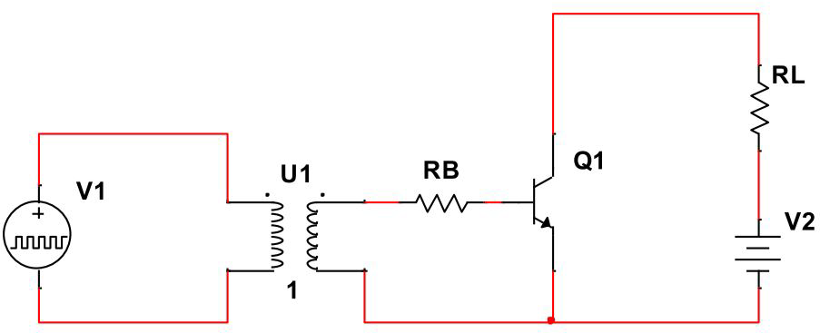{width="400"}

In your CNT Year 2 Kit, there's a pulse transformer. Look up its specification sheet. What is its isolation voltage, in $V_{RMS}$? \_\_\_\_\_\_\_\_\_\_

### Electromechanical Isolation

Electromechanical isolation typically involves the use of relays, although some semiconductor devices on the market blur the distinction somewhat. We'll address those later. The first device, a relay, is simply an electromagnetic switch. Other devices, like Hall Effect sensors and Solid State Relays are related or similar in effect.

#### Relay

In a typical relay, an electromagnet controlled by one circuit is used to move a magnetically-attracted physical element which, in turn, physically actuates a switch in an isolated circuit.

Often, the magnetically-attracted part of the relay is linked to the switch using non-conductive parts like plastic push-rods or levers. The electromagnet, or coil, is usually insulated either by an air gap or by a physical non-conductive shield to ensure electrical isolation.

Relays come in a number of configurations, based upon the following characteristics:

-   number of poles or circuits controlled -- the mechanical actuator can control a single switch or multiple switches

-   number of positions -- relays are usually either single throw (on/off) or double throw (on/on for two different circuit choices) single-coil or latching

    -   a single-coil relay has a spring-loaded mechanical element that holds the switch in one position when the coil is off, and maintains the switch in the opposite position when the coil is activated; the associated contacts can be Normally-Open (N.O.) or Normally-Closed (N.C.). Continuous current is required to maintain the activated condition.

    -   a latching relay has two coils -- one to move the mechanical element one way, the other to move it back. One coil is referred to as the Latch coil and the other is referred to as the Clear coil. Both of these coils require only a momentary application of current, as the position of the mechanical element is maintained when the current is turned off.

The following picture is of a simple single-pole single-throw single coil relay, with its insulating plastic cover removed. Go back through the descriptions above to help you identify the various parts of this relay. Note, especially, the isolation distance between the coil and the switch, which would be further enhanced by a plastic shield between the two. In addition, the metal actuator is resting on a "metal wall" that provides shielding from electromagnetic radiation, as well.

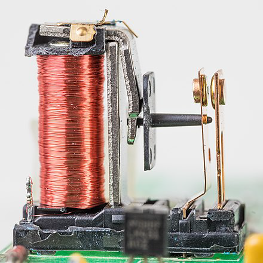{width="300"}

The following is a picture of the relay in your CNT Year 1 Kit -- which is a double-pole double-throw single-coil relay -- with the plastic cover removed. Note that the plastic cover has a plastic divider to increase the isolation between the coil and the switch elements.

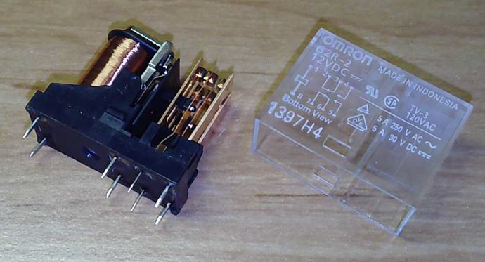{width="375"}

The relay in your CNT Year 1 Kit can be used to control switches in \_\_\_\_\_\_\_\_\_\_ separate circuits, and can connect the centre pin of each switch to \_\_\_\_\_\_\_\_\_\_ different circuit elements. This makes it a(n) \_\_\_\_\_\_\_\_\_\_ (SPST, SPDT, DPST, or DPDT) switch.

One concern you've already encountered in previous courses is the inductance of the coil. Once a current starts flowing in the coil, it cannot be stopped instantaneously. If the coil circuit is opened, the voltage will build up until the current finds a path. If the control element is a transistor or other semiconductor device, it will be driven into Reverse Breakdown, and may be damaged or destroyed. A normally reverse-biased diode or a snubber capacitor is required to protect the semiconductor device from the relay coil.

#### Hall Effect Sensor

The Hall Efffect Sensor is a device with no moving parts that produces a change in the voltage across a sensor element in response to a perpendicular magnetic field. Unlike a coil, which only responds to a changing magnetic field, a Hall Effect Sensor also responds to static magnetic fields. The difference in voltage is proportional to the strength of the magnetic field, so the output of a Hall Effect Sensor is a continuous analog signal. A Hall Effect Switch couples a Hall Effect Sensor with a simple comparator circuit (this could be as simple as a single, properly biased transistor) so that magnetic fields greater than a manufacturer-determined threshold will activate the output, turning the device into a binary switch.

The Hall Effect Sensor or Hall Effect Switch is typically not designed to handle any significant power -- voltages and currents will typically be low -- so further signal-conditioning circuitry is necessary if anything other than presence/absence of a magnetic field is required.

Here is an application in which a Hall Effect Sensor is being used to replace a small-signal relay:

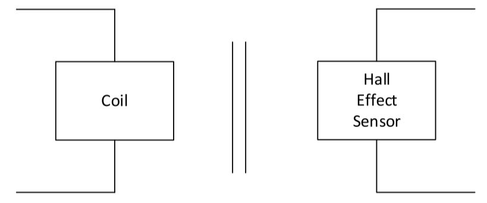{width="350"}

#### Solid State Relay

In reality, most Solid State Relays (SSR) are optically-coupled devices designed to operate similarly to a mechanical relay, but with no moving parts. You'll be learning more about these later in the course.

### Optical Isolation

Since light can travel through vacuum, air, transparent materials, and so on, and since it is affected very little by electrical or magnetic fields, it is an ideal medium to use in isolating electrical circuits.

Although we typically think of semiconductor devices as being electrically controlled, they also can be controlled using photons. In a previous course, you learned that a P-N junction exposed to light can generate a current that is driven by the junction's barrier potential. This is what makes photovoltaic cells and solar collectors possible.

This photoactivity of the P-N junction makes the photodiode possible. However, it doesn't stop there: photons can be used to activate BJTs, MOSFETs, silicon-controlled rectifiers (SCRs) and TRIACS -- you'll be learning about these last two devices later, but suffice it to say that they can be used to control AC circuits much the way diodes and transistors control DC circuits.

Optical isolation devices are interchangeably called Optoisolators or Optocouplers.

The circuit isolation value provided by the manufacturer for an optoisolator simply refers to the voltage at which the insulation between the two parts of the device fail and a current or spark may cross between the two circuits that should be isolated. Clearly, the usual design constraints for semiconductor devices need to be adhered to for the semiconductor devices in the two halfs of the optoisolator device -- diodes and transistors need to be properly biased, and must be kept at voltages below their reverse breakdown values.

#### Photodiode Isolator

In a photodiode isolator, the driving side is an LED and the driven side is a reverse-biased photodiode. When light shines on the photodiode, its reverse current increases significantly, just as it does in a photovoltaic cell. If the photo diode is in series with a resistor, the voltage across the resistor increases while the voltage across the photodiode decreases, indicating the presence of light from the driving LED.

Since it is necessary to keep the photodiode reverse biased, a photodiode optocoupler is used with DC circuits.

#### Phototransistor Isolator

The Base of a BJT phototransistor responds to light in much the same way as the Base of a regular transistor responds to the injection of current. With no light, the transistor is in cutoff, and behaves as an ope switch. With sufficient light, the phototransistor can be saturated, thereby acting as a closed switch. If so desired, there is an active linear region between cutoff and saturation, but most commonly phototransistor optocouplers are used in switch mode.

Here's a diagram of a typical BJT optoisolator. Note that the Base is light sensitive, but is also made available to the designer in case there's a need to provide additional biasing, usually to increase the sensitivity of the system.

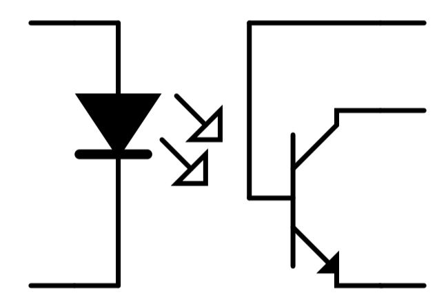{width="375"}

There are also photoactive MOSFET transistors available, and shining sufficient light on the Gate will saturate the transistor. Again, since transistors need to be biased properly in order to operate, phototransistor optocouplers are used with DC circuits.

#### PhotoSCR and PhotoTRIAC Isolators

As mentioned previously, SCRs and TRIACs can be used to control AC circuits; in fact, unless additional circuitry is provided to periodically turn these devices off, they can't be used for DC, as once they are turned on, the voltage across them must be reduced to zero to allow them to turn off.

The SCR is a half-wave AC controller, and the TRIAC is a full-wave AC controller.

#### Design considerations

None of the optoisolators mentioned above are designed to handle any significant power, so the current must be kept low. However, these devices can be used to control other devices, such as power transistors, power SCRs, and power TRIACs.

Not only do optoisolators ensure there is no direct electrical connection between devices, they also make it possible for low power/low voltage circuits, such as logic circuits and microcontrollers, to control much higher power/higher current/higher voltage circuits. As a result, they are frequently used as level translators and signal conditioning circuits even when isolation isn't a primary concern.

For true circuit isolation with photocouplers (as with any of the circuit isolation devices) there should be no common Ground connection between the two sides of the circuit -- both power and ground of the controlled circuit should be "floating" with respect to the controlling circuit.

When designing circuitry that employs optocouplers, keep in mind the usual design rules for LEDs (driving side) and diodes, BJTs, MOSFETs, SCRs, or TRIACs.

For a BJT optocoupler, rather than using $\beta$ or $h_{fe}$ , the optocoupler manufacturer will provide a Current Transfer Ratio (CTR), which is the ratio of the Collector current, $I_C$ to the LED current, $I_f$ for "forward diode current".

$CTR=\frac{I_C}{I_f} \cdot 100\%$

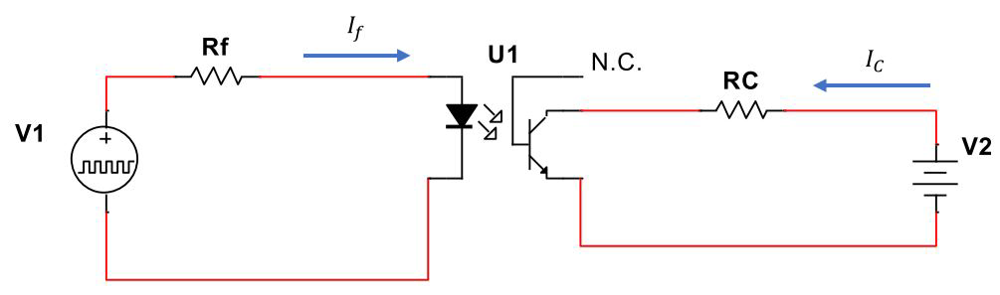{width="400"}

If you recall, the current gain of a BJT only really applies to the linear active region -- as the collector current reaches its maximum, it doesn't matter how much more base current is supplied: the transistor won't turn on any more. In the same way, the CTR value for a phototransistor will be different in saturation than in the active linear region, so read the manufacturer's specification to ensure you are designing your circuit properly.

Also, CTR is affected by temperature, so you may need to keep that in mind while designing a circuit.

#### Simple Application Circuits

Here's a simple circuit in which an optocoupler is used by a $3.3 V$ circuit to control a $5 V$ circuit. The oscilloscope screenshot below is shown to help explain the signals.

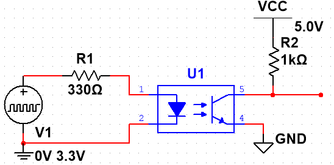{width="400"}

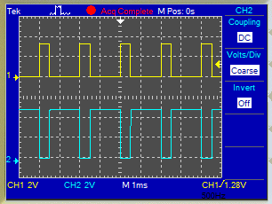{width="300"}

Note that the output logic is inverted with respect to the input. This is to be expected when the output is taken from the Collector of an NPN transistor. In all of the switching circuits you've done with transistors, for N-type devices (NPN or N-Channel) the Emitter or Source has been connected to ground, and for P-type devices (PNP or P-Channel), the Emitter or Source has been connected to power; the logic gate produced by these arrangements has always been an Inverter. For switching purposes, the Emitter or Source needs to be connected directly to a fixed voltage, since the activating signal, $V_{BE}$ or $V_{GS}$, needs to be solidly referenced at the Emitter or Source. This means that the resistor at the output needs to be at the Collector or Drain.

Interestingly, when using an optocoupled device, the semiconductor is activated by light instead of an electrical signal, so we can get non-inverting action by placing a resistor at the Emitter or Source, with equally-valid results, as shown below:

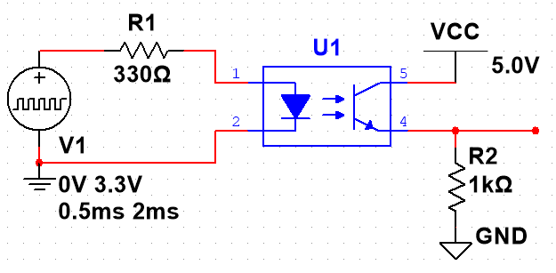{width="400"}

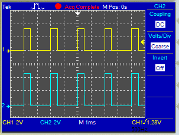{width="300"}

Note that this time the output signal is not inverted with respect to the input!

This solution wouldn't work for a standard NPN transistor, as the Base would always be $0.7 V$ above the Emitter, making it so that the output signal would never be higher than $3.3 - 0.7 = 2.4 V$. In fact, with a standard NPN transistor, to get $5.0 V$ logic out with the resistor in the Emitter instead of the Collector, we would need to raise the Base voltage to $5.7$ V.

##### Notes

-   Galvanic isolation is achieved because the power supplies, including their grounds, are not connected together, and there is no electrical path between the two sides of the circuit.

-   Proper biasing is in place, both for the LED and the phototransistor, to limit the current and protect the semiconductor components

-   Due to the time it takes to "fill" and "empty" the holes in the P-N junctions of the semiconductors (referred to as the Storage Time), larger current requirements will result in slower switching times, limiting the frequency of operation

-   Note that the physical Base for the phototransistor isn't even shown in this symbol; for optoisolators that provide a connection to the transistor's Base, CTR can be adjusted by careful biasing of the Base pin.

From a safety perspective, the second circuit shown (and the use of a PNP rather than an NPN in a conventional transistor circuit) makes the voltage at the load $0 V$ when the input signal is not connected; the conventional NPN circuit with the Emitter grounded and the resistor at the Collector makes the voltage at the output $V_{CC}$, so the circuit's output is "live" to accidental probing or unintended connections to other components.

Here's a Motor Driver Circuit with Optocoupler Isolation:

](images/motordriveroptocoupler.png){width="400"}

##### Notes

-   Brushless DC motors, as inductive devices, produce large voltage spikes when their coils are turned off -- which happens multiple times per rotation. Consequently, the semiconductors in the circuit, particularly $Q_2$, need protection, which is provided by $D_1$ and $D_2$

-   Given that BJTs are current-controlled current sources, with careful design we could eliminate $R_2$ (open) and $R_3$ (short) and replace $Q_1$ with a PNP transistor to achieve the same results, as you did in a previous course. These changes would also result in the opposite polarity of the control signal, with the motor ON when the input signal is ON.

-   $S_1$ and $V_1$ could represent the output from a logic-level device, such as a microcontroller, as long as the output current is sufficient to activate the optocoupler.

#### Operation

-   When there is no current through the LED side of the optocoupler ($S_1$ open), the phototransistor is in cutoff, which pulls the Base of $Q_1$ up, providing Base current to $Q_1$ which saturates it. This pulls the Emitter of $Q_1$ to a high enough potential to saturate $Q_2$, which turns the motor ON.

-   When current flows through the LED side of the optocoupler, the phototransistor in the optocoupler is saturated, pulling the Base of $Q_1$ down and turning $Q_1$ off. This turns $Q_2$ OFF, stopping the motor. Residual current from the motor windings is either dissipated through $D_1$ or drawn from ground through $D_2$, depending on the direction of current flow through the motor coils as the motor continues to rotate during the stopping process.

This circuit could be used as shown to turn the motor on and off; however, by pulsing the input signal using a Pulse Width Modulated (PWM) circuit of varying duty cycle, the power delivered to the motor (which would vary the speed of the motor for a given load torque) can be varied over a range of values ranging from $0\%$ to $100\%$. With feedback supplied by a speed or position sensor, this system could be designed to operate at a constant set point speed even with varying load torque.



::: border
## Answers to Self Tests

### Electrostatic Isolation

-   50

-   63

-   TRUE

-   3.98

### Electromagnetic Isolation

-   1000

## Electromechanical Isolation

-   2

-   2

-   DPDT
:::
