## Semiconductor AC Power Controllers

Practically everything you've done in your previous work with semiconductor devices has involved DC power. We used diodes to convert AC power to DC power, but beyond that, we've powered BJT circuits, FET circuits, Op Amp Circuits, Comparator circuits, and Logic circuits using DC---either with carefully-regulated power supplies or batteries. Yes, we've used some of these devices to manipulate AC signals, but they've always been powered using DC.

Many devices used commercially or industrially are designed to run on AC power. Up to this point in your study of electricity and electronics, the only ways we've used to turn AC power on and off have been switches, relays, and SSRs. We haven't even tried to control AC power over a range of values (analog), as switches and relays can only be on or off (binary).

However, you've likely encountered full-range AC power controllers as implemented in the home: You may have a room in your house with a dimmer for the lights instead of a switch, you may have a floor lamp with a dimmer, and your high-efficiency furnace may speed up and slow down the fan as it goes through its heating cycle. In industry, huge three-phase AC motors may have speed controllers that can be manipulated by the operator or by control circuitry.

### Four and Five Layer Semiconductor Devices

The BJT transistors you studied earlier are three-layer devices, either PNP or NPN. As such, they must be biased appropriately with DC power supplies: For an NPN transistor, the Collector must be at a higher voltage than the Emitter, and control is exercised by running a current through the positively-biased Base to Emitter junction. For aNP transistor, the Collector must be at a lower voltage than the Emitter, and control is exercised by running a current through the negatively-biased Base to Emitter junction.

::: column-margin
{width="40mm"}

William Shockley, 1910-1989 (Wikipedia)
:::

William Shockley was a researcher at Bell Labs, and, beyond his role in inventing transistors, he had a particular interest in AC power control. He invented a number of semiconductor devices that had more than three layers. Some of his devices were four-layer (NPNP or PNPN) and some were five-layer (NPNPN or PNPNP). It turned out that these devices responded in surprising but useful ways to AC signals.

Some sources use the general term *Thyristor* to include all of the four- and five-layer devices, whereas other sources use the term for only one of these---the Silicon Controlled Regulator(SCR). Because of this uncertainty in terminology, we'll use specific names for all of these devices.

All these devices (with the exception of two which have been specially designed to have shut-off control) have this unusual characteristic in common: once they have been activated, they remain ON until the voltage across them drops practically to zero. Therefore, they are not particularly useful for DC circuits -- activate the device, and you can't turn it off! Of course, creative people have come up with ways to use these devices in DC circuits, but they are definitely best used in AC circuits.

In an AC circuit, the supply voltage crosses zero twice each cycle, or 120 times per second in North America. So, in an AC application, these devices, when activated, will be turned off 120 times a second, ready to be activated again.

Although these devices can be approximately modelled as pairs of coupled transistors, the model sometimes doesn't adequately explain the operation of the device, so that particular model will not be presented in this course. If you're interested, you can look it up for yourself. Instead, we will simply describe the behaviour of each device from an operational point of view ---"this is what it does"---rather than from a theoretical point of view---"this is why".

### Four-layer Half-Wave AC Power Controllers

The four-layer devices can control only one polarity of the AC signal. Typically, this is the positive half wave, with the negative half wave producing no useful power. It is also possible to use these devices to control the negative half wave, with the positive half wave producing no useful power, but that is much less common.

#### Shockley Diode

The basic four-layer device is called the Shockley Diode[^1] , although it is not actually a diode (the names of these devices can be a bit confusing, as you will see).

[^1]: Don't confuse the *Shockley* Diode with the *Schottky* Diode, which is a special high-frequency/high power diode using a P-Type to metal junction.

The Shockley Diode has only two pins, and is given the symbol shown in the margin.

::: column-margin
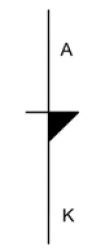{width="15mm"}

Symbol for a Shockley Diode
:::

To begin with, the device is open, allowing no current to flow. As the Anode to Cathode voltage increases, it remains OPEN until a relatively large breakover voltage ($V_{BR_f}$) is reached and sufficient current is injected into the Gate to turn the device on; after this, it continues to conduct until the current is turned off or the Anode to Cathode voltage is reduced to practically zero. The graph of the transfer below demonstrates this.

Note the following:

-   This curve is not "reversible".

    -   It starts at (0,0), follows an increase in VAK up to the forward breakover voltage $V_{BR_f}$ and the injection of current $I_H$.

    -   $V_{AK}$ then drops to a much lower value, $V_F$, as it has now been turned On.

    -   If biased properly, sufficient current now flows to "hold" it in the On condition—$I_H$.

    -   If the voltage across the device is dropped to zero, the cycle can start over again at (0,0).

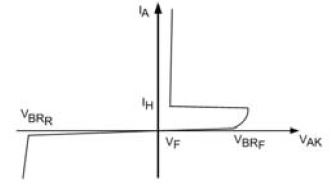{width="100mm"}

-   As with other semiconductor devices you've investigated, there is also a reverse breakdown voltage, $V_{BR_r}$ which should be avoided to prevent damage to the device.

-   The reverse breakdown of the device does not resemble the forward breakdown, and occurs at a much greater voltage; so this device only acts as an electronic switch in response to a positive $V_{AK}$.

-   Once the device is conducting, its current must be limited by external biasing devices, such as a resistor, motor, lamp, etc., or the device will burn out (thermal destruction).

When biased in an AC circuit, the current transfer function of a Shockley Diode looks like the following: The dotted line represents the voltage of the power signal with an amplitude of $24 V_p$, and the other trace represents the current in milliamps supplied to a $500 Ω$ load by a Shockley Diode with a forward breakover of $20 V$. (The numbers on the Y-axis represent voltage for the input signal and current for the output signal—that's a bit confusing, so take a moment to examine this graph and the ones that follow.)

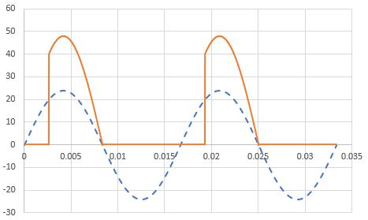{width="100mm"}

-   As the positive half-wave rises, no current flows until the incoming signal passes $V_{BR_f}$.
-   At that point, current begins to flow, and continues to flow until the voltage across the device drops to practically zero.
-   After this, no current flows throughout the negative half cycle, nor throughout the beginning of the next positive cycle.

The voltage across the Shockley diode looks like the following, with the voltage dropping to under a volt once the device is turned on. Otherwise, the entire supply appears across it, so its voltage there looks just like the input.

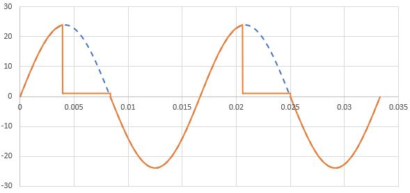{width="100mm"}

As can be seen from these diagrams, power is available from somewhere between $90^\circ$ and $180^\circ$ out of the total $60^\circ$. The greater the amplitude of the AC power or the lower the forward breakdown for the Shockley Diode, the closer to $180^\circ$ of conduction, since the breakover voltage is reached earlier in the cycle. Consequently, a Shockley Diode can only allow for less than half of the available AC power.

#### Silicon Controlled Rectifier—SCR

::: column-margin
{width="100"} Symbol for a Silicon-Controlled Rectifier (SCR)
:::

The SCR is a three-pin device that behaves like a Shockley Diode with a controlled forward breakover voltage. The controlling pin is called a Gate, although its function is considerably different from that of the Gate in a FET. In the context of an SCR, the Gate "opens" the main current path in response to the injection of sufficient Gate current. In many circuits, this occurs at a voltage established using a voltage divider that follows the voltage across the SCR. In this configuration, once the trigger occurs and the SCR is turned On, the voltage at the Gate drops, so no further Gate current is injected. It is no longer needed, as the SCR remains On until the signal crosses the zero line anyway.

With no connection to the Gate, the SCR will behave as a Shockley Diode, but usually the forward breakover voltage is higher than the peak voltage of the AC source. However, by injecting Gate current, the forward breakover voltage can be lowered, turning the SCR on earlier in the positive half-cycle.

The following transfer function shows how varying the timing of the injection current into the Gate affects the forward breakover voltage.

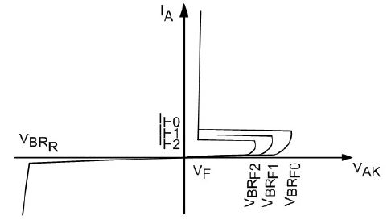{width="100mm"}

The graph below shows an SCR with Gate current injected to reduce the forward breakover voltage to just under $24 V$, then $20 V$, and finally to $10 V$.

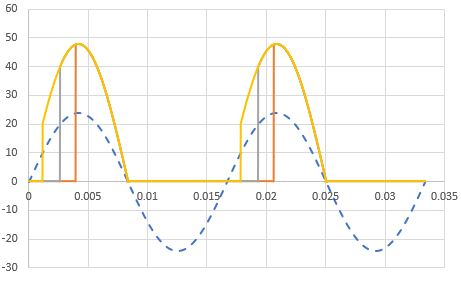

Here are the voltage curves for the same settings as in the current graphs above:

As can be seen from these sets of graphs, the SCR can be adjusted to provide between approximately $90^\circ$ and close to $180^\circ$ using the Gate.

As previously mentioned, SCRs are usually chosen to have a basic $V_{AK}$ that is significantly higher than the peak voltage of the AC signal so that, with no Gate current injected, the SCR will be Off. If a voltage divider is used to control the Gate injection current, as the voltage divider is adjusted, it will bring VAK down to where it first starts to fire at the top of the cycle ( $90^\circ$ ) then will move it toward $180^\circ$. The circuit to the right demonstrates this type of circuit, which is a fader, but not a very good one.

::: column-margin
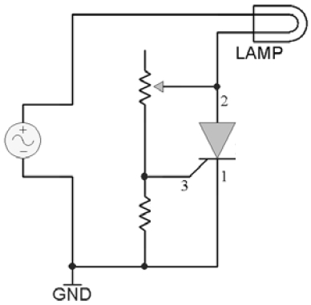{width="200"} SCR Simple Fader Circuit
:::

The problem with this circuit is that it kicks in at $90^\circ$ of the available $360^\circ$, and it can only be adjusted to increase the conduction angle to somewhat less than $180^\circ$. In other words, it can adjust the power from about a quarter of the total to just under a half -- not very impressive. We would most likely prefer to have a fader that starts from zero and can increase the conduction angle to the maximum available, which, for an SCR, is ideally $180^\circ$; in other words, from no power to half power.

Some more sophisticated fader circuits introduce circuitry to inject Gate current at any point during the SCR's active half-cycle, allowing for power control from zero to half of what's available from the AC source.

#### Optoisolation

For both the SCR and the TRIAC (next topic), optoisolation offers at least the following two possibilities:

-   isolating high power AC circuits from low voltage DC control circuitry -- this will be discussed in another topic

-   allowing for logic-level trigger control of the AC power controller

This last item will be investigated briefly in one of our exercises. The following is an equally brief description of the process and an evaluation of its effectiveness in comparison to AC variable power control.

With a comparator, it is easy to detect when the AC power signal crosses zero volts. With an edge detector, it is possible to determine if the crossing is from positive to negative or from negative to positive.

Since we want to be able to control the trigger time for the SCR starting from the end of the positive half-cycle, we could create a pulse that goes LOW at that point in time. Then, we could increase the duty cycle of the pulse so that its positive-going edge moves forward with respect to the negative-going crossing point, as shown in the following graph.

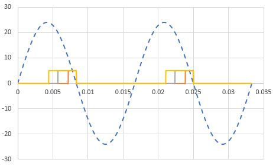

This diagram shows three different pulse widths, where the red trace would turn the SCR on for only a short time and the yellowish trace would turn the SCR on for considerably more of the useful half-cycle, resulting in a brighter output in a fader application. This type of control is not possible using variable resistors and capacitors, and can be much more carefully controlled.

*Duty Cycle*—the duty cycle of a pulse is determined by

$t_d=\frac{t_p}{T}$

or, as a percent,

$t_d=\frac{t_p}{T}\times100\%$

where $t_d$ is the duty cycle, $t_p$ is the pulse width, and $T=\frac{1}{f}$ is the period of the pulse.

Pulse Width Modulation (PWM) is the process of varying the duty cycle of a pulse, and is the term applied to the process described above.

#### Other Four-Layer Devices

The SCR is by far the most commonly used four-layer device. There are, however, two other devices you may run into:

Programmable Unijunction Transistor (PUT) -- this one is really badly named: with four layers, it has three junctions, not one; and it's only "programmable" in terms of the designer being able to change its electrical conditions externally. It gets its name because it behaves somewhat similarly to a Unijunction Transistor (UJT), which, in turn, is similar to a JFET. All three of these share the characteristic of having an external pin that can turn them OFF. So, unlike the SCR, once the PUT triggers and is in its On condition, the external circuitry can turn it off before the end of the positive half-cycle.

Silicon-Controlled Switch (SCS)---this one has two Gates—one to control when it turns ON, like an SCR, and one to control when it turns OFF, like a PUT.

We will not further investigate these devices in this course. They are usually reserved for some pretty specialized control circuits.

### Full-Wave AC Power Controllers

Modern AC Power Controllers are usually five-layer devices, which allow control of the full (positive and negative) AC wave. Although they may look like they could be installed either way up in a circuit, the polarity actually matters—be sure to read the manufacturer's data sheet! This author believed what he had been told about a two-transistor model of the TRIAC, and ended up with pieces of hot plastic bouncing off the walls while working on his SAIT final project because the Gate was $180^\circ$ out of phase from what it should have been!

#### DIAC

::: column-margin
{width="100"} Symbol for a DIAC
:::

The DIAC is the full-wave equivalent of the Shockley Diode---it breaks over both at a relatively high positive voltage on the positive half wave and at a relatively high negative voltage on the negative half wave of an AC signal.

Note that the two pins are both Anodes---$A_1$ and $A_2$. These devices have nothing labelled as a Cathode.

The transfer function for a DIAC looks like the following:

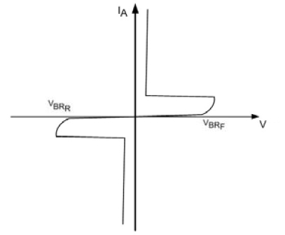{width="400"}

Note that $V_{BR_r}$ for this device is not a reverse breakdown in the sense we've used it before -- it's a reverse breakover voltage which triggers the device into an *On* condition in the negative direction, producing a significant current over a fairly small device voltage.

The following shows the current generated by a DIAC with forward and reverse breakovers of $\pm20 V$, under the same conditions as the Shockley Diode investigated earlier.

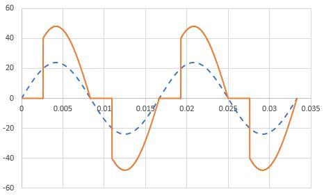

The following shows the voltage curve expected for the DIAC in the current graphs above. As with the Shockley Diode, once the DIAC has turned on, the voltage across it drops to under $\pm1 V$; otherwise, the entire source voltage appears across it as it acts as an Open in the circuit.

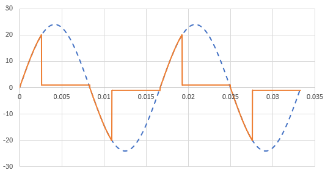

#### TRIAC

::: column-margin
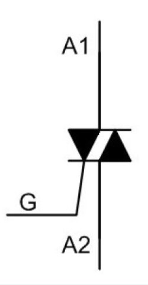{width="100"} Symbol for a TRIAC
:::

The TRIAC is the full-wave equivalent to the SCR -- a device with a Gate to control both the forward and reverse breakover voltages.

Here is a typical transfer function for a TRIAC:

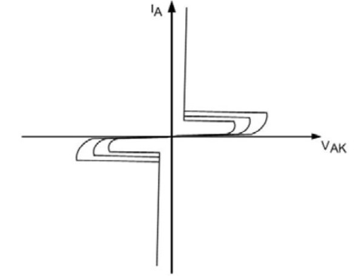{width="300"}

The following shows a TRIAC with basic breakover voltages much higher than the peak voltage of the power signal, with Gate current injected to trigger the device at just under $24 V$, then $20 V$ and finally $10 V$.

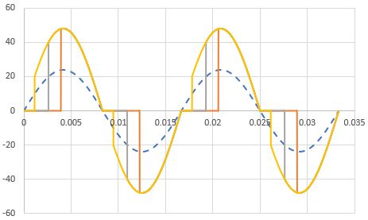

Here are the matching voltage curves for the current curves in the graph above:

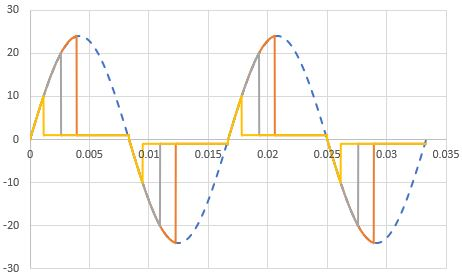

Notice that, when the TRIAC is set to turn on for most of the cycle, the signal looks like just short spikes following the zero crossing points of the incoming signal, then the device remains turned on until the next zero crossing point.

When connecting a modern TRIAC in a circuit, the Gate phase needs to be matched to the $A_1$ anode.

As with the SCR, the TRIAC can be used in a power fader. Assume the TRIAC chosen has inherent breakover voltages that are greater than the peak voltage of the power signal. With no Gate current injected, the TRIAC will be Off. If the Gate current is injected using a controllable voltage divider, the TRIAC can be triggered to turn on from just about $90^\circ$ to $180^\circ$, then to turn on again from just about $270^\circ$ to $360^\circ$. That means that, once the TRIAC is triggered, the minimum power delivered to the load will be just over half the total available. A fader circuit like this can provide power control from half to full power, but not from zero to half power. With more sophisticated circuitry, the starting angles can be moved towards $0^\circ$ and $180^\circ$, allowing for a full control from $0^\circ$ to $360^\circ$. The TRIAC doubles the amount of power that can be delivered by an SCR.

In many TRIAC faders, a DIAC is used to trigger the Gate so that the current into the Gate is turned on suddenly when the DIAC breaks over, producing a much more reliable *On* starting condition. Without the DIAC, a TRIAC fader will typically flicker at low power settings.

#### Optoisolation

As with the SCR, optoisolators with light-activated TRIACs are available. These can be used simply to turn a power TRIAC on or off. However, as with the SCR optoisolator, it is possible to synchronize a pulse width modulator (PWM) to both the positive-going and negative-going zero crossing points of the AC power signal to provide carefully-managed full power control. In order to establish full-wave power control, the pulse width modulation would look something like the following:

[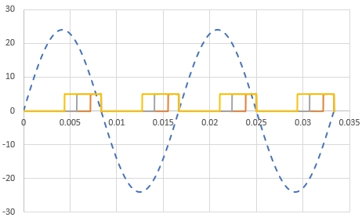](PWM%20Control%20of%20a%20TRIAC)

### Optically-Isolated Power Controllers

In a Smart Home application or a PLC-controlled industrial process, some form of logic circuit or microcontroller will be used to control an AC-powered device. Although other devices such as relays and solid state relays (SSR) could be used, often an SCR or a TRIAC is used as an inexpensive and quiet alternative.

To protect the logic circuit or microcontroller, the circuit should be optically isolated. Just as was the case for controlling power transistors, optocouplers have been designed for SCR and TRIAC circuits.

In one of your projects, you will be using a TRIAC optocoupler to activate a TRIAC in a circuit similar to the one below. Note that this is an ON/OFF only circuit–-more complex circuitry would be required to produce a power range such as that needed for a power fader.

Since the concept is the same for an optically-isolated SCR, you haven't been asked to purchase an SCR optocoupler. Typically, designers opt for TRIACs in power controllers due to the extra power available anyway, so SCR optocouplers are not as readily available as TRIAC optocouplers.

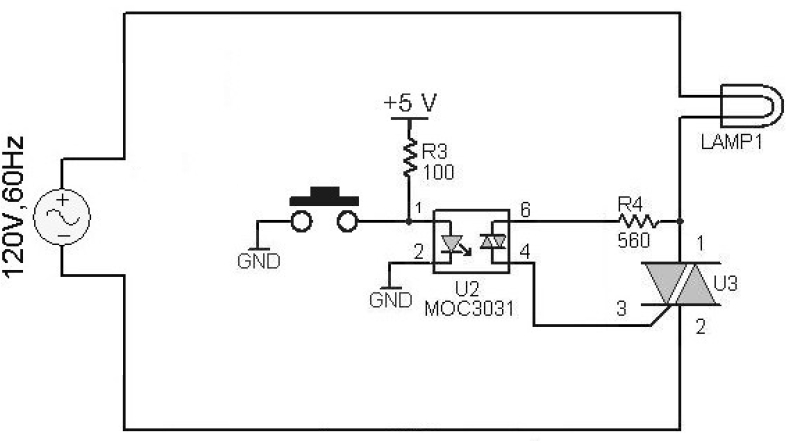

In this circuit, the switch forms an *Active-Low* logic switch. It could be replaced by an NPN transistor driven by the logic circuit or microcontroller, in which case the transistor would be capable of providing sufficient current to turn on the LED in the optocoupler, while the much smaller Base current required to turn on the transistor would not load the logic circuit or microcontroller.

1.  When the switch in the above circuit is OPEN, current will \_\_\_\_\_\_\_\_\_\_ (Flow/Not Flow) through the LED, and the optocoupler's TRIAC will \_\_\_\_\_\_\_\_\_\_ (activate/not activate) the power TRIAC, and the Lamp will \_\_\_\_\_\_\_\_\_\_ (glow/not glow).
2.  If the switch was to be replaced by a 2N3904 BJT, driving the properly-biased Base HIGH would put the transistor into \_\_\_\_\_\_\_\_\_\_ (cutoff/saturation) , the LED would \_\_\_\_\_\_\_\_\_\_ (glow/not glow) , and, following the circuit through, the Lamp would \_\_\_\_\_\_\_\_\_\_ (glow/not glow).
3.  A better circuit could be built by putting the 2N3904 transistor between optocoupler pin 2 and ground. Now, driving the Base HIGH would put the transistor into \_\_\_\_\_\_\_\_\_\_ (cutoff/saturation), and the Lamp would \_\_\_\_\_\_\_\_\_\_ (glow/not glow) .
4.  In the circuit of question 2, if the microcontroller was accidentally disconnected, the Lamp would \_\_\_\_\_\_\_\_\_\_ (glow/not glow) . Consequently, from a power consumption and safety perspective, the safer circuit is \_\_\_\_\_\_\_\_\_\_(circuit 2/circuit 3).



::: border
## Self-Test Answers
:::

1.  

    -   flow
    -   activate
    -   glow

2.  

    -   saturation
    -   not glow
    -   not glow

3.  

    -   saturation
    -   glow

4.  

    -   glow

    -   circuit 3
