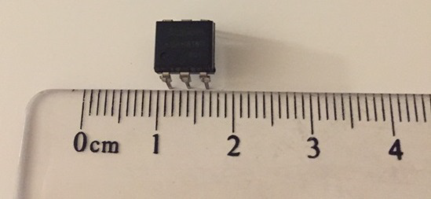
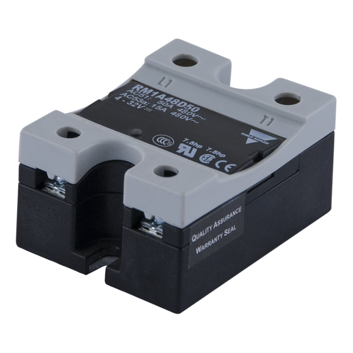

## Semiconductor AC Power Controllers

Practically everything you've done in your previous work with
semiconductor devices has involved DC power. We used diodes to convert
AC power to DC power, but beyond that, we've powered BJT circuits, FET
circuits, Op Amp Circuits, Comparator circuits, and Logic circuits
using DC---either with carefully-regulated power supplies or
batteries. Yes, we've used some of these devices to manipulate AC
signals, but they've always been powered using DC.

Many devices used commercially or industrially are designed to run on
AC power. Up to this point in your study of electricity and
electronics, the only ways we've used to turn AC power on and off have
been switches, relays, and SSRs. We haven't even tried to control AC
power over a range of values (analog), as switches and relays can only
be on or off (binary).

However, you've likely encountered full-range AC power controllers as
implemented in the home: You may have a room in your house with a
dimmer for the lights instead of a switch, you may have a floor lamp
with a dimmer, and your high-efficiency furnace may speed up and slow
down the fan as it goes through its heating cycle. In industry, huge
three-phase AC motors may have speed controllers that can be
manipulated by the operator or by control circuitry.

### Four and Five Layer Semiconductor Devices

The BJT transistors you studied earlier are three-layer devices,
either PNP or NPN. As such, they must be biased appropriately with DC
power supplies: For an NPN transistor, the Collector must be at a
higher voltage than the Emitter, and control is exercised by running a
current through the positively-biased Base to Emitter junction. For a
PNP transistor, the Collector must be at a lower voltage than the
Emitter, and control is exercised by running a current through the
negatively-biased Base to Emitter junction.

William Shockley was a researcher at Bell Labs, and, beyond his role
in inventing transistors, he had a particular interest in AC power
control. He invented a number of semiconductor devices that had more
than three layers. Some of his devices were four-layer (NPNP or PNPN)
and some were five layer (NPNPN or PNPNP). It turned out that these
devices responded in surprising but useful ways to AC signals.

Some sources use the general term *Thyristor* to include all of the
four and five layer devices, whereas other sources use the term for
only one of these---the SCR. Because of this uncertainty in
terminology, we'll use specific names for all of these devices.

All these devices (with the exception of two which have been specially designed to have shut-off control) have this unusual characteristic in common:  once they have been activated, they remain ON until the voltage across them drops practically to zero.  Therefore, they are not particularly useful for DC circuits -- activate the device, and you can't turn it off!  Of course, creative people have come up with ways to use these devices in DC circuits, but they are definitely best used in AC circuits.

In an AC circuit, the supply voltage crosses zero twice each cycle, or 120 times per second in North America.  So, in an AC application, these devices, when activated, will be turned off 120 times a second, ready to be activated again.

Although these devices can be approximately modelled as pairs of coupled transistors, the model sometimes doesn't adequately explain the operation of the device, so that particular model will not be presented in this course.  If you're interested, you can look it up for yourself.  Instead, we will simply describe the behaviour of each device from an operational point of view -- "this is what it does"  -- rather than from a theoretical point of view -- "this is why".

Four-layer Half-Wave AC Power Controllers

The four-layer devices can control only one polarity of the AC signal.  Typically, this is the positive half wave, with the negative half wave producing no useful power.  It is also possible to use these devices to control the negative half wave, with the positive half wave producing no useful power, but that is much less common.

Shockley Diode

The basic four-layer device is called the Shockley Diode, although it is not actually a diode (the names of these devices can be a bit confusing, as you will see!).  (Don't confuse the Shockley Diode with the Schottky Diode, which is a special high-frequency/high power diode using a P-Type to metal junction.)  The Shockley Diode has only two pins, and is given the following symbol:

To begin with, the device is OPEN, allowing no current to flow.  As the Anode to Cathode voltage increases, it remains OPEN until a relatively large breakover voltage (VBRf) is reached and sufficient current is injected into the Gate to turn the device On; after this, it continues to conduct until the current is turned off or the Anode to Cathode voltage is reduced to practically zero.  The following transfer function demonstrates this.

Note the following:

This curve is not "reversible".
It starts at (0,0), follows an increase in VAK up to the forward breakover voltage VBRf and the injection of current IH.
VAK then drops to a much lower value, VF, as it has now been turned On.
If biased properly, sufficient current now flows to "hold" it in the On condition -- IH.
If the voltage across the device is dropped to zero, the cycle can start over again at (0,0).
As with other semiconductor devices you've investigated, there is also a reverse breakdown voltage, VBRr which should be avoided to prevent damage to the device.
The reverse breakdown of the device does not resemble the forward breakdown, and occurs at a much greater voltage; so this device only acts as an electronic switch in response to a positive VAK.
Once the device is conducting, its current must be limited by external biasing devices, such as a resistor, motor, lamp, etc., or the device will burn out (thermal destruction).
When biased in an AC circuit, the current transfer function of a Shockley Diode looks like the following.  The dotted line represents the voltage of the power signal with an amplitude of 24 Vp, and the other trace represents the current in milliamps supplied to a 500 Ω load by a Shockley Diode with a forward breakover of 20 V.  (The numbers on the Y-axis represent voltage for the input signal and current for the output signal -- that's a bit confusing, so take a moment to examine this graph and the ones that follow.)

As the positive halfwave rises, no current flows until the incoming signal passes VBRf.
At that point, current begins to flow, and continues to flow until the voltage across the device drops to practically zero.
After this, no current flows throughout the negative half cycle, nor throughout the beginning of the next positive cycle.
The voltage across the Shockley diode looks like the following, with the voltage dropping to under a volt once the device is turned on.  Otherwise, the entire supply appears across it, so its voltage there looks just like the input.

As can be seen from these diagrams, power is available from somewhere between 90º and 180º out of the total 360°.  The greater the amplitude of the AC power or the lower the forward breakdown for the Shockley Diode, the closer to 180° of conduction, since the breakover voltage is reached earlier in the cycle.  Consequently, a Shockley Diode can only allow for less than half of the available AC power.

Silicon Controlled Rectifier -- SCR

The SCR is a three-pin device that behaves like a Shockley Diode with a controlled forward breakover voltage.  The controlling pin is called a Gate, although its function is considerably different from that of the Gate in a FET.  In the context of an SCR, the Gate "opens" the main current path in response to the injection of sufficient Gate current.  In many circuits, this occurs at a voltage established using a voltage divider that follows the voltage across the SCR.  In this configuration, once the trigger occurs and the SCR is turned On, the voltage at the Gate drops, so no further Gate current is injected.  It is no longer needed, as the SCR remains On until the signal crosses the zero line anyway.

With no connecton to the Gate, the SCR will behave as a Shockley Diode, but usually the forward breakover voltage is higher than the peak voltage of the AC source.  However, by injecting Gate current, the forward breakover voltage can be lowered, turning the SCR on earlier in the positive half-cycle.

The following symbol is used to represent an SCR:

The following transfer function shows how varying the timing of the injection current into the Gate affects the forward breakover voltage.

The following graph shows an SCR with Gate current injected to reduce the forward breakover voltage to just under 24 V, then 20 V, and finally to 10 V.

Here are the voltage curves for the same settings as in the current graphs above:

As can be seen from these sets of graphs, the SCR can be adusted to provide between approximately 90º and close to 180º using the Gate.

As previously mentioned, SCRs are usually chosen to have a basic VAK that is significantly higher than the peak voltage of the AC signal so that, with no Gate current injected, the SCR will be Off.  If a voltage divider is used to control the Gate injection current, as the voltage divider is adjusted, it will bring VAK down to where it first starts to fire at the top of the cycle (90º) then will move it toward 180º.  The following circuit demonstrates this type of circuit, which is a fader, but not a very good one.

The problem with this circuit is that it kicks in at 90º of the available 360º, and it can only be adjusted to increase the conduction angle to somewhat less than 180º.  In other words, it can adjust the power from about a quarter of the total to just under a half -- not very impressive.  We would most likely prefer to have a fader that starts from zero and can increase the conducton angle to the maximum available, which, for an SCR, is ideally 180º; in other words, from no power to half power.

Some more sophisticated fader circuits introduce circuitry to inject Gate current at any point during the SCR's active half-cycle, allowing for power control from zero to half of what's available from the AC source.

Optoisolation

For both the SCR and the TRIAC (next topic), optoisolation offers at least the following two possibilities:

isolating high power AC circuits from low voltage DC control circuitry -- this will be discussed in another topic
allowing for logic-level trigger control of the AC power controller
This last item will be investigated briefly in one of your exercises.  The following is an equally brief description of the process and an evaluation of its effectiveness in comparison to AC variable power control.

With a comparator, it is easy to detect when the AC power signal crosses zero volts.  With an edge detector, it is possible to determine if the crossing is from positive to negative or from negative to positive.

Since we want to be able to control the trigger time for the SCR starting from the end of the positive half-cycle, we could create a pulse that goes LOW at that point in time.  Then, we could increase the duty cycle of the pulse so that its positive-going edge moves forward with respect to the negative-going crossing point, as shown in the following graph.

This diagram shows three different pulse widths, where the red trace would turn the SCR on for only a short time and the yellowish trace would turn the SCR on for considerably more of the useful half-cycle, resulting in a brighter output in a fader application.  This type of control is not possible using variable resistors and capacitors, and can be much more carefully controlled.

Duty Cycle -- the duty cycle of a pulse is determined as

td=tpT

or, as a percent,

td=tpT×100%

where td is the duty cycle, tp is the pulse width, and T is the period of the pulse.

Pulse Width Modulation (PWM) is the process of varying the duty cycle of a pulse, and is the term applied to the process described above.

Other Four-Layer Devices

The SCR is by far the most commonly used four-layer device.  There are, however, two other devices you may run into:

Programmable Unijunction Transistor (PUT) -- this one is really badly named:  with four layers, it has three junctions, not one; and it's only "programmable" in terms of the designer being able to change its electrical conditions externally.  It gets its name because it behaves somewhat similarly to a Unijunction Transistor (UJT), which, in turn, is similar to a JFET.  All three of these share the characteristic of having an external pin that can turn them OFF.  So, unlike the SCR, once the PUT triggers and is in its On condition, the external circuitry can turn it off before the end of the positive half-cycle.

Silicon-Controlled Switch (SCS) -- this one has two Gates -- one to control when it turns ON, like an SCR, and one to control when it turns OFF, like a PUT.

We will not further investigate these devices in this course.  They are usually reserved for some pretty specialized circuits.

Full-Wave AC Power Controllers

Modern Full-Wave AC Power Controllers are usually five-layer devices.  Although they may look like they could be installed either way up in a circuit, the polarity actually matters -- be sure to read the manufacturer's data sheet!  This author believed what he had been told about a two-transistor model of the TRIAC, and ended up with pieces of hot plastic bouncing off the walls while working on his SAIT final project because the Gate was 180º out of phase from what it should have been!

DIAC

The DIAC is the full-wave equivalent of the Shockley Diode -- it breaks over both at a relatively high positive voltage on the positive half wave and at a relatively high negative voltage on the negative half wave of an AC signal.

Here's the symbol for a DIAC:

Note that the two pins are both Anodes -- A1 and A2.  These devices have nothing labelled as a Cathode.

The transfer function for a DIAC looks like the following:

Note that VBRr for this device is not a reverse breakdown in the sense we've used it before -- it's a reverse breakover voltage which triggers the device into an On condition in the negative direction, producing a significant current over a fairly small device voltage.

The following shows the current generated by a DIAC with forward and reverse breakovers of ±20 V, under the same conditions as the Shockley Diode investigated earlier.

DIAC V

The following shows the voltage curve expected for the DIAC in the current graphs above.  As with the Shockley Diode, once the DIAC has turned on, the voltage across it drops to under ±1 V; otherwise, the entire source voltage appears across it as it acts as an Open in the circuit.

TRIAC

The TRIAC is the full-wave equivalent to the SCR -- a device with a Gate to control both the forward and reverse breakover voltages.

Here are the symbol and expected transfer function for the TRIAC:

The following shows a TRIAC with basic breakover voltages much higher than the peak voltage of the power signal, with Gate current injected to trigger the device at just under 24 V, then 20 V and finally 10 V.

Here are the matching voltage curves for the current curves in the graph above:

Notice that, when the TRIAC is set to turn on for most of the cycle, the signal looks like just short spikes following the zero crossing points of the incoming signal, then the device remains turned on until the next zero crossing point.

When connecting a modern TRIAC in a circuit, the Gate phase needs to be matched to the A1 anode.

As with the SCR, the TRIAC can be used in a power fader.  Assume the TRIAC chosen has inherent breakover voltages that are greater than the peak voltage of the power signal.  With no Gate current injected, the TRIAC will be Off.  If the Gate current is injected using a controllable voltage divider, the TRIAC can be triggered to turn on from just about 90º to 180º, then to turn on again from just about 270º to 360º.  That means that, once the TRIAC is triggered, the minimum power delivered to the load will be just over half the total available.  A fader circuit like this can provide power control from half to full power, but not from zero to half power.  With more sophisticated circuitry, the starting angles can be moved towards 0º and 180º, allowing for a full control from 0º to 360º.  The TRIAC doubles the amount of power that can delivered by an SCR.

In many TRIAC faders, a DIAC is used to trigger the Gate so that the current into the Gate is turned on suddenly when the DIAC breaks over, producing a much more reliable On starting condition.  Without the DIAC, a TRIAC fader will typically flicker at low power settings.

Optoisolation

As with the SCR, optoisolators with light-activated TRIACs are available.  These can be used simply to turn a power TRIAC on or off.  However, as with the SCR optoisolator, it is possible to synchronize a pulse width modulator (PWM) to both the positive-going and negative-going zero crossing points of the AC power signal to provide carefully-managed full power control.  In order to establish full-wave power control, the pulse width modulation would look something like the following:

## Electromechanical Relays

You've had quite a lot of experience with relays up to this
point---you've used them in your Semiconductors course to show how
circuits can be controlled using BJT and FET transistors acting as
relay drivers; you've used them earlier in this course as one means of
achieving Galvanic Isolation---Electromechanical Isolation.

In all cases, you've had a relatively small DC current in a coil
opening and closing mechanical switches which can be used to activate
isolated circuits of differing voltages and even differing forms---DC
or AC.

You've been carefully instructed always to place a reverse-biased
diode across the coil when activating a DC relay with a semiconductor.
When we attempt to suddenly stop the current through an inductor or an
inductive coil such as the activating coil in a relay, there will be a
sudden very high voltage generated across the open spot in the
circuit. This voltage will quickly exceed the reverse breakdown
voltage of a BJT or FET, resulting in a sudden current at high voltage
through the semiconductor device. The instantaneous power will be
quite high ($P=IV$), and may destroy the semiconductor device. With
small coils, the energy available may not be sufficient to destroy the
device, but may damage it progressively over time. The reverse biased
diode across the coil (sometimes called a "flyback diode" or "snubber
diode") will become temporarily forward biased by the coil-induced
voltage spike. Since its cathode is directly connected to the DC power
supply, the voltage spike will be reduced to approximately 0.7 V above
the supply rail for a silicon diode or approximately 0.2 V above the
supply rail for a Schottky diode, and will therefore not exceed the
reverse breakdown voltage of the semiconductor device. The energy of
the spike will be dissipated as heat from the other components in the
circuit---primarily the resistance of the coil itself.

In addition to relays such as the one in your kit, which is to be
activated using a DC supply ($12 V_{DC}$, to be specific), there are
AC-activated relays. These use different coil configurations to
generate magnetic fields from AC currents, but otherwise their basic
functionality is the same: Activating the coil activates the switches
to control circuits that are usually isolated from the control signal.
AC-activated coils cannot be protected by a single diode in the way
that DC coils can be, since the polarity reverses many times a second,
and the diode would act as a half-wave rectifier. Instead,
AC-activated relays need either snubber capacitors to prevent rapid
changes in voltage across the coil or back-to-back Zener diode
clippers.

Of course, you only have a DC-activated coil at your disposal; but
knowing a bit about AC-activated coils could be useful to you in a
future employment situation.

## Solid-State Relays (SSRs)

Solid state relays are not, by the conventional use of the term,
actually relays. Instead, they are semiconductor devices designed to
mimic (and often improve upon) electromechanical relays.

There are a number of types of SSRs, so you will need to consider a
number of factors when choosing an SSR.

  - Control side -- most SSRs use optocouplers at their inputs, so the
    circuitry that drives them must be capable of turning on an LED.
    - Most SSRs expect a DC current through a forward-biased internal
      LED to activate the circuit.
    - Some SSRs have two LEDs connected anode to cathode in parallel
      so that they can be activated by AC signals instead of the usual
      DC signals.
    - In either case, external circuitry must be capable of
      controlling the LED or LEDs, and must limit the current so as
      not to destroy the LEDs.
  - Switching side -- unlike the electromechanical relay which simply
    closes switches so current can flow either way or alternatively
    both ways through the switch, SSRs use semiconductor switches --
    BJTs, FETs, SCRs, TRIACs, etc. Therefore, its important to pick an
    SSR that can handle the circuit power you need to switch.
    - Some SSRs can only switch DC power, and polarity is critical
      (you can't reverse the terminals). These SSRs use power BJTs or
      power FETs, controlled by phototransistors in the optocoupler
      section, so you'll need to keep in mind the transistor biasing
      rules you learned in your Semiconductors course.
    - Some SSRs can only switch AC power. These SSRs use power SCRs or
      power TRIACs, controlled by photo-SCRs and photo-TRIACs in the
      optocoupler section. As with any SCR or TRIAC circuit, these
      can't be used to control DC circuits, because once they're
      turned on they can't be turned off unless the supply voltage
      drops to zero.
    - Some SSRs are designed to switch both AC and DC. These usually
      involve creative configurations of power FETs in the output,
      biased to conduct current in either direction in ways you
      haven't studied in previous courses. These SSRs most closely
      emulate electromechanical relays, and can be used
      interchangeably with them, as long as they have equivalent
      specifications.

Here are two different SSRs -- one from your kit, the other used in
the Chemical Plant for the Industrial Processes course:

{width="250"}

{width="225"}

This second SSR is sometimes referred to as a "puck" SSR, as it is
close to the size of a hockey puck (but is much more expensive).

SSRs typically have the following advantages over electromechanical
relays:

  - They don't require protection diodes, as there is no inductive
    current to protect other parts of the circuit against.
  - They can operate at much higher speeds, as there are no moving
    parts
  - They typically last longer, as there is no mechanical wear, and
    there is no deterioration from arcing as would be seen in
    mechanical switches as they open and close
  - They do not exhibit switch bounce, a characteristic of
    spring-loaded mechanical switches which can be interpreted as
    multiple activations
  - They do not generate nearly as much electromagnetic noise as
    electromechanical relays, as there are no physical switches
    opening and closing to generate sparks and electrical fields
  - They are silent, as opposed to the clicking of an
    electromechanical relay

However, SSRs have their disadvantages, as well:

  - They can be quite expensive, particularly if they need to handle
    significant current
  - It is more difficult to design them to withstand high "open"
    voltages
  - They may be damaged by electrostatic discharge
  - The "holding current" at the input needs to be maintained all the
    time the SSR is activated; in an electromechanical relay, it is
    possible to reduce the activation current by up to 90% and still
    maintain, or "hold" the relay in position
  - Their "ON" resistance may not be quite as low as that of an
    electromechanical relay
  - Their "OFF" resistance is high, but won't be as good as an open
    switch

## Self Test

For the questions below, answer with one of:

  1) G2R-2-DC12 Electromechanical Relay
  2) PR3BMF51NSLH Solid-State Relay
  3) Either the Electromechanical or Solid-State Relay

Which device(s) in your kit could be used to control a lamp powered by
the $24 V_{RMS}$ transformer in your kit? \_\_\_\_\_\_\_\_\_\_

Which device(s) in your kit could be used to control a DC motor
powered by the $6 V$ battery pack? \_\_\_\_\_\_\_\_\_\_

Which device(s) in your kit require a snubbing diode when driven by a
BJT or FET? \_\_\_\_\_\_\_\_\_\_

Which device(s) in your kit could be operated directly with either $5
V$ logic or $12 V$ logic on the controlling side? \_\_\_\_\_\_\_\_\_\_



::: border
## Self-Test Answers

- Both
- G2R-2-DC12 EM Relay
- G2R-2-DC12 EM Relay
- PR38BMF51NSLH SSR
:::
