There are quite a few types of electric motors:

-   Brushed motors, AC or DC

-   Brushless motors, AC or DC

-   Induction motors

-   Permanent magnet motors

-   Electromagnetic field magnet motors

-   Stepper motors

-   Servo motors

-   Rotational motors

-   Linear motors

-   Single phase motors

-   Two phase motors

-   Three phase motors

-   ...the list goes on and on.

In addition to motors, there are also solenoid actuators, which we'll discuss briefly below, and which you will use in one of the upcoming activities.

In terms of motors, we'll focus our attention at this point on Permanent Magnet DC motors, as you've got one of those in your kit, and later we'll investigate Servo Motors and Stepper Motors, but first we'll take a big-picture view of electromagnetically-generated motion by looking at some general principles.

## Electromagnetism

Electric motors (and their closely-related relatives the electric generators) all work on the principle of electromagnetism. As you probably learned in secondary school, electricity and magnetism are two aspects of the same phenomena. Our AC power is generated by rotating electromagnets (in a generator) and electromagnets allow us to use electricity to generate a magnetic field. Electromagnetism was one of the first ways that we could use electricity to affect the physical world, and continues to be very useful as time goes by.

The connection between electricity and magnetism is tied to motion: a moving electric charge or current generates a circular magnetic field whose plane is perpendicular to the direction of the charge motion. Similarly, a moving magnetic field -- as in a rotating magnet -- generates a current in any conductor the field passes through.

In earlier studies, you probably encountered various "right hand rules" that helped show the relationships between current, magnetic fields, and magnetic force:

::: {layout-ncol="3"}
{width="150"}

{width="150"}

{width="150"}
:::

These help to indicate the polarity of a magnetic field and the force exerted on a current-carrying wire in a magnetic field. We won't go into any detail on these -- suffice it to say that changing electric currents can move magnets and vice versa, and that's the basis for all electric motors, generators, and solenoid actuators.

You will already be aware of the way electromagnetism is employed in transformers: the changing electric currents in the coils on one side of the transformer generate a magnetic field that is generally confined to the core. This magnetic field induces a current in another coil wound about the other side of the transformer. The requirement that the fields be changing in order for electric fields to induce magnetic fields and vice-versa is why classic transformers don't work with DC.

### Solenoid Actuator

A Solenoid Actuator is typically an electromagnet with a hollow core that houses a magnetically-active shaft, or plunger. When the electromagnet is activated, it generates a force on the plunger causing it to move. When the electromagnet is deactivated, a spring returns the plunger to its resting position.

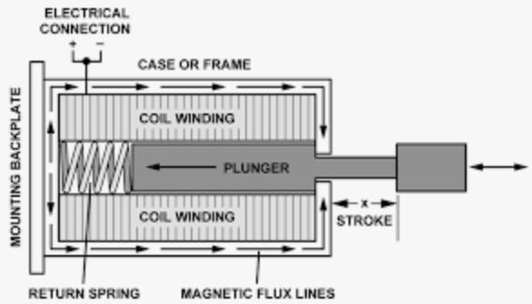

Since the stroke, or distance of travel, is usually relatively short, solenoid actuators often initiate sequences that are translated into greater motion by other sources of force. For example, a solenoid that turns the water on and off for an automatic dishwasher or clothes washer opens a small valve that then uses the water pressure in the line to open a large valve, allowing a large flow of water into the appliance.

Sometimes, it's hard to get any useful information about hobbyist equipment. The solenoid actuator in your kit shows up on the parts list as "SOLENOID VALVE", described as "MICRO MINI SOLENOID VALVE ELECTROMAGNET DC 12V PUSH-PULL". Not a lot to go on! Try searching for the part number printed on it: SH-0452S-016 to see if you can get any more useful information -- if you do, please let this author know!

Here's a link to a solenoid actuator that appears to be the one we're using, at Amazon, of all places!

From the information provided, what is the expected current draw from a 12 VDC supply? Answer 1 mA

What is the effective resistance of the solenoid coil? Answer 2 Ω

## Electric Motors

Many rotating electrical motors use a commutator ring to change the direction of current, and therefore the polarity, of the electromagnets in the rotor or armature as it turns. Look up this link to see an animation of a simple commutated, or brushed motor. The "brushes" are the parts that touch the contacts on the commutator ring. To begin with, the polarity of the rotor is such that it is repelled from the stator magnetic poles it is closest to and attracted to the opposite ones. As the rotor spins toward the magnetic poles it's attracted to, the polarity is reversed at the commutator ring so it is forced to keep moving.

Most brushed motors will have multiple coils that activate one after the other to produce smoother, more continuous power to the output shaft. You can determine the number of coils by counting the sections in the commutator ring and dividing by two.

Brushless AC motors usually rely upon the constantly reversing current in AC power to reverse the polarity of the electromagnets. Consequently, these synchronous motors will operate at multiples or simple fractions of the line frequency -- a clock motor, for instance, may rotate at exactly 10 revolutions per second (600 RPM) if it has six tuned coils.

Many high-power motors, whether AC or DC, use electromagnets in both the rotor and stator, as electromagnets can be smaller for the same field strength as conventional magnets, and rare-earth magnets aren't usually practical for large applications.

Here's the armature of a very large AC motor:

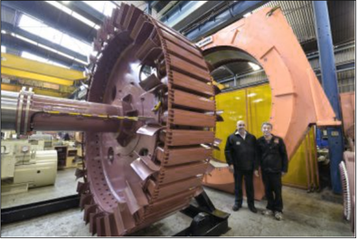

If an external force rotates the shaft of a motor that isn't being driven by a power source, the motor becomes a generator. Picture it this way:

-   A motor converts electrical energy to mechanical energy

-   A generator converts mechanical energy to electrical energy

In both cases, the amount of energy at the output will be less than the energy at the input: the mechanical energy at the output of a motor will be less than the electrical energy at the input, and the electrical energy at the output of a generator will be less than the mechanical energy used to drive the generator.

In an interesting extension of one of the earlier topics in this course, electromechanical isolation can be achieved by mechanically coupling a motor to a generator -- one electrical circuit drives the motor, and the generator drives a second, isolated electrical circuit.

Clearly, there are a lot more variations we could investigate, but let's turn our focus to the motor you will be using first. If you're interested, here are a couple of links to some simple motors you could build:

-   [Build a Simple Electric Motor](https://www.youtube.com/watch?v=WI0pGk0MMhg)[@YTMotor1]

-   [Amazing Electric Motor With Aluminum Cans And Simple Materials](https://www.youtube.com/watch?v=A7Q37jqIdng)[@YTMotor2]

### Permanent Magnet DC Motors (PMDC Motors)

Many small, lower powered motors use permanent magnets in the stator, with electromagnetic coils in the rotor accessed through a commutator ring. Here's an example of the rotor, commutator, and brushes in such a motor:

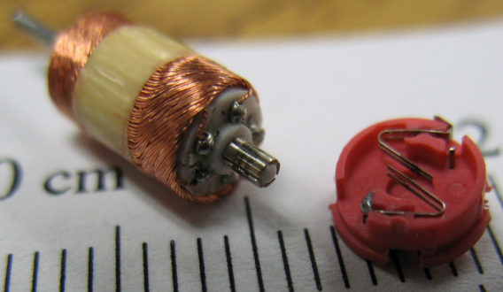

### Mechanical Speed, Torque, and Power

Some basic mathematical relations and terminology that are useful when discussing or analyzing motors are described below

#### Motion in a Circle

Angular velocity ($ω$) is a rate of motion around a fixed point in a circular path with radius ($r$), and has units of radians per second ($\frac{rad}{s}$)

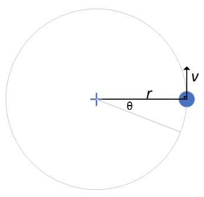

$$ω = \frac{dθ}{dt}$$

which is the same as $$ω = vr$$

Where $v$ is the tangential velocity and $r$ is the radius of travel. Usually, rotational motor speed is indicated in revolutions per minute, or RPM. The relationship between RPM and angular velocity in radians per second is

$$RPM = ω\frac{30}{π}$$

Angular acceleration is the rate of change of angular velocity, which amounts to

$$α=\frac{dω}{dt}$$

Analoguous to linear kinematics, rotational velocity of a shaft can be calculated using

$$ω = ω_o + αt$$

Torque is a measure of how much force is exerted tangentially at a particular distance from a rotational axis, and is measured in newton-metres.

$$τ = Fd$$

or, in terms of radius from the centre of rotation,

$$τ = Fr$$

Another calculation for torque is

$$τ = J_mα$$

where $J_m$ is the *moment of inertia* of the armature, the rotational equivalent of mass (which, as you might remember, is really a measure of the inertia of an object. Note the similarity of this formula to the familiar $F = ma$ for non-rotational forces).

In terms of torque, the rotational velocity can be determined by

$$ω = ω_o + \frac{τ}{J_m}t$$

This means that, under constant mechanical torque, the speed of a motor will change over time from its initial velocity.

Power is the rate of change of energy from one form to another, and, for a rotational system, can be calculated using torque and angular velocity.

$$P_{mech} = ωτ$$

The electrical input power is

$$P_{elec} = IV$$

The law of conservation of energy indicates that any difference between the input power and the useful output power is power lost to something else in the system. The two categories of wasted power in a motor are the winding power, which is the heat generated due to the resistance of the wires in the electromagnetic windings, and power lost to mechanical friction and "windage" -- air motion generated by the rotation of the motor and any cooling fans.

$$P_{elec} = P_{mech} − P_{winding} − P_{FW}$$

The total electrical power can be calculated using $P=IV$.

The power lost as heat from the windings can be calculated using $P=I^2R$

The efficiency of a motor, as with any energy conversion device, is

$$η=\frac{P_{out}}{P_{in}}×100\%$$

#### Quantities and Conversions

As with most measurements, there are a number of systems used for the characteristics we've been discussing. Here are just a few of them that can be used in calculations.

+-----------------------------+---------------------------------+-------------------------------------------+
| Quantity                    | SI Unit                         | Alternate with Conversion                 |
+=============================+=================================+===========================================+
| Power ($P$)                 | Watt ($W$)                      | $0.00134102 hp$ (horsepower)              |
+-----------------------------+---------------------------------+-------------------------------------------+
| Torque($\tau$)              | Newton-Metre ($Nm$)             | $0.7376 ft\cdot lb$ (foot-pound)\         |
|                             |                                 | $10.197 kg\cdot cm$ (kilogram centimetre) |
+-----------------------------+---------------------------------+-------------------------------------------+
| Angular Velocity ($\omega$) | Radians per Second ( $s^{-1}$ ) | $9.549 RPM$ (revolutions per minute)      |
+-----------------------------+---------------------------------+-------------------------------------------+

### Modelling Motor Behaviour

In order to predict how a motor will behave, we can model it fairly simply as follows:

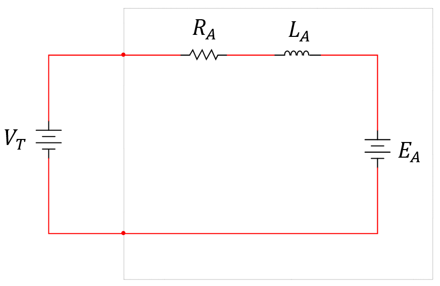{width="400"}

To start with, let's examine $E_A$. This is a voltage called *back EMF*, and its polarity is opposite to that of the power source voltage, $V_T$. Recall that we can drive the shaft of a motor to make it generate electrical power. It stands to reason, then, that a spinning motor is generating electrical power, and the resulting voltage would be opposite to the driving supply. If the driving supply voltage is greater than the back EMF, the motor will accelerate; if the back EMF is greater than the driving supply voltage, the motor will decelerate. A motor will run at a constant speed when the back EMF is equal to the driving supply voltage.

This might help you understand this balance: in an electric vehicle, applying power to the wheel motors accelerates the car, because the applied voltage is greater than the back EMF. When the vehicle reaches its designed speed, the back EMF is equal to the applied power; when the driver wants to decelerate, the "regenerative braking" is actually the motor acting as a generator, because its back EMF is greater than the applied power.

Back EMF can be calculated as follows:

$$E_A=Kϕω_m$$

Where:

-   $K$ is a machine constant

-   $φ$ is the magnetic flux produced by each stator magnetic pole

-   $ω_m$ is the angular velocity of the motor.

When the motor is accelerating and decelerating, there is a net current through the series resistance (winding resistance) and the inductance; if the current is constant, the inductance can be ignored, leaving us with

$$I_A = \frac{V_T−E_A}{R_A}$$

This explanation of the model is somewhat oversimplified, as a motor performing mechanical work will continue to draw current, as the output power will be slightly less than ($P = IV$) so there must be a current present to do the work. Here's a more detailed explanation that includes work performed by the motor:

When the motor is loaded (i.e. doing work), its rotational velocity decreases, so its back EMF also decreases; therefore, the difference between the power source voltage and the back EMF increases, and more current is drawn through the circuit.

Combining the last two expressions (back EMF and circuit current), we arrive at

$$I_A=\frac{V_T−Kϕω_m}{RA}$$

Taking this to the extremes, if the motor is stalled (rotational velocity reduced to zero), back EMF will be zero, and the supply voltage will drive the maximum current through the motor's windings. If the motor is unloaded, it will accelerate to the rotational velocity where back EMF is equal to the power source voltage, and the current will be at a minimum.

Since the free-running motor is doing no useful work, the torque on its armature will be zero.

When the motor is loaded, the current required is related to the torque in the following relationship (a lower-case $k$ has been used to distinguish it from the upper-case $K$ used previously):

$$τ=kϕI_A$$

Where:

-   $ϕ$ is the magnetic flux produced by the motor's permanent magnets

-   $k$ is a factor that represents less-than-perfect coupling of magnetic flux between the magnets and the armature

Substituting in the expression for the armature current, we get

$$τ=\frac{kϕ}{R_A}(V_T−Kϕω_m)$$

We're finally at a point where we can characterize the operation of the motor:

Rearranging the expression above to isolate the motor's angular velocity results in

$$ω_m=\frac{V_T}{Kϕ} − \frac{τR_A}{kKϕ^2}$$

-   With no mechanical load, the second term is zero, and the motor will spin at its maximum speed of $ω_m=\frac{V_T}{Kϕ}$

-   When stalled, $ω_m$ is reduced to zero and the remaining terms can be rearranged to show that $τ_{stall} = kϕ\frac{V_T}{R_A}$

The result is a linear relationship between these two extremes, known as a *Motor Torque/Speed Curve*.

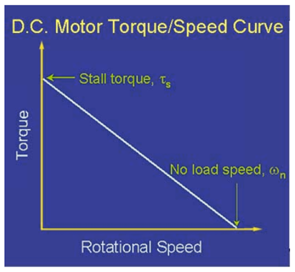

This should look very much like the DC Load Line for a BJT transistor, which leads us to the next topic: the *Quiescent Operating Point* of the motor. In the case of a motor, we want to optimize the power output of the motor. The following image shows that the maximum power should be generated at the midpoint of the line.

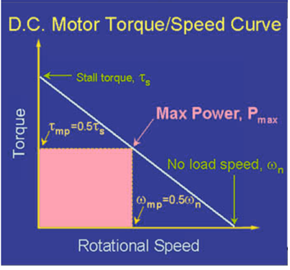

This can be shown another way -- by plotting the speed vs. power over the speed vs. torque graph, as shown below.

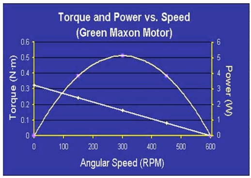

A couple of words of explanation:

-   When the motor is unloaded, its angular velocity is at a maximum but its useful power is zero;

-   when the motor is stalled, its torque is at a maximum but its useful power is zero.

-   Maximum power occurs at half the maximum torque and half the maximum angular velocity, or the midpoint of the speed vs. torque graph.

-   Operating the motor under greater load than this not only reduces the useful power but also stresses the motor and potentially overheats it;

-   Operating with a lesser load not only reduces the useful power but also increases the wear on the motor due to excessive high speeds.

#### Efficiency, Revisited

Here's a complicating factor in determining the optimal conditions for operating the motor -- an analysis of the efficiency of the system.

The efficiency of a motor is maximized at a torque value much lower than half the maximum torque. Here's just an example of one motor's torque vs. efficiency relationship:

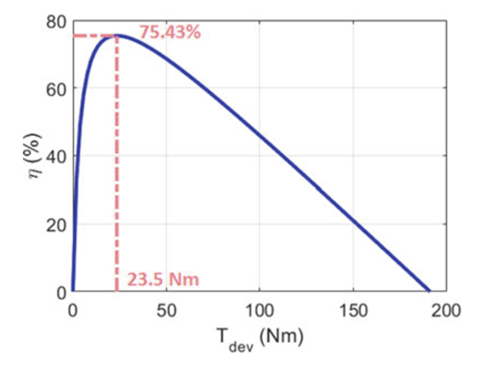

This would mean that, to be efficient, the motor should be run at close to its maximum speed. So, it becomes a toss-up between maximum power and maximum efficiency.

### Gearhead Motors

Since PMDC motors are usually small and operate at high to very high speeds, but with not much torque, many times they are geared down, decreasing the speed while increasing the torque. The gearing unit is usually called a Gearhead or Gearbox. These gearheads may be conventional gear and pinion configurations or planetary gears.

This unit is made up of two conventional gearheads stepping down two PMDC motors to speeds suitable for driving wheels on a toy:

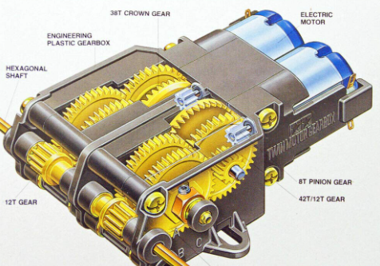

Usually, conventional gear drives have an output shaft that isn't aligned or centred with the motor shaft.

Below is a double-planetary gearhead that reduces the speed and increases the torque of a PMDC motor in an electric screwdriver -- it has enough torque to twist itself out of a pretty strong pair of hands!

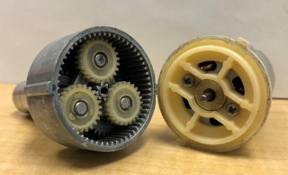

Planetary drives have an output shaft that is aligned with the motor shaft, and may be referred to as *coaxial* (the input and output sharing the central axis).

### Motor Drive Circuits

Motors typically require significant power supplies to meet the motor's demand for power these need to:

-   provide sustained current for performing work

-   provide inrush current during startup or loading, which may be on the order of five times the continuous current

-   handle the current generated by back EMF as the motor slows down

-   mitigate commutator noise to reduce interference with other associated equipment and control circuitry

-   protect sensitive control circuitry from the inductively generated high voltages when the motor is turned off

#### Unidirectional Control

If a PMDC motor only needs to turn in one direction, it can be turned on and off, and can even be speed-controlled, by a single switching element. This would likely be a power BJT or power FET, although a relay could be used for simple on-off control.

Design considerations would include:

-   logic levels or switches for input

-   level translation to the voltages required by the motor

-   current requirements

-   fly-back protection

-   power supply noise decoupling

Here's a suitable unidirectional control circuit using an NPN transistor, capable of level-shifting $3.3 V$ logic to $6 V_{DC}$ for a particular motor:

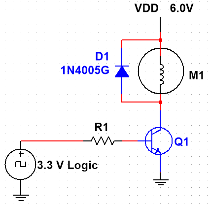

In this circuit, the transistor would need to be able to handle startup and full load current, and $R_1$ should be calculated using the transistor's beta to provide sufficient base current to saturate the transistor.

An unfortunate characteristic of this circuit is that, when the motor is turned OFF, both of its terminals will be at $6 V$, or "live" to anything else that may come in contact with them.

A better circuit uses two transistors to reduce the Base current requirements and to put the motor terminals at ground when the motor is turned OFF:

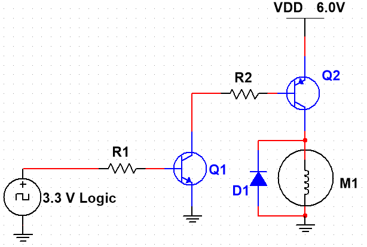

In this circuit, $R_2$ acts as both a Base resistor for $Q_2$ and a Collector resistor for $Q_1$. It needs to provide enough Base current to saturate $Q_2$ with the motor's startup and full load current. The Base current of $Q_2$ is also the Collector current for $Q_1$, so the Base current of $Q_1$ will be quite small, and R1 can be quite big, reducing the current requirements of the $3.3 V$ Logic.

#### Speed Control

Speed control can be introduced by using Pulse Width Modulation (PWM). The frequency of the logic signal needs to be high enough that its instantaneous changes don't have much effect on the motor, as all we want to do is change the average current through the motor. If the duty cycle is $0\%$, the motor will be OFF; if the duty cycle is $100\%$, the motor will be ON; anywhere in between, the average current will be essentially the percentage of the total that matches the duty cycle—$40\%$ duty cycle $≈ 40\%$ of total current.

#### Bidirectional Control

PMDC motors are usually capable of running both forward and reverse, depending on the polarity of the applied signal. It is possible to use a DPDT switch to reverse the polarity applied to the motor, as shown here:

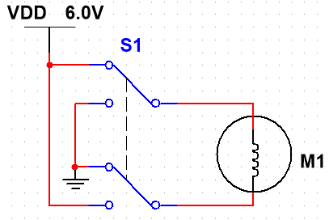

However, this doesn't provide automated control, nor does it provide speed control. The much more common way to provide bidirectional control is the H-Bridge configuration you studied in a previous course. Here's an example adapted from that course using BJTs:

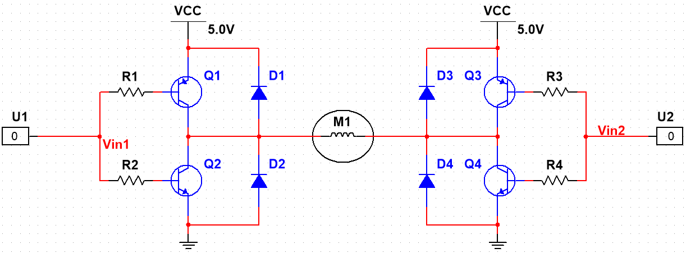

You will probably recall that either "00" or "11" will stop the motor, "10" turns it one way, and "01" turns it the other way.

$D_1$ protects $Q_2$, $D_2$ protects $Q_1$, $D_3$ protects $Q_4$ and $D_4$ protects $Q_3$.

Another example from that course shows a FET H-Bridge with Level Translators to allow five-volt logic to control a twenty-four volt motor:

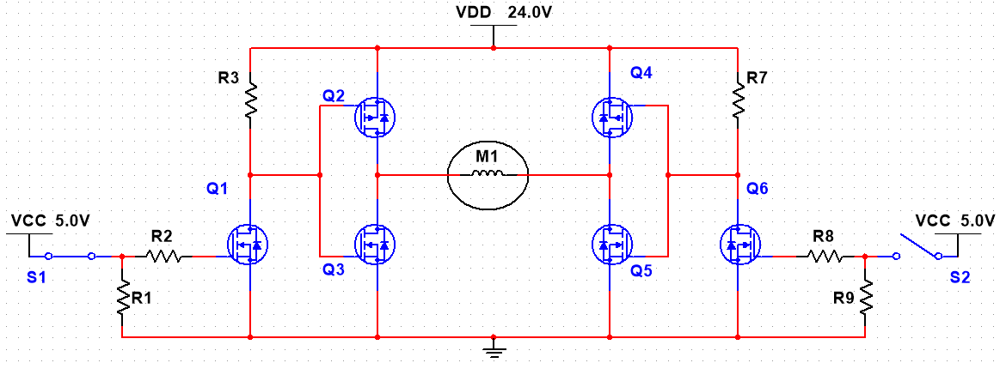

In this design, all the FETs have internal fly-back diodes, so no external ones were required. The small FETs, $Q_1$ and $Q_6$, both have pull-down resistors to ensure that the motor is OFF if the control logic isn't attached.

Speed Control can be introduced by Pulse Width Modulating one of the inputs while the other input establishes the direction of rotation.

#### Commercially-Available H-Bridges

Since motor control is required in so many applications, H-Bridges are commercially available in a wide variety of power handling capacities and control logic levels.

In this course, we will be using an L293D IC called a *Quad Half-Bridge*, which means it can be used as two relatively independent H-Bridges, and could therefore provide reversible control of two motors simultaneously.

Many of these commercially-available units come with controllable *Enable* lines as well as the Logic control lines, which add a new way to control motor speed, as you will investigate in an associated activity in this course.

Many of these also come with heatsinks to help handle the heat dissipated as these devices control large current flows. The L293D doesn't come with a heat sink, but information is provided to help designers determine the heat dissipation requirements.

Some of the commercially-available devices also contain fly-back protection. The "D" in the L293D indicates it contains four protection diodes; the related part, L293, does not contain these diodes, and therefore the designer has to install them externally.

That's a lot of information! Some of it will be directly useful, and some you may not need unless you do motor controller design. Hopefully, you now understand motors and their operation a bit more completely!



::: border
:::
