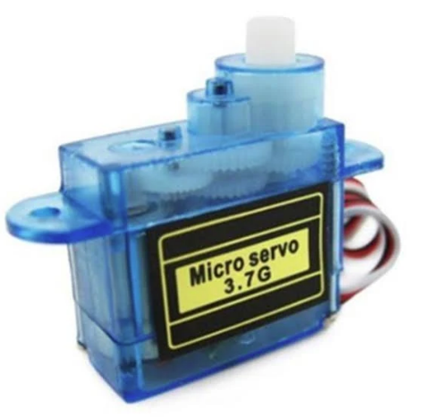
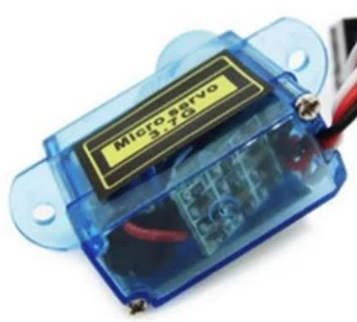

The term "servo motor" or "servomotor" refers to a variety of systems, including DC and AC, rotational and linear (a linear motor has a movable element that travels in or on a track), all of which can be moved to precise positions in their range of travel. Regardless of their differences, all servo motors share the following common features:

-   They have built-in closed loop control systems.

-   Their position can be controlled by an external signal.

Other servo motors may have the following additional characteristics:

-   The speed of movement of some servo motors can also be controlled, and may even be manipulated depending at where the motor is at in its transition from one location to another. For example, a high-performance servo may accelerate gradually to a set speed, then decelerate gradually to stop at its destination position.

-   Some rotational servo motors may be capable of continuous rotation rather than the more typical operation of moving back and forth within a limited range, often no more than 180o.

Some servo motors are large and powerful; however, it's likely that you will mostly encounter the small, relatively inexpensive servo motors that are used in toys, small robotic systems, printers, 3-D printers, etc.

Servo motors like the one in your CNT Year 2 Kit typically use a relatively simple closed loop control system:

-   The position of the output shaft is monitored through the use of a potentiometer configured as a variable voltage divider to provide feedback to the controller.

-   The control system uses two comparators in what is often called a "bang-bang" controller -- the difference between the current position and the desired position generates an error signal that turns the motor on at full speed in the desired direction, determined by which comparator is active; when the motor reaches the desired location, the comparator becomes inactive and the error signal drops to zero, so the power to the motor is stopped instantly. The motor, therefore, switches between full speed and stopped, with no ramp up or ramp down time. Clearly, this wouldn't work for a large motor with a heavy armature. T

-   he control signal is usually a rectangular pulse, with the duty cycle varying over only a small range of values. Often, the range of values will be no more than from 5% to 15%, with 10% generating the middle position of the servo motor shaft.

-   Most rotational servo motors use a gearbox as a reducer, so the actual motor shaft may rotate many times at a high speed to produce a much slower, partial rotation of the output shaft.

The following pictures show the reduction gearing and the control circuitry of one small servo motor, which is similar to the one in your kit, but this one is transparent. Unfortunately, the encoder potentiometer is hidden above the control circuit board, but a mockup of a typical potentiometer is also provided.

::: {layout-ncol="3"}
{width="180"}

{width="180"}

{width="150"}
:::

Notice that there are three wires going into the servo motor: Power (Red), Common (Black), and PWM Control (White). This is a fairly typical colour code for small servo motors like yours.

The power supplied on the Red wire must be sufficient to drive the motor, so it needs to be from a relatively high current-generating voltage source. Power is supplied to the motor through an H-Bridge in the controller circuitry -- a similar H-Bridge to what you used with your PMDC motor earlier. The PWM Control line, on the other hand, provides logic level pulses to a high-impedance input, so it does not need to handle any appreciable current. The motor and control line share the Common line as a current return for the motor and voltage reference for the control line.

One of the challenges with driving servo motors is the tiny range of possible duty cycles employed. Let's investigate:

A particular microcontroller has an eight-bit PWM module. How many possible duty cycles does this represent? \_\_\_\_\_\_\_\_\_\_

The servo motor to be controlled by this microcontroller utilizes duty cycles over a range from 6% to 14% to cover a travel range from 0o to 180o, with 10% placing the motor at 90o. If the entire range of values for the PWM module are to be used as the period, what number should be used for the "duty" for each of the following:

-   $0^\circ$: \_\_\_\_\_\_\_\_\_\_

-   $90^\circ$: \_\_\_\_\_\_\_\_\_\_

-   $180^\circ$: \_\_\_\_\_\_\_\_\_\_

How many possible different positions are available for the motor? \_\_\_\_\_\_\_\_\_\_

What is the resolution for the positioning of the motor, in degrees? \_\_\_\_\_\_\_\_\_\_ $^\circ$

This granularity in operation may be acceptable for some applications, but it may be too coarse for precision work.

Let's repeat for a sixteen-bit PWM module, with the same servo motor:

How many possible duty cycles are available with a sixteen-bit PWM module?\_\_\_\_\_\_\_\_\_\_

Since this is quite a number of possibilities, it may make sense to limit the range to simplify calculating the values for duty cycles. Let's limit the period of the PWM signal to 50,000. What number should be used for each of the following in this system?

-   $0^\circ$: \_\_\_\_\_\_\_\_\_\_

-   $90^\circ$: \_\_\_\_\_\_\_\_\_\_

-   $180^\circ$: \_\_\_\_\_\_\_\_\_\_

How many possible different positions are available for the motor? \_\_\_\_\_\_\_\_\_\_

What is the resolution for the positioning of the motor, in degrees? \_\_\_\_\_\_\_\_\_\_ $^\circ$

Clearly, more bits in the PWM module increases the resolution in positioning a servo motor.



::: border
### Answers

-   $256$

-   $15$

-   $26$

-   $36$

-   $21$

-   $8.6^\circ$

-   $65,536$

-   $3000$

-   $5000$

-   $7000$

-   $4000$

-   $0.045^\circ$
:::
