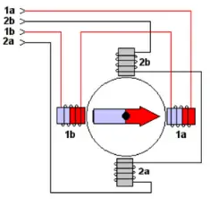
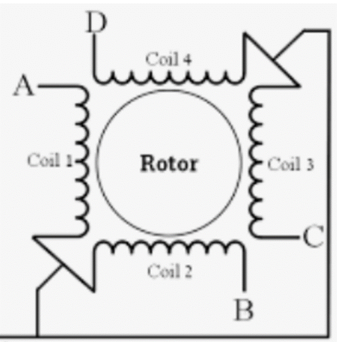
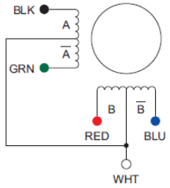
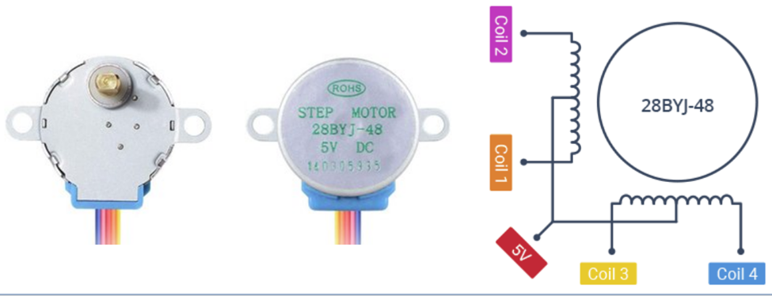
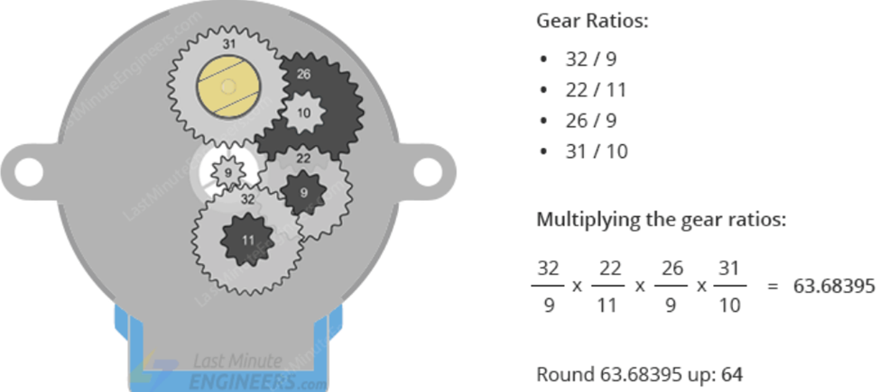
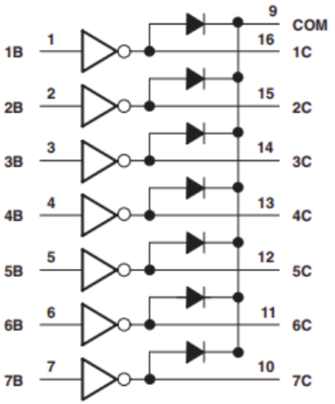
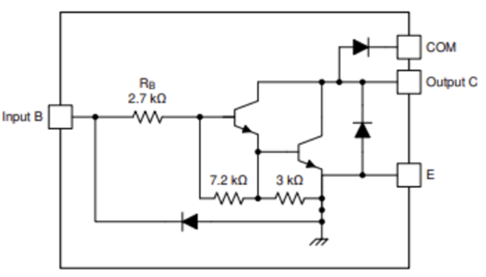
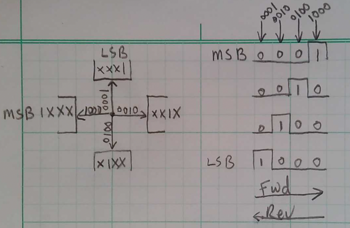

# CMPE2150 Notes 09
Taylor, Moore, and Armstrong
15 Nov 2024

- [Bipolar Stepper Motors](#bipolar-stepper-motors)
- [Unipolar Stepper Motors](#unipolar-stepper-motors)
- [Stepper Motor Driver](#stepper-motor-driver)
- [Unipolar Stepper Motor Drive
  Modes](#unipolar-stepper-motor-drive-modes)
- [Answers](#answers)

One very special type of motor is the Stepper Motor – a motor that
rotates in very clearly defined “steps” in response to a specialized
controller circuit.

If a stepper motor is working properly (i.e. not overloaded or
under-powered), its change in position can be known precisely. However,
its absolute location cannot be known precisely without additional
position-locating circuitry. Consequently, many stepper motor driven
devices have limit switches that are used at boot-up or during
recalibration to provide a reference point, after which the changes in
position can be relied upon to provide subsequent positioning
information.

A stepper motor uses a magnetically active armature with clearly defined
“teeth” to match similar teeth on the stator electromagnets. In its
simplest form of motion, when a particular stator electromagnet is
activated, the nearest set of armature teeth are forced to align with
the stator electromagnet teeth, resulting in a small rotation of the
armature. Activating a different stator electromagnet will cause the
armature teeth to align with the teeth of that electromagnet. This
process can be seen best in an animation, available at this link.

Although the animation shows only one coil active at a time, typically
that coil would be wound half on one side and half on the other side of
the armature to keep the forces on the armature and its bearings
balanced. The half coil on the opposite sides would generate the
opposite magnetic poles to align the magnetically-active armature.

Stepper motors typically have two sets of stator electromagnets to move
the armature through its rotational steps.

### Bipolar Stepper Motors

Reasonably powerful stepper motors are often Bipolar Stepper motors. In
Bipolar Stepper motors, the coils in the stator electromagnets are
simple coils without a centre-tap. The entire coil is used when
activated, unlike in the Unipolar Stepper motors we will investigate
soon, which only use half of any given coil at a time.

Here’s a simplified model of a Bipolar Stepper Motor:

In a Bipolar Stepper motor, the direction of the current is reversed in
the coil to generate the opposite magnetic polarity, alternating through
the sequence.

The simplest control cycle for a Bipolar Stepper motor might look like
this:

- Coil 1: positive current

- Coil 2: positive current

- Coil 1: negative current

- Coil 2: negative current

In order to reverse the coil currents, the coils must be driven by two
H-Bridges. That’s why the L293D is a quad half-bridge: its two H-Bridges
can be used to reversibly control the two coils in a Bipolar Stepper
motor.

Bipolar Stepper motors are sometimes called Four-Wire Stepper motors, as
the only the two connections to the two coils are needed.

### Unipolar Stepper Motors

Small stepper motors for low-power applications are typically Unipolar
Steppers motors, so-called because they are designed for operation
without reversing the direction of current flow. To achieve this, each
coil is centre-tapped, with power provided at the centre tap. One side
of the coil is activated by connecting it to common (or ground) for one
“polarity”, and the other side of the coil is similarly activated by
connecting it to common when needed.

Here’s a simplified model of a Unipolar Stepper motor:

This is usually rearranged to simplify it even further:

Unipolar Stepper motors will have five, six, or eight wires, depending
upon how the centre taps are handled. For a five-wire motor, the two
centre taps are connected internally; for a six-wire motor, the two
centre taps are brought out separately; for an eight-wire motor, the
ends of all four half-coils are brought out.

The simplest motion of a Unipolar Stepper motor would look like this,
assuming the two centre taps are connected to a positive DC supply:

- Half-coil $A$ grounded

- Half-coil $\bar{B}$ grounded

- Half-coil $B$ grounded

- Half-coil $\bar{A}$ grounded

It’s not hard to see why the Unipolar Stepper motor is typically less
powerful than the Bipolar Stepper motor—only half of each coil is used
at any given time.

The motor in your kit is a hobbyist Unipolar Stepper motor with the
centre taps connected together. In addition, this motor comes with a
controller board that has high-current motor drivers on it, so all we
need to do is to supply logic levels to activate the motor drivers at
the right times.

Here’s the motor itself:

Note that there are five wires, as would be expected for a Unipolar
Stepper motor. The simplified wiring diagram shows how these are
connected internally.

Also note that the drive shaft isn’t in the middle. that means that
there’s a conventional gear and pinion gearbox between the actual
stepper motor and the output shaft. Here’s a synopsis of the gearing
ratios:

The data sheet states the rounded value of $64:1$, which may be close
enough for most applications, particularly those that move forward and
reverse like the platen or print head of a 3D printer; however, if the
motor was intended for continuous rotation in a particular direction,
the error would accumulate.

The motor itself has 32 full steps (more on that later) per rotation.

For the motor in your kit (described previously), how many degrees are
there in a full step of the basic motor? \_\_\_\_\_\_\_\_\_\_ $^\circ$.

With the actual gearing ratio, how many degrees does one full step
translate to at the output drive shaft? \_\_\_\_\_\_\_\_\_\_ $^\circ$.

What percent error in motion would be introduced using the rounded value
from the specification sheet? \_\_\_\_\_\_\_\_\_\_ $\%$.

### Stepper Motor Driver

The driver board that comes with your Unipolar Stepper motor really just
contains a single IC which is the inverting seven-driver ULN2003A, along
with connectors and some LEDs because everyone loves flashing lights.
(Only four of the seven drivers are actually used, one for each
half-coil or “phase”.)

From a Logic perspective, the ULN2003A looks like this:

In reality, it’s really seven Darlington Pair BJTs. Here’s one channel:

As with most transistor switches, it’s an inverter from a Logic
perspective, but it’s a current switch from an electrical point of view.
When the input goes HIGH, the transistor is saturated, pulling the
collector nearly to zero volts, allowing current to flow through the
transistor from the Collector to the Emitter. If we connect the
Collector to one of the Stepper coils, and if the centre tap in the
Stepper is connected to a positive DC supply, current will flow through
the selected coil, activating it.

Long story short: we drive an input to this IC HIGH to activate the
associated coil in the Stepper motor.

The diodes connected to the *COM* pin are flyback protection diodes, so
if *COM* is connected to the motor power supply, we don’t need any
additional external protection. That’s how the driver board for your
Unipolar Stepper motor is set up.

### Unipolar Stepper Motor Drive Modes

It should, at this point, be fairly clear that, to drive a Stepper
motor, a logical sequence of activating the various coils is required.
It turns out that the process of generating these logical sequences is
more involved that it might appear on the surface.

#### Wave Stepping

What we’ve been alluding to in the introductory discussion is a mode in
which the motor moves from coil to coil as each one is activated
independently of other coils. Although the motor performs a full step in
this mode, the term “Full Stepping” is reserved for a better mode of
activation than Wave Stepping. However, Wave Stepping is the easiest to
explain and visualize, so it’s a good starting point from an educational
perspective. Here’s the sequence:

Note that the armature, indicated by the moving arrow in the picture,
always points directly to one of the coils, as only one coil is
activated at any given time. More on that in a moment. Note that the
timing diagram looks like a single wave moving across the page, hence
the term “Wave Stepping”. Let’s see if you can interpret this diagram
correctly. In order to drive the motor forward in a Wave Stepping
sequence starting with the lowest numeric value, the logic values sent
would need to be:

1.  \_\_\_\_\_\_\_\_\_\_

2.  \_\_\_\_\_\_\_\_\_\_

3.  \_\_\_\_\_\_\_\_\_\_

4.  \_\_\_\_\_\_\_\_\_\_

To drive the motor backward, starting with the highest numeric value,
the logic values sent would need to be:

1.  \_\_\_\_\_\_\_\_\_\_

2.  \_\_\_\_\_\_\_\_\_\_

3.  \_\_\_\_\_\_\_\_\_\_

4.  \_\_\_\_\_\_\_\_\_\_

The Wave Stepping sequence generates the least torque of all the
sequences, because only one coil is activated at a time.

#### Full Stepping

Full-Stepping again moves the motor by a full step each time, although
it has a slightly different starting position that Wave Stepping. The
advantage of Full-Stepping over Wave Stepping is the torque:
Full-Stepping activates two coils at the same time, with the armature
positioned half-way between the two, so the torque is increased by a
factor of $\sqrt{2}$ , or approximately $1.41$ times that of the Wave
Stepping sequence.

Check to see if you can interpret this sequence correctly.

Starting with the “top” and “right” coils, write the sequence for
driving the motor forward:

Answer 1

Answer 2

Answer 3

Answer 4

Starting with the “top” and “left” coils, write the sequence for driving
the motor in reverse:

Answer 5

Answer 6

Answer 7

Answer 8



### Answers

- $11.25^\circ$

- $0.1767^\circ$

- $0.496\%$

- `0001, 0010, 0100, 1000`

- `1000, 0100, 0010, 0001`

