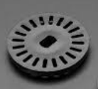
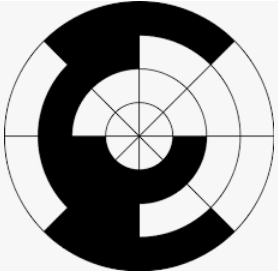
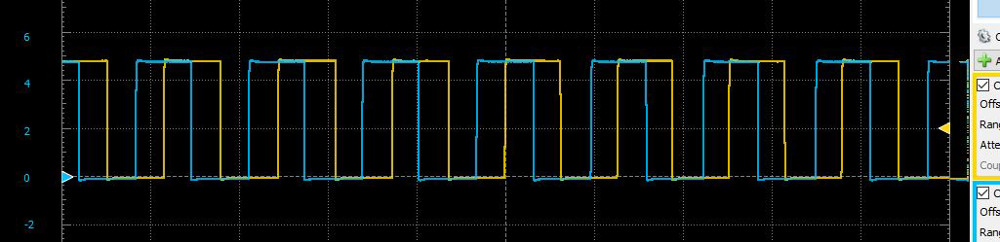
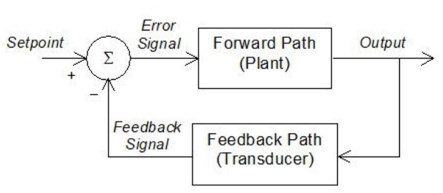

### Rotary Encoders

Rotary encoders are used to monitor rotating shafts in mechanical systems.  Some applications for rotary encoders are:

-   Digital Multimeter function selection switches

-   Human interface sensing (e.g. control knobs)

-   Antilock braking systems (ABS)

-   Engine crank shaft position sensing

-   Robotic arm joint angle sensing and control

-   Conveyor belt speed and distance sensing and control

-   Photographic lens focusing

-   Rotational shaft position monitoring and control

-   Counting and control of the number of revolutions of a shaft

-   Rotational speed determination and control

-   Rotational acceleration determination and control

Notice how many of these include a "control" element.  We'll briefly discuss control systems later.

Rotary encoders may be classified as:

-   Incremental (also known as relative or differential)

    -   only changes in position and rate of change of position can be determined

    -   velocity and acceleration can be calculated, but absolute position cannot be directly determined

    -   Position can be determined indirectly, through an "observer routine" which combines information from another source, such as a limit switch used in a start-up homing routine

    -   Position information may be lost due to slippage, power outage, reset, or missed counts

-   Absolute

    

    -   position is directly available relative to a fixed reference

    -   absolute position is not lost in a slippage event, power down, or reset

    

When choosing an encoder, it is critical to know whether absolute position is important or if relative motion is all that is required.

Servo Motors have absolute encoding built into their systems, but very few servo motors are designed for continuous rotational operation -- most operate only over something like half of a complete rotation.

Stepper motors have very accurate incremental encoding built into their systems and are built for continuous rotation, but need an observer routine to determine their absolute location.

Conventional AC and DC motors provide neither incremental nor absolute positioning information, and must therefore use external encoders if position and/or position control is required.

#### Types of Position Encoders

There are three fundamental types of encoders:

*Electromechanical encoders* use some form of switching system to indicate the position of the shaft.

In a simple system, a single switch contact may be opened and closed by a cam on a rotating shaft.  Many older vehicles use such a system in the "distributor" of a spark ignition system to time the firing of spark plugs.  More complex systems may have multiple switches activated by cams on shafts geared to different speeds to initiate critically-timed events.

The rotating selector switch on your digital multimeter (DMM) is an electromechanical encoder, with multiple contacts available to close different circuits on a printed circuit board (PCB) in the meter, depending on the position of the selector.

Another electromechanical encoder utilizes a Gray wheel system to generate digital values representing different positions of a shaft.  The Gray wheel could be printed on a PCB with an electrical sweeper rotating in contact with it to activate the different bits at different positions.  Gray wheels are more commonly used in optical systems -- we'll go into more detail on these in the next section.

*Optical encoders* typically use the presence or absence of light to provide position information.  This is usually more reliable and does not introduce any mechanical energy loss, as other encoders may do.  For example, switches in an electromechanical encoder eventually wear out, and mechanical energy is required to open and close the switches.

In an optical encoder, light sources and light sensors are paired, with either an opaque interrupter rotating between them to prevent light from reaching the sensor or a mirrored surface rotating to reflect the light from the source to the sensor.

Since there is no physical contact between the rotating element and the encoder, no mechanical energy is expended.  However, some energy is required to run the system, but with LEDs or laser LEDs, that energy will be minimal.

Simple optical encoders produce a single pulse for each rotation of a shaft, which can be used to determine the number of rotations or the rotational speed, but cannot provide information about the direction of rotation.

For more accurate counting and speed information, a slotted wheel can be used to provide multiple pulses per rotation.  Here's an example of a slotted wheel encoder:

{width="200"}

*Electromagnetic Encoders* use magnetic sensors to determine when a magnetic pole passes by.  This is the type of encoder you will investigate in this course.

A *Quadrature Encoder* uses two simple optical encoders set apart by 90^o^ around the rotating shaft.  This system can provide both rotational speed and rotational direction (i.e. rotational velocity), as it is a fairly simple process to determine which of the two encoders pulsed first in the rotational sequence.

A more complex Quadrature Encoder uses a slotted wheel, with the light sensors spaced so when one is in the light, the other is in the dark; as with the simple Quadrature Encoder, the direction of rotation can be determined by observing which sensor activates first in a sequence.

A *Gray Wheel Encoder* can provide much more precise positioning information, as it generates digital values for a number of positions of the shaft.

A Gray wheel encoder uses concentric bands of dark and light (reflective and not reflective, or transparent and opaque, or in the case of the electromechanical Gray wheel, conductive and non-conductive) regions.  Each concentric band represents a different bit in the digital result.

Here's a three-bit Gray wheel:

{width="300"}

The MSB is the inside ring, the LSB is the outside ring.  If you start at the positive end of the "X" axis and rotate counterclockwise, you'll get the following endlessly-repeating sequence:

000\
001\
011\
010\
110\
111\
101\
100

Recall that, in Gray Code, these are the numbers from 0 to 7, which, as you should recall from your Digital Logic course, are a different sequence from the usual binary counting sequence. The "magic" of Gray Code is that only a single bit changes as you count through the sequence and start again. This is important in an optical or electromechanical system, as there will be no "race conditions" as there would be in the standard binary counting system: if more than one bit changes between two numbers, one of them is guaranteed to be detected first, resulting in an incorrect representation. For example, in three-bit binary, the change from "3" to "4" is 011 to 100: all three bits change, so race conditions could temporarily produce 001, 010,111, or, in fact, almost any of the three-bit binary numbers, depending on which bit changes are detected first. A very fast sensing system could read these "glitches" as incorrect intermediate states, potentially resulting in useless positioning data. Gray Code, on the other hand, only changes one bit at a time, so there are no race conditions possible, not even when the count starts over again!

Here's a much more complex Gray wheel encoder:

{width="300"}

Notice that the three innermost rings are the same as in the wheel above.

As an exercise, fill out the table below describing the number of distinct positions in an n-bit Gray wheel, and consequently how many degrees of resolution it will have.

| Number of Rings (Bits) | Number of Positions  | Resolution, in Degrees |
|:----------------------:|:--------------------:|:----------------------:|
|           4            | \_\_\_\_\_\_\_\_\_\_ |  \_\_\_\_\_\_\_\_\_\_  |
|           5            | \_\_\_\_\_\_\_\_\_\_ |  \_\_\_\_\_\_\_\_\_\_  |
|           6            | \_\_\_\_\_\_\_\_\_\_ |  \_\_\_\_\_\_\_\_\_\_  |
|           7            | \_\_\_\_\_\_\_\_\_\_ |  \_\_\_\_\_\_\_\_\_\_  |
|           8            | \_\_\_\_\_\_\_\_\_\_ |  \_\_\_\_\_\_\_\_\_\_  |

#### Quadrature Encoders

The Quadrature encoder is best suited to systems in which simple rotational velocity measurements are required, including both speed and direction of rotation.

One type of Quadrature encoder uses magnets to trigger *Hall Effect* magnetic sensors. A Hall Effect sensor is a semiconductor device that detects the presence of a relatively strong magnetic field (both varying and static, unlike a coiled conductor). Typically, Hall Effect sensors are used in switch mode, indicating the presence or absence of a magnetic field. (A related device called a magnetometer produces a linear analog output in response to varying strengths of magnetic fields, and can be used in directional compasses and navigation systems.)

In your CNT Year 2 Kit, you have an APS11700LUAA-0PL Hall Effect sensor. This is an Open Drain device, and, like all Open Drain or Open Collector devices, it requires a pull-up resistor in order to produce any meaningful information. As with all simple transistor switches, these devices are Active Low—in the presence of a magnetic field, the output transistor turns on, effectively shorting the output to ground (LOW); otherwise, no current flows through the pull-up resistor, and the output is pulled HIGH.

You'll get the opportunity to demonstrate the operation of your Hall Effect sensor in the associated Self Assessment.

##### Hall Effect Quadrature Encoder

On your PMDC motor, there's a Quadrature encoder made by positioning two Hall Effect sensors at $90^\circ$ to each other referenced to an extension at the back end of the motor's shaft. On the shaft is mounted a magnetic disk with seven magnetic poles which pass by the Hall Effect sensors. As each magnetic pole passes the Hall Effect sensors, they activate the first one they encounter then the second one before passing through the remaining $270^\circ$ of rotation. As a result, a pattern like the following can be observed on an oscilloscope, where the yellow trace represents the $C_1$ sensor and the blue trace represents the $C_2$ sensor.

{width="450"}

Hard as it may be for you to make this shift, recall that it's the falling edges that matter, as the Hall Effect switches are Active *LOW.*

Since the $C_1$ sensor (yellow trace) provides the reference timing for this encoder, the motor must be turning \_\_\_\_\_\_\_\_\_\_ (Forward/Reverse) .

If the motor operates in the opposite direction, the order in which the magnetic poles encounter the Hall Effect sensors is reversed, so it is easy to determine the direction of rotation.

The speed of rotation is also fairly simple to determine, as long as the number of poles in the magnetic disk is known:

$RPS=\frac{f}{poles}$

$RPM=60 \cdot RPS$

With our seven-pole encoder, if the frequency of the pulses is 378 Hz, the rotational velocity of the shaft, in RPM, is \_\_\_\_\_\_\_\_\_\_ RPM.

If the motor is coupled to a gearbox or gearhead, the rotational velocity of the output shaft of the gearhead is simply the motor shaft velocity divided by the gearing ratio.

If the motor shaft is rotating at a rate of $3600$ RPM and the gearhead has a reduction ratio of $150:1$, the output shaft is rotating at\_\_\_\_\_\_\_\_\_\_RPM.

Our PMDC motor with a gearhead and encoder says its gear ratio is $380:1$. From the manufacturer's specifications, what is it actually? (Just enter the first number in the ratio.) \_\_\_\_\_\_\_\_\_\_ $:1$.

If the desired rotational speed of the output shaft is $75$ RPM, what would be the frequency of one of the sensors on the encoder, in kilohertz? \_\_\_\_\_\_\_\_\_\_ $kHz$.

#### Feedback Control Using Encoders

There are two general approaches to controlling a system that is expected to have variable outputs:

-   Open Loop Control

-   Closed Loop Control

*Open Loop Control* involves setting or adjusting an input condition to modify the output condition, but with no feedback supplied. An example of this would be a variable speed trigger on an electric drill -- the rotational speed of the drill bit varies with the position of the trigger; however, if the bit is slowed down as it drills through hard material, no feedback is provided to attempt to restore the desired speed: the drill bit just slows down, or may even stall.

*Closed Loop Control* receives feedback from the output, and attempts to correct for variations in the system. An example of this would be the cruise control in an automobile. The operator sets the desired speed, and the cruise control module monitors the actual vehicle speed, applying more power when the automobile slows down below the set point and reducing the power when the automobile speeds up above the set point.

Closed Loop Control involves the following:

-   a Set Point, either adjustable or fixed

-   an Output Sensor or Transducer that measures the output characteristic and, in modern digital systems, provides the measured characteristic as a digital value

-   a Feedback Channel which feeds the data from the output sensor back into the control system

-   an Error Signal which is, in effect, the difference between the Set Point and the Feedback

-   a Controller which responds to the error signal to adjust a variable that controls the output characteristic.

Here's a simple diagram of a Closed Loop Control system, borrowed from your Hardware Interfacing course:

{width="450"}

In modern control systems, the response to the error signal is typically handled mathematically in software. In order to respond quickly enough for many control systems, the controller must have the following characteristics:

-   High main clock speed

-   Built-in floating-point calculations (preferably capable of doing floating point arithmetic in a single clock cycle)

-   Circular buffers to hold multiple samples for digital signal processing in complex algorithms

-   Digital Signal Processor functionality

-   High resolution peripherals for accurate control

Personal computers are not ideal for feedback control because they do not execute threads at regular intervals due to OS-managed multitasking.

A Closed Loop Control system that is incorrectly managed may quickly (or over time) run to the available limits, not unlike an op amp that is "nailed to the rails" unless special control mechanisms are designed in to prevent this. Closed Loop Control systems may respond too slowly, resulting in out-of-range outputs before the system can respond. Closed Loop Control systems designed to respond quickly to changes in the output may be unstable, resulting in oscillations. These oscillations may simply swing temporarily outside of the range of acceptable values and then stabilize, or they may even continue to increase in amplitude resulting in complete loss of control.

Well-designed Closed Loop Control systems, known as PID systems, usually employ three different control elements, carefully balanced against each other to produce rapid response without overshoot or ringing:

-   Proportional Control -- the bigger the error signal, the greater the response

-   Integral Control -- the accumulated history of the error signal is taken into account when generating the response

-   Derivative Control -- the instantaneous rate of change of the error signal is taken into account when generating the response

A good understanding and appropriate level of expertise for complex Closed Loop Control systems requires in-depth study and experience.

However, small closed loop control systems in which the scale and risks of malfunctioning are minor can be instructive.



1.  ::: border
    ### Solutions to Self-Test Questions

    1.  N-Bit Gray Wheel: Number of Positions = $2^n$; Resolution = $\frac{360}{2^n}^\circ$

    2.  In reverse

    3.  $3240$ RPM

    4.  $24$ RPM

    5.  $379.17:1$

    6.  $3.318 kHz$
    :::
