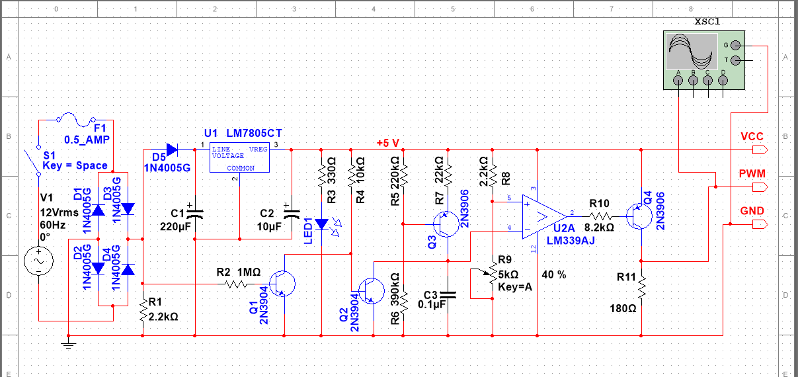

::: callout-important
You should already have completed an exercise introducing and exploring KiCAD 8.0. This exercise assumes you are already familiar with the tools and interfaces of KiCAD and that you have completed a simple introductory project. If you have not done so, please complete the KiCAD introductory tutorial before proceeding with this lab assignment. On the course LMS, you should find KiCAD manuals and other guides. This document assumes you have access to those and does not go into great detail on the specifics of basic actions and functions in the application.
:::

### Schematic Capture

You are already quite familiar with schematic capture and simulation using the *NI Multisim* application used in our Electronics courses. Multisim is integrated with a PCB design package called *Ultiboard*, which students in this program have used in the past. Unfortunately, Ultiboard has an old-fashioned and perhaps overly-complicated interface, and is not commonly used in the industry. If you find yourself working with PCB design in industry, it is more likely you will work with *Altium*, *Autodesk Eagle*, or *OrCAD*. It is also increasingly likely to see the open source *KiCAD*, especially in smaller organizations unable to invest in enterprise-class products. We have selected KiCAD because it is cheap, well-maintained and multi-platform.

The reason that we have not similarly moved to KiCAD from Multisim for our electronics classes is that Multisim has a very powerful and intuitive simulation feature, which is very useful for students, especially in their first year or so of studies. KiCad also supports simulation using SPICE[^1], an industry-standard platform for electronic simulation, but it is not particularly novice-friendly. More information can be found at the KiCAD site[@KiCadEDA].

[^1]: Simulation Program with Integrated Circuit Emphasis

As you have read, CAD/CAM[^2] Schematic Capture is used to formally, and in a computer-readable and -analyzeable format, the electrical circuit that you are developing. Use of standardized symbols[^3] and connections mean that we can easily communicate about a circuit to our colleagues—and software systems—without ambiguity. That allows us to use software to check the integrity of our design. In some cases, you will be given a design that must be imported or entered into your Schematic Capture system, and annoted to prepare for laying out a PCB to realize the design. This is the scenario we will simulate

[^2]: Computer-Aided Design/Computer-Aided Manufacturer

[^3]: Both NEMA (US) and the IEC (Europe) publish standards for electrical and electronic schematics. Canadians, for the most part, use the NEMA standard.

#### The Circuit Design—Analog PWM Generator

The circuit we have selected for you to realize is shown below. You should also have access to an NI Multisim file for the circuit, which will allow you to see it in detail and even simulate it to investigate its behaviour.

As you will recognize, this circuit is closely based on the TRIAC Dimmer cicuit you analyzed and built in an earlier exercise. As you recall, the TRIAC power was controlled with an analog PWM[^4] signal whose duty cycle was controlled with a potentiometer. We have pulled out that control circuit to create slightly simpler circuit that can be used to generate a $0$ to $5 V$ TTL PWM signal with a duty cycle anywhere between $0\%$ and $100\%$ by adjusting a potentiometer knob.

[^4]: Pulse-Width Modulation

Some significant features and changes from your earlier circuit include:

1.  Obviously, the outer AC circuit driving the bulb, the bulb itself, and the TRIAC connecting the two parts of the circuit have been removed, leaving the inner PWM generation circuit.

2.  The power source has been changed to $12V$, as we no longer need to drive a halogen bulb, and it drops the input voltage down to a range appropriate for the simpler LM7805 regulator.

3.  A power indicator LED has been added ($LED_1$). Note that it turns on or off depending on if the switch $S_1$ is toggled in the simulation.

4.  The potentiometer ($R_9$) has been changed to $5K\Omega$, to make the range of PWM values output more smooth and linear.

5.  Some output pins have been added.
