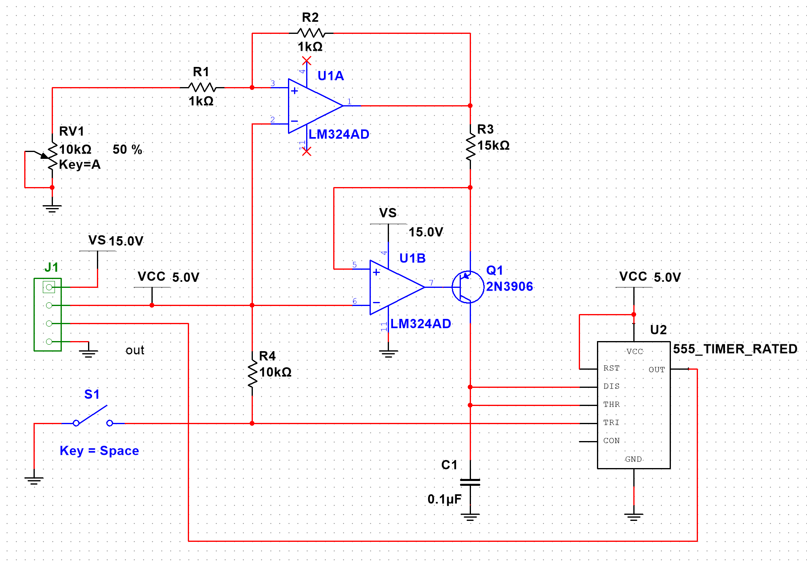

::: callout-important
You should already have completed an exercise introducing and exploring KiCAD 9.0 and worked on the CMPE2150 PCB Project. This project is a similar but smaller version of the that one, suitable for a skills check or timed exam. It assumes your familiarity with those exercises and notes and will therefore be comparatively terse. See the original project if you need more clarity on specific tasks. The steps in this exercise are broadly the same and presented in the same order as the original project.
:::



## Part 1 - Schematic Capture

### The Circuit Design—Programmable Pulse Generator

The circuit we have selected for you to realize is shown below.

This circuit is from the classic *The Art of Electronics* [@AoE3, p. 242]. It is a variable width single pulse generator. The potentiometer sets the duration of the pulse and the switch triggers it.

The four-pin header represents the board's inputs and outputs:

-   $V_S$ is the voltage source to power the op amps (the top rail). It will ordinarily be $+15V_{DC}$.

-   $V_{cc}$ is the voltage source for the 555 timer and also serves as the "on" digital voltage reference. It will be $+5V_{DC}$.

-   $Out$ is the output of the timer. This is where the pulse generated by the circuit appears.

-   $Gnd$ is the ground reference for the other three pins.



### A - KiCAD Project Setup

Follow the procedure below—nearly identical to the detailed one presented in the tutorial—to create your project to realize the schematic above.

1.  Open KiCAD 9.0 and select *File → New Project*. Name your project "PulseGenerator-*\<UserID\>*", replacing *\<UserID\>* with your NAIT username. You do not need to create a new folder if you already did so for the Github project. Then click *Save*

2.  If you haven't already done so, setup the Symbol Library to use the recommended option of copying the default global symbol library table.

3.  For settings not mentioned above, select the defaults or use your own judgement.

### B - Schematic Sheet Setup

Now, open the *Schematic Editor* and perform the following procedure:

1.  Select *File → Page Settings* to open the sheet setup.

2.  Choose a size of *8.5 x 11in* with *Landscape* orientation. Set the revision to 0. Use today's date. You'll only need one sheet. Add a title of "CMPE2150 Pulse Generator - *\<UserID\>*[^1]". Use "NAIT CNT" as your Company. Add your full name to the first comment. Save your work and confirm that the *Title Block* looks correct.

[^1]: Mutatis mutandis

### C - Place Schematic Symbols

Add the components from our schematic using the tools and techniques you learned from the tutorial.

1.  Please use NEMA (sometimes called 'US' or 'American') symbols. The only one likely to matter is the resistors. Use the sawtooth symbol, not the rectangle (look for `_US` in the symbol name).

2.  You can use a `CONN_01x04`[^2] to get the four output pins on the left of the schematic.

3.  The *Power Symbols* for this project (all sourced at the connector) are `VS`, `VCC`, and `GND`. Don't forget they'll need a *Power Flag.*

[^2]: Four-pin header row

The components in the schematic are listed below, along with a description of the component part and footprint you should use.

::: callout-note
You are not required to have the footprints completed for the first schematic checkoff. Some are included below for the sake of those of you who like to set them as you place the symbols.
:::

::: column-page
| Part | Reference | Footprint | Notes |
|--------------|----------|------------|--------------------------------------|
| Connection Header | `J1` | *See Below* | You'll be modifying this in a bit, so don't worry about the footprint. |
| Resistors | `R1-R4` | SMD 0805 | Search terms include “R”, “SMD”, and “0805” |
| Potentiometer | `RV1` | *See Below* | We'll discuss this part shortly. Initially you do not need to specify a footprint. |
| Capacitor | `C1` | SMD 0805 | Just an ordinary capacitor. No need for electrolytic. |
| Transistor | `Q1` | TO-92 | In a real solution, you'd likely use a surface mount part, but we want to see a through-hole part, hence the TO-92 footprint. |
| Switch | `S1` | *See Below* | This will be a momentary push-button that you will select later. |
| Op Amps | `U1A,U1B` | TSSOP-14 | Use an LM324 (Quad Op Amps) part to get four. Remember you'll need to deal with the two unused op amps. |
| Timer | `U2` | SOIC-8 | This chip is a standard 555 timer. Use TLC555 as your search term for the part. |
:::



### D - Wire the Schematic

Once you have all the symbols (or suitable stand-ins) in place, complete all the connections between components, and make the adjustments to pass the *Electrical Rules Check* without any errors or warnings.

1.  Add the `VS`, `VCC`, `GND` net connections using power symbols ($P$).

2.  Add power flags (`PWR_FLG`) to those three nets.

3.  Place the extra op amps to one side and mark their pins as unconnected.

4.  Pin 5 (*Control Voltage*) of the timer is unconnected, too.

5.  Run the *Electrical Rules Check* and fix any errors or warnings.

### Submission

When you have completed the above, show your clean ERC result and schematic to your instructor for checkoff.

::: vspace
:::

::: right
Signature:\_\_\_\_\_\_\_\_\_\_\_\_\_\_\_\_\_\_\_\_\_\_\_\_\_\_\_
:::



## Part 2 - Footprints

There are a few parts we will need to tweak and specify the footprints for before we begin laying out the PCB.

1.  Complete the footprints specified for the parts in the table from the previous section (those not marked as *See Below). Note:* Recall that you can use *Tools-\>Edit Symbol Fields* to quickly access the footprints for all parts.
2.  For the *Connection Header*, change the device from a four-pin header row to a four-pin *Screw Terminal*. Use a *Metz Connect Type 0, 4 Pin* device footprint. It should already be available in KiCad.
3.  For the *Potentiometer*, use a through-hole (*THT*), *vertical*, footprint.
4.  For the *Switch*, select any two-terminal momentary switch (a search on `SW_Push` will likely be of value).
5.  Run the *Electrical Rules Check* and fix any errors or warnings.

### Submission

When you have completed the above, show your clean ERC result and the *Symbol Fields Table* for checkoff.

::: vspace
:::

::: right
Signature:\_\_\_\_\_\_\_\_\_\_\_\_\_\_\_\_\_\_\_\_\_\_\_\_\_\_\_
:::



## Part 3 - PCB Layout

### A - Setting Up the Board

Open your project's PCB editor and select *File → Page Settings* and set the page up the same way we did for the schematic in Part A. Otherwise, we will do a two-layer board with the default settings.

### B - Component Placement

If necessary, make sure you have reviewed the rules and guidelines for part placement and connection in the PCB Project notes you were earlier introduced to.

1.  Update the PCB from your recently created schematic. Confirm you have the parts and footprints you expect to see.
2.  Creating a compact design, place the components:
    a.  The Screw Terminal should be on the top edge, facing out, at the left-hand side.
    b.  The Potentiometer should be below that, near the left edge
    c.  The Button should be below that, also positioned near the left edge.
    d.  You may place the remaining components as you see fit.
3.  Place your edge cuts to neatly contain your design.

### C - Power Plane Copper Pours

Add two crosshatched copper planes covering the entire board:

1.  On the Front Cu layer, the plane should attach to the `GND` net.
2.  On the Back Cu layer, use the `VCC` net.

NB: Remember to regularly hit the $B$ key to refill your pours and keep track of how your board really looks as you route.

### D - Routing Traces

A bunch of your `VCC` and `GND` rats nest connections will have disappeared by being automatically connected to one of the pours. Now complete the routing:

1.  Start with the `VCC` net. Because it is on the bottom, the surface mount components won't have automatically connected to it. However, you can easily connect them by adding some vias connected to the `GND` net, which you can then connect to with your surface mount ground pads. That should let you get all the `VCC` pins connected easily, leaving lots of room for other traces.
2.  Try to do traces that connect one surface mount part to another first, so that you can keep the whole thing on the top layer and not need to use two vias to drop down to the bottom plane and then come back up. (You can do this if you have to, but it's to be avoided.)
3.  Remember you can just hit $V$ while you're drawing a route to create a via to go to the other plane if you need to get around something. Also remember to hit $B$ afterwards to see how that affected the copper pours.
4.  Leave connections to through-hole components until later, as they are already on both planes and thus can be routed to from either direction.

Keep going until you have replaced the whole rats nest with valid traces and you pass the *Design Rules Check* without any errors or warnings.

### Submission

When you have completed the above, show your clean DRC result and the completed design to your instructor for checkoff.

::: vspace
:::

::: right
Signature:\_\_\_\_\_\_\_\_\_\_\_\_\_\_\_\_\_\_\_\_\_\_\_\_\_\_\_
:::
