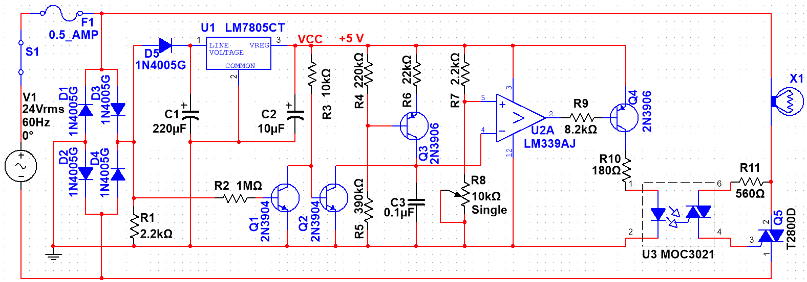

::: callout-warning
This is a complex circuit with many potential pitfalls, some of which could be dangerous. Do not attempt to build this circuit all at once! As indicated in the discussion below, you should understand what each section of the circuit is intended to do so you can test and troubleshoot your work as you build it stage by stage. It is important in this project that you build the circuit in the order specified. After each sub-circuit is built and tested, make sure you get screen captures or photographs of the oscilloscope traces you need to demonstrate your circuit. *You must take the oscilloscope measurements for each phase of circuit development below, or you will have to rebuild the circuit.*
:::

There may be times in your career when you will be asked to build and test a circuit designed by someone else in the company. The ability to assemble a complicated circuit, understand what it is doing, and make it work could prove invaluable to you and to your company.

The following circuit incorporates a great deal of what you have learned in your Basic Electricity and Semiconductors Courses, and takes your circuit-building and testing skills to a whole new level. As you carry out this exercise, note how many of the concepts you've learned come together to do what, from the outside, seems to be a fairly simple task---dimming a bulb over its full range of power without flickering. Also take note, mental or otherwise, of the testing and troubleshooting skills you will use as you proceed through this exercise.

There are times when you'll be testing a circuit for which the operation is well-known, and you will be provided with expected values. In this project, you will be provided with expected waveforms (in gray-scale) which you will compare your circuit's behaviour to, and submit full-colour shots of what you see for grading.

{.fullwidth}

::: callout-important
Some time after the design above was first drawn, we discovered an error. Depending on the vendor and detailed specifications of your voltage regulator, the circuit above might destroy it.

The reason is because, if you consult the [datasheet for the LM7805](https://www.ti.com/lit/ds/symlink/lm7800.pdf) its $V_{max}$ rating for the DC input is $35 V$. This would seen to be fine for our $24 V_{AC}$ source. However, recall that AC sources are generally specified as RMS voltages. So the peak voltage of the source is

$$V_P = V_{AC}\cdot\sqrt{2} = 24\sqrt{2} = 33.9 V$$

You will notice that this is getting pretty close to the maximum voltage of the 7805 Voltage Regulator. Unfortunately, it gets worse. The $24V_{AC}$ transformer will be designed to give $24 V_{RMS}$ even if the wall voltage is at a minimum. At NAIT's robust wall voltage, the transformer actually provides $28.7 V_{AC}$, which means a peak output of

$$V_P = 28.7\sqrt{2} V = 40.6 V_P$$

which (even after the voltage is dropped by three diodes ($= 2.1 V_{DC}$) is well over what our LM7805 is certified to handle. It actually worked fine for a number of years, probably because the vendor supplying our parts was providing ones robust enough to handle the excursions. However, some vendor's products have started failing over recent years.

There are a number of ways of getting around this problem:

-   Change from a $24 V_{RMS}$ source to a lower value, although this might require a redesign of the lamp circuit.

-   Add some additional diodes in series with $D_5$ to drop enough voltage to reduce $V_p$ below $35 V_P$. Three standard silicon signal diodes would drop the peak voltage by $3\times0.7 V = 2.1 V$.

-   Add one or two zener diodes in series with $D_5$ to reduce the peak voltage—Zeners typically have a reverse-bias voltage drop of several volts.

-   Redesign the circuit to use a different voltage regulator.

Because you have an *LM339N Adjustable Voltage Regulator*—whose [datasheet](https://www.ti.com/lit/ds/symlink/lm317.pdf) specifies a $V_{max}$ of $40 V$, we will use that.

**Redesign the schematic above to use the LM339 Adjustable Voltage Regulator** to provide a regulated $5 V_{DC}$ supply.
:::

This is an entirely stand-alone circuit, other than the $24 V_{AC}$ transformer from your kit. It contains the following sections, which you will build and test in steps:

-   Full-wave bridge rectifier
-   +5 VDC regulated supply
-   120 Hz zero-crossing detector
-   Constant current source ramp generator
-   Variable analog pulse width modulator (PWM)
-   TRIAC-Output Optocoupler
-   TRIAC power controller for a halogen lamp

For checkoff, attach your schematic and calculations to this document and demonstrate your circuit for your instructor to sign off \_\_\_\_\_\_\_\_\_\_\_\_\_\_\_\_\_\_\_\_
