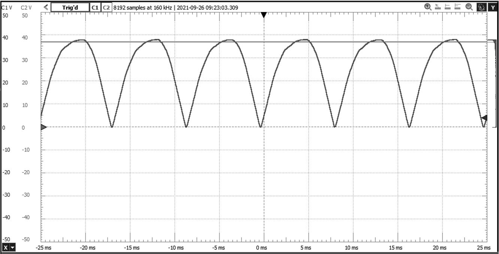
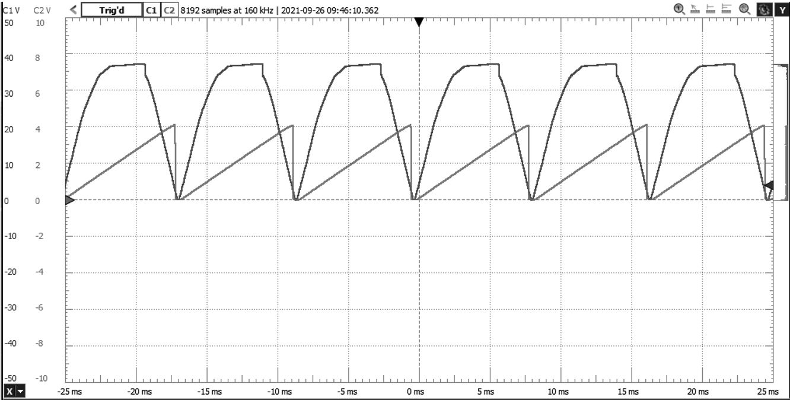
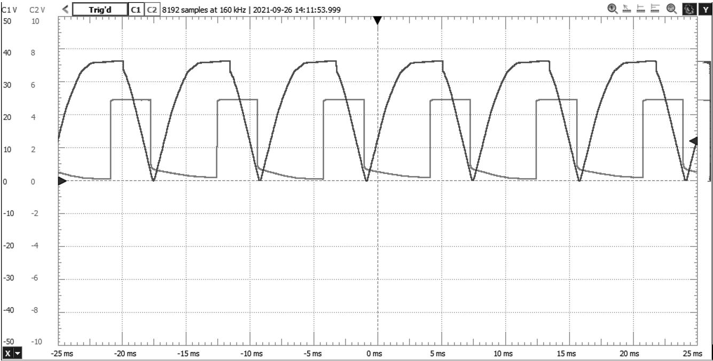

::: callout-warning
This is a complex circuit with many potential pitfalls, some of which could be dangerous. Do not attempt to build this circuit all at once! As indicated in the discussion below, you should understand what each section of the circuit is intended to do so you can test and troubleshoot your work as you build it stage by stage. It is important in this project that you build the circuit in the order specified. After each sub-circuit is built and tested, make sure you get screen captures or photographs of the oscilloscope traces you need to demonstrate your circuit. *You must take the oscilloscope measurements for each phase of circuit development below, or you will have to rebuild the circuit.*
:::

There may be times in your career when you will be asked to build and test a circuit designed by someone else in the company. The ability to assemble a complicated circuit, understand what it is doing, and make it work could prove invaluable to you and to your company.

The following circuit incorporates a great deal of what you have learned in your Basic Electricity and Semiconductors Courses, and takes your circuit-building and testing skills to a whole new level. As you carry out this exercise, note how many of the concepts you've learned come together to do what, from the outside, seems to be a fairly simple task---dimming a bulb over its full range of power without flickering. Also take note, mental or otherwise, of the testing and troubleshooting skills you will use as you proceed through this exercise.

There are times when you'll be testing a circuit for which the operation is well-known, and you will be provided with expected values. In this project, you will be provided with expected waveforms (in gray-scale) which you will compare your circuit's behaviour to, and submit full-colour shots of what you see for grading.

::: callout-important
Some time after the design above was first drawn, we discovered an error. Depending on the vendor and detailed specifications of your voltage regulator, the circuit above might destroy it.

The reason is because, if you consult the [datasheet for the LM7805](https://www.ti.com/lit/ds/symlink/lm7800.pdf) its $V_{max}$ rating for the DC input is $35 V$. This would seen to be fine for our $24 V_{AC}$ source. However, recall that AC sources are generally specified as RMS voltages. So the peak voltage of the source is

$$V_P = V_{AC}\cdot\sqrt{2} = 24\sqrt{2} = 33.9 V$$

You will notice that this is getting pretty close to the maximum voltage of the 7805 Voltage Regulator. Unfortunately, it gets worse. The $24V_{AC}$ transformer will be designed to give $24 V_{RMS}$ even if the wall voltage is at a minimum. At NAIT's robust wall voltage, the transformer actually provides $28.7 V_{AC}$, which means a peak output of

$$V_P = 28.7\sqrt{2} V = 40.6 V_P$$

which---even after the voltage is dropped by three diodes ($= 2.1 V_{DC}$)---is well over what our LM7805 is certified to handle. It actually worked fine for a number of years, probably because the vendor supplying our parts was providing ones robust enough to handle the excursions. However, some vendors' products have started failing over recent years. There are a number of ways of getting around this problem:

-   Change from a $24 V_{RMS}$ source to a lower value, although this might require a redesign of the lamp circuit.

-   Add some additional diodes in series with $D_5$ to drop enough voltage to reduce $V_p$ below $35 V_p$. Three standard silicon signal diodes would drop the peak voltage by another $3\times0.7 V = 2.1 V$.

-   Add one or two zener diodes in series with $D_5$ to reduce the peak voltage—Zeners typically have a reverse-bias voltage drop of several volts.

-   Redesign the circuit to use a different voltage regulator.

Because you have an LM317TG Adjustable Voltage Regulator---whose [datasheet](https://www.ti.com/lit/ds/symlink/lm317.pdf) specifies a $V_{max}$ of $40 V$---we will use that.

In one of the sections below, you will **redesign the schematic above to use the LM317 Adjustable Voltage Regulator** to provide the regulated $5 V_{DC}$ supply.
:::

This is an entirely stand-alone circuit, other than the $24 V_{AC}$ transformer from your kit. It contains the following sections, which you will build and test in steps:

-   Full-wave bridge rectifier
-   $+5 V_{DC}$ regulated supply
-   $120 Hz$ zero-crossing detector
-   Constant-current source ramp generator
-   Variable analog pulse width modulator (PWM)
-   TRIAC-Output optocoupler
-   TRIAC power controller for a halogen lamp

### Full-Wave Bridge Rectifier

In this circuit, k tely, we can have both by inserting a diode between the rectifier and the capacitor ($D_5$). The capacitor only draws current from the rectifier when the waveform is at a higher potential than the capacitor voltage, so as the signal amplitude falls, the diode will be reverse biased, effectively disconnecting the rectifier from the filter capacitor. $R_1$ acts as a load resistor for the unfiltered signal, ensuring that it pulls down to ground at the zero crossing points.

Install the following components from the schematic above:

-   $V_1$ - $244 V_{AC}$ transformer from CNT Year 2 Kit
-   $S_1$ - SPST Toggle switch from CNT Year 1 Kit
-   $F_1$ - $500 mA$ fuse from CNT Year 2 Kit
-   $D_1$ through $D_5$ - 1N400x rectifier diodes
-   $R_1$ - $2.2 kΩ$ resistor
-   $C_1$ - $220 μF$ electrolytic capacitor

#### Notes

1.  Assign two of the breadboard power rails to the switched AC signal -- the output from the fuse on the top rail and the low side of the secondary to the bottom rail
2.  Assign two other breadboard power rails to $+5 V_{DC}$ and ground
3.  Try to build your circuit as compactly as you can---It can be done on a single breadboard with some careful planning!
4.  Be very careful with the orientation and connection of the diodes in the bridge
5.  Be very careful with the orientation and connection of the filter capacitor---the schematic highlights the '+' pin, but the '-' pin is marked on the body of the capacitor; ensure that the negative pin is connected to ground
6.  Do NOT connect anything on the transformer side of the bridge to ground
7.  Do NOT put your oscilloscope probe ground clip anywhere on the transformer side of the bridge---put it on the ground bus

#### Testing

1.  With the switch turned on, you should observe a full-wave signal across $R_1$. Display this with oscilloscope Channel 1.
2.  Across the filter capacitor $C_1$, you should observe an almost completely flat DC signal when the regulator is not connected. Display this with oscilloscope Channel 2. This is what a filtered rectifier looks like with no load to draw current from the filter capacitor---the ripple voltage is effectively zero, since in the formula $V_r=\frac{I_LT}{C}$, $I_L$ is zero.

Verify that the shape, amplitudes, and timing are satisfactory, and ask your instructor for a grade out of one mark; record the grade below. If your instructor isn't available, take a picture of the oscilloscope screen and attach it here. \_\_\_\_\_\_\_\_\_\_

### $+5 V$ Regulated Supply

This the section where you will modify the existing design. Replace the Voltage Rectifier subcircuit ($U_1$ and $C_2$) with an LM317 subcircuit for delivering $5 V_{DC}$. Recall that, because the LM317 is adjustable, you will need to add some external resistors to set the voltage. The output decoupling capacitor $C_2$ should be retained. Draw your subcircuit schematic and include it here.

#### Testing

You should observe a constant voltage at the output pin of $U_1$. Record its value here for one mark: \_\_\_\_\_\_\_\_\_\_

### $120 Hz$ Zero-Crossing Detector

In order to synchronize the Pulse Width Modulator so that its falling edge occurs as closely as possible to $0^\circ$ and $180^\circ$, we need to detect when the unfiltered full-wave rectifier signal drops to practically $0 V$. Since $0.7$ V is pretty close, we will use the Base-Emitter junction of an NPN transistor to detect these events. Whenever the signal driving the Base of $Q1$ through $R2$ is greater than $0.7 V$, $Q1$ will saturate, pulling its Collector practically to zero. When the signal drops below $0.7 V$, the transistor will be in cutoff, and $R3$ will pull the signal HIGH. Thus, the zero crossing points will be seen as *HIGH* voltage spikes in an otherwise *LOW* signal.

Install $Q_1$, $R_2$, and $R_3$.

#### Notes

1.  Make sure you have the correct pinout for $Q_1$.
2.  In an IEEE-standard schematic, a line crossing another line is not connected unless there is a junction marker (dot). Don't make connections you shouldn't make!

#### Testing

With no connection to $Q_2$, display the signal across $R_1$ using Channel 1 for reference, and the signal at the Collector of $Q_1$ using Channel 2. You should see something like the following. (Note the different channel settings).

Once you have verified the amplitude and timing of the zero-crossing detector signal, ask your instructor to give you a grade out of one mark; record your grade here. If your instructor isn't available, attach a picture of your oscilloscope screen here. \_\_\_\_\_\_\_\_\_\_

### Constant Current Source Ramp Generator

You've been told numerous times that transistors are practically ideal current sources. This part of the circuit uses a transistor as an ideal current source to charge a capacitor. You've also been told that, when charged by a constant current, a capacitor's voltage will increase linearly over time according to the formula $V_C=\frac{It_c}{C}$.

In our circuit, $Q_2$ will short capacitor $C_3$ to ground each time the incoming AC voltage nears zero. Theoretically, from the time between zero-crossings of the input signal, what is the charging time $t_c$ in the formula above? \_\_\_\_\_\_\_\_\_\_ $ms$.

$Q_3$, the transistor acting as a constant current source, is in a *Voltage Divider Bias* configuration, following the design requirements for a "good" circuit that were provided in your Semiconductors course. As such, its current should be reliably predictable regardless of the characteristics of the transistor. To determine the current, start by determining the Base voltage ($V_b$) from the voltage divider. The Emitter is at a potential $V_{be} = 0.7 V$ higher than the Base. From that, you should be able to determine the current through $R_6$: \_\_\_\_\_\_\_\_\_\_ $μA$.

From this, you should be able to determine the maximum voltage expected across $C_3$ between zero-crossing events (it gets discharged to zero at each of these): \_\_\_\_\_\_\_\_\_\_ $V$.

Now, install the following:

-   $Q_2$ and $Q_3$
-   $R_4$ through $R_6$
-   $C_3$

#### Notes

1.  $Q_3$ is a 2N3906 PNP transistor. Make sure you know which pins are Emitter and Collector, both on the device and in the schematic.
2.  In the schematic, watch out for a line crossing another line with no junction marker (dot). Don't make connections you shouldn't make!

#### Testing

With Channel 1 still on the rectifier output for reference, use Channel 2 to display the signal across $C_3$. You should see something like the following:

Verify that the maximum ramp voltage matches your prediction, and that the timing is correct.

Ask your instructor to grade your work out of one mark, and record the grade assigned below. If your instructor isn't available, attach a picture of your oscilloscope screen here. \_\_\_\_\_\_\_\_\_\_

### Variable Analog Pulse Width Modulator (PWM)

The reason we've created a repetitive ramp that starts at 0 V at the zero crossing point of the AC signal is so we can create a pulse that: starts part-way through the signal at a point in time of our choosing to trigger the TRIAC; and ends at a zero crossing point. If the pulse starts sooner in the half-cycle, the lamp will glow more brightly; if the pulse width drops to zero, the lamp will be off; if the pulse width fully covers each half-cycle, the lamp will glow with maximum power.

To create this pulse, we use a comparator (output is either HIGH or LOW, depending upon which of its inputs is at a more positive voltage). One of its inputs is the Ramp, the other is a setpoint controlled by us using a *Variable Voltage Divider* ($R_7$ and $R_8$).

#### Analysis

1.  Determine, for the condition where the Ramp voltage is *below* the setpoint, what the expected output from the Comparator would be, what effect this would have upon $Q_4$, and then what effect it would have upon the LED inside the optocoupler. When the Ramp voltage is below the setpoint, the LED will \_\_\_\_\_\_\_\_\_\_ (glow/not glow).

2.  Assuming the maximum voltage is $4.0 V$ and given the duration of a single half-cycle for a $60 Hz$ supply, determine what the pulse width would be if the variable voltage divider voltage was set to $2.5 V$ (you may want to draw a picture to help you determine this):\_\_\_\_\_\_\_\_\_\_ $ms$.

Now, install the following:

-   $R_7$ through $R_{10}$

-   $U_2$ and $U_3$ (LED side connected only)

-   $Q_4$

#### Notes

1.  The Comparator is Open Collector, so we can only see its activity when a load is connected; since its load includes Q4 and the LED of the optocoupler, we need to install all these components to see if the Comparator is operating; alternatively, we could put a dummy load on Q4, but the LED is a fairly simple load as long as it is connected correctly

2.  In this circuit, the external transistor was required rather than simply using the internal transistor of the Comparator, because this comparator cannot pull a heavy load down to zero volts (i.e. its internal transistor's $V_{CEsat}$ is big enough that it has trouble turning off the LED in the optocoupler). This is also why the output from the Comparator is inverted from what you might expect, in order that the transistor will provide current towards the end of each half-cycle of the AC signal, thus providing for power control over the full range of the signal

3.  Your pulse width should increase as you turn $R_8$ clockwise. If this isn't the case, either re-wire $R_8$ or simply pull it out, turn it around, and plug it in again.

#### Testing

1.  Use oscilloscope Channel 1 to display the rectified signal as before, and use Channel 2 to display the signal at the Collector of $Q_4$.

2.  Verify that you can adjust the pulse width from practically zero to practically on full time.

3.  Use a Digital Multimeter (DMM) to set the level generated by the variable voltage divider to $2.5 V$, and verify that your signal looks something like the following:

4.  Using the X cursors, measure the pulse-width for the signal when the variable voltage divider is set to $2.5 V$, and record it here in milliseconds: \_\_\_\_\_\_\_\_\_\_ $ms$.

Ask your instructor to assign you a grade out of one mark; record the grade assigned below. If your instructor isn't available, attach a picture of your oscilloscope screen here. \_\_\_\_\_\_\_\_\_\_

### TRIAC Power Controller

In this circuit, the MOC3021 is not acting as a true optoisolator---there is no complete isolation between the $5 V$ circuitry and the AC power. The TRIAC circuit is isolated, but the Bridge Rectifier is not. In an actual $120 V_{AC}$ circuit, there would be a step-down transformer providing isolation between the $120 V_{AC}$ mains and the "electronic" portion of this design, so there would be true isolation involving electromagnetic isolation at the front end and optical isolation at the back end.

In this circuit, though, we still need the MOC3021, because it provides the simplest triggering mechanism for the Gate of the power TRIAC. In an On/Off only control, the triggering is often carried out using a DIAC; however, in our circuit, the MOC3021 allows for external control of the pulse width, giving us manual control over the brightness of the TRIAC---something that could not be achieved using a DIAC.

Install $R_{11}$, $Q_5$, and $X_1$.

#### Notes

1.  Make sure you have the correct pinout for the TRIAC.

2.  The TRIAC and Lamp are connected to the AC source, *NOT* to either $V_{CC}$ or ground.

::: callout-warning
Do not attempt to observe the output signal with your oscilloscope, as its ground clip will short out half of the bridge, and may allow large currents to flow through the test equipment.
:::

#### Testing

Verify that you can adjust the brightness of the LED from OFF to full bright, and that the lamp doesn't flicker noticeably.

Ask your instructor to grade your work out of four marks; record the grade assigned below. If your instructor isn't available, attach a picture of your breadboard here, with the lamp glowing.

You will be graded for completeness, functionality, and good layout practices. \_\_\_\_\_\_\_\_\_\_
