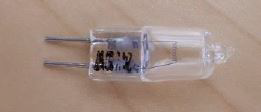
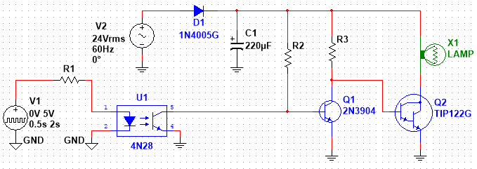

### Required Equipment and Materials

- Safety Eyewear
- Halogen lamp (G4-24V-10W)
- Optocoupler (Part Number 4N28)
- Various resistors and transistors
- Bread board
- Jumper wire
- Hand tools
- 24 VAC transformer (CNT Year 2 Kit)
- Plug to Terminal Power Adapter (CNT Year 2 Kit)

### Objectives

Design, construct, and test a circuit to provide galvanic isolation between 5 V logic control circuit and higher-power load circuit.

### Safety Precautions

- Safety eyewear must be worn at all times.
- This project involves the use of a halogen bulb, and to avoid personal injury and damage to your components and breadboard some basic precautions are necessary. Below is a picture of the halogen lamp like the one in your component kit:

{width="200"}

- When operating, the halogen lamp will get very hot after a time, and may become hot enough to cause pain or burn skin if touched, especially if it remains on for more than a few seconds
- The lamp may also become hot enough to melt plastic objects or burn some types of materials if it comes into close contact with them. Avoid touching the lamp or allowing objects to come into contact with the lamp if it is hot, and try to avoid melting you breadboard.
- Do not bend the leads that extend from the lamp’s glass envelope (as shown in the left side of the lamp in the picture above).  Applying a bending force is likely to cause the glass envelope to fracture, allowing air to enter the lamp, which will cause the lamp filament to burn out.  Instead of bending the leads, install the lamp on the breadboard diagonally between holes in two adjacent rows -- the spacing is almost exactly correct for that orientation.

### Instructions

Design and construct a circuit using the 4N28 optocoupler from your component kit to control current to the halogen lamp from your kit (Part Number G4-24V-10W). $Q_1$ may be any small signal transistor, such as a 2N3904 or, if you prefer, one of the E-MOSFET transistors in your ETC kit (just design the circuitry to match the device).

The following incomplete schematic is provided for you to work with.

{width="600"}

### Specifications

- The circuit will be controlled by a $5 V$ logic signal, such that the bulb turns fully off or fully on based on the state of the logic signal
- The logic signal will be produced by a signal generator.  Follow proper transistor circuit design procedures to ensure that the current drawn from the logic signal generator is minimal.  Use the ON Semiconductor data sheet for the 4N28M optoisolator to locate the test current used for determining the internal LED's forward voltage drop, and use this as the current for the transistor side of the 4N28 in your design.
- The circuit provided shows the use of a TIP122 Darlington Pair power transistor, the usual choice for a higher power application.  Use its manufacturer's specification sheet to locate $V_{BEon}$ and the typical value for beta in your calculations.

## Design Guidelines

1. For the Logic side, use the test current for the 4N28M, the HIGH voltage of $5 V$, and the worst-case voltage drop across the internal LED to determine a suitable value for $R_1$.
2. For the rest of the resistors:  Start by determining the peak voltage expected from the $24 V_{AC}$ transformer ($V_{AC} = V_{RMS}$).
3. Determine the worst-case estimate for current through the lamp, assuming the full $24 V_{AC}$ and the lamp's rating of $10 W$.
4. Also calculate the approximate "ON" resistance of the lamp.
5. Use the worst-case estimate for the current to determine the ripple voltage with the capacitor installed.  This should indicate that the power signal will nearly drop to zero each cycle; however, this is worst case, and the ripple will likely be half or less than what you've predicted.  This should satisfy you that we have a suitable DC source (with a lot of ripple) for powering the transistors and lamp.
6. Use the Average (i.e. DC) voltage determined from your ripple calculation as a more reasonable estimate of the RMS voltage and the approximate "ON" resistance of the lamp to determine a better estimate of the lamp's current.
7. Use the worst-case characteristics of the transistors as found in the manufacturer's specification sheets to work back through the circuit to determine a suitable value for $R_3$, which acts as $R_C$ for $Q_1$ when it is saturated, and as $R_B$ for $Q_2$ when $Q_1$ is in cut-off.  As in previous work, aim for Base resistances to be just less than half the value required to just saturate the transistors.
8. From the Collector current for $Q_1$ and its transistor characteristics, determine a suitable value for $R_2$.
9. Once you are satisfied with your component selection, ask your instructor to verify your design.

## Testing

The logic signal controlling this circuit should be:

- Unipolar (i.e. $0 V$ to $5 V$)
- Period = $2 s$
- Pulse width = $500 ms$
- This will give you a $500 mHz$ signal with a duty cycle of $25\%$, which should be ON long enough to see the lamp glow, and OFF long enough to let it cool down a bit

You should be able to determine if the power-controlling transistor is switching properly (entering both saturation and cutoff) by observing $V_C$ with an oscilloscope.  Check your results for $V_{CEon}$ against the specification sheet for your transistor.

### Schematic Diagram

Once you are satisfied with your circuit, your instructor will grade it out of five marks.  Ask your instructor to sign-off your work and enter the grade here: __________/5.

### Circuit Operation

The operation of your circuit is to be graded by your instructor out of five marks.  Ask your instructor to sign-off your work and enter the grade here: __________/5.

::: content-hidden


::: border
## Answers

-   
:::
:::
