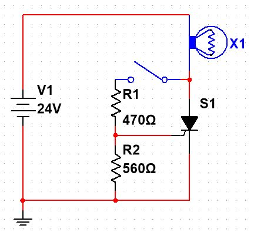
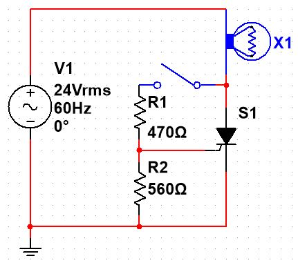
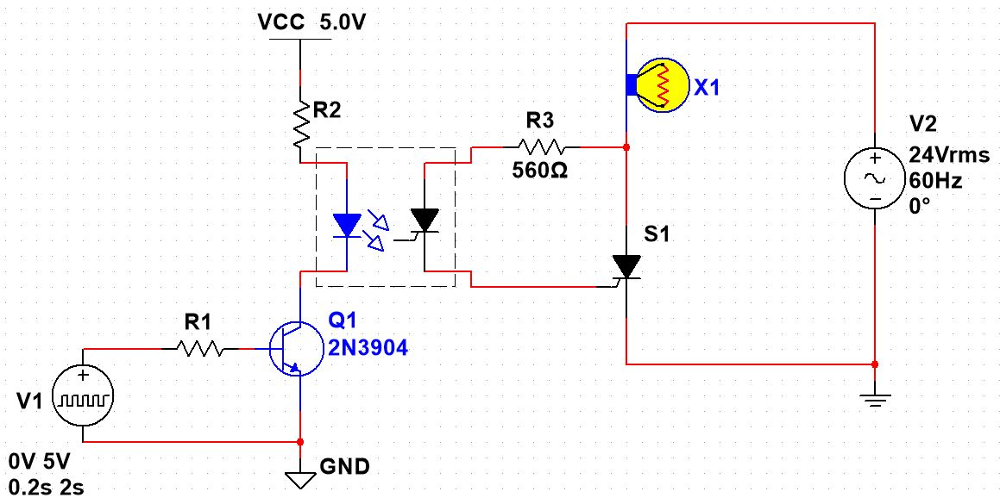
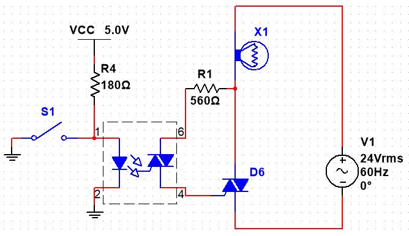

1.  In an SCR circuit that uses a variable voltage divider from the AC supply waveform to trigger the Gate, the power can be controlled from:

    a.  [ ] $0^\circ$ to $90^\circ$

    b.  [ ] $90^\circ$ to $180^\circ$

    c.  [ ] $0^\circ$ to $180^\circ$

    d.  [ ] $0^\circ$ to $360^\circ$

2.  Describe what would happen if the following circuit if the switch was closed and then opened.

    {width="200"}

    a.  [ ] The lamp would start to glow, then stop glowing.

    b.  [ ] The lamp would not glow.

    c.  [ ] The lamp would start to glow and remain glowing.

3.  Describe what would happen if the following circuit if the switch was closed and then opened.

    {width="200"}

    a.  [ ] The lamp would start to glow, then stop glowing.

    b.  [ ] The lamp would not glow.

    c.  [ ] The lamp would start to glow and remain glowing.

Consider the following schematic when answering the questions below:

{width="400"}

4.  If the LED in the optocoupler requires approximately $35 mA$ to operate, pick a $10\%$ standard resistor value for $R_1$ that would be about half the value calculated from the Active transistor model: \_\_\_\_\_\_\_\_\_\_$kΩ$ (this is identical to the rule-of-thumb we have been using for BJT saturation).

5.  Also pick a suitable $10\%$ standard resistor value for $R_2$, given the conditions above: \_\_\_\_\_\_\_\_\_\_$Ω$.

6.  When the input signal is HIGH:

    a.  [ ] The lamp will glow with a continuous, full-power current.

    b.  [ ] The lamp will glow during each positive half-cycle.

    c.  [ ] The lamp will not glow.

7.  When the signal is driven LOW after being HIGH:

    a.  [ ] The lamp will continue to glow.

    b.  [ ] The lamp will not glow.

    c.  [ ] The lamp will glow at half-power.

8.  This circuit could be made to control the brightness of the lamp if circuitry was added to detect when the AC power signal crossed zero volts once for each cycle. In this case, the frequency of the pulse would end up being\_\_\_\_\_\_\_\_\_ $Hz$. If the pulse was designed to drop to zero at the negative crossing point of the signal (i.e. when the sine wave changes from the positive half-cycle to the negative half-cycle), what duty cycle would turn the lamp off? \_\_\_\_\_\_\_\_\_\_ ($0$, $25$, $50$, or $100\%$) . What duty cycle would turn the lamp on at approximately half of the maximum power this circuit could provide? \_\_\_\_\_\_\_\_\_\_ ($0$, $25$, $50$, or $100\%$).

9.  In a TRIAC circuit with a controller that doesn't incorporate a phase delay in its triggering circuitry,

    a.  [ ] the power can be controlled from $0^\circ$ to $90^\circ$

    b.  [ ] the power can be controlled from $90^\circ$ to $180^\circ$

    c.  [ ] the power can be controlled from $90^\circ$ to $180^\circ$ and from $270^\circ$ to $360^\circ$

    d.  [ ] the power can be controlled from $0^\circ$ to $360^\circ$

For the following circuit:

{width="400"}

10. If the switch is open, the lamp will \_\_\_\_\_\_\_\_\_\_ (glow/not glow).
11. If the switch is then closed, the lamp will \_\_\_\_\_\_\_\_\_\_ (glow/not glow).

For the following circuit:

{width="400"}

12. If the switch is open, the lamp will \_\_\_\_\_\_\_\_\_\_ (glow/not glow).
13. If the switch is then closed, the lamp will \_\_\_\_\_\_\_\_\_\_ (glow/not glow).



::: content-hidden
::: border
### Answers

1.  $90^\circ$ to $180^\circ$
2.  The lamp would start to glow and remain glowing.
3.  The lamp would start to glow, then stop glowing.
4.  5.6 $k\Omega$
5.  82 $\Omega$
6.  the lamp will glow during each positive half cycle
7.  the lamp will not glow
8.  $60 Hz$, $0\%$, $25\%$
9.  The power can be controlled from $90^\circ$ to $180^\circ$ and from $270^\circ$ to $360^\circ$
10. Glow
11. Not glow
12. Glow
13. Glow
:::
:::
