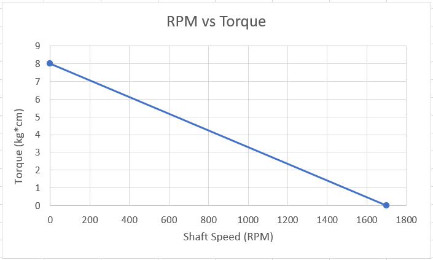
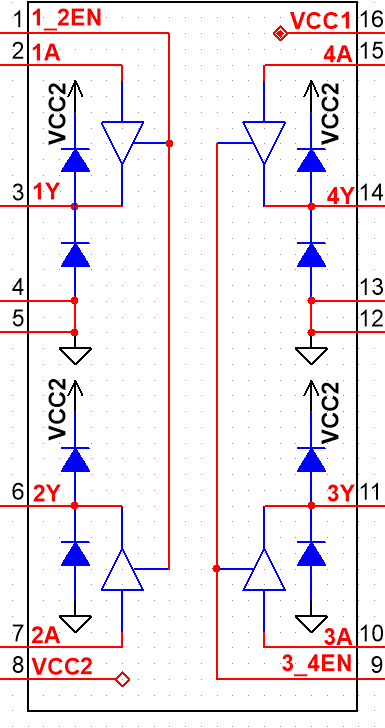

1.  Why do PMDC motors generally have less torque than other types of motors of the same size? (Choose One)
    a.  The stator in a PMDC motor has coil windings to produce a stationary magnetic field, and coil windings produce less magnetic flux density than permanent magnets of the same size.
    b.  The rotor in a PMDC motor has permanent magnets to produce a stationary magnetic field, and magnets produce less magnetic flux density than coil windings of the same size.
    c.  The stator in a PMDC motor has permanent magnets to produce a stationary magnetic field, and magnets produce less magnetic flux density than coil windings of the same size.
    d.  The rotor in a PMDC motor has coil windings to produce a stationary magnetic field, and coil windings produce less magnetic flux density than permanent magnets of the same size.

2.  The manufacturer specifications for a particular PMDC motor include the torque-speed curve given below.

    {width="400"}

    -   What is the no-load speed for this motor in radians per second? \_\_\_\_\_\_\_\_\_\_ $s^{-1}$
    -   What is the stall torque of this motor? \_\_\_\_\_\_\_\_\_\_ $Nm$

3.  Complete the following below by selecting and circling the best options: (Armature/Stator) current will *decrease* when the back EMF (increases/decreases).

4.  Complete the following below by selecting and circling the best options: Motor shaft speed will *decrease* when the load torque (increases/decreases), and this will cause cause back EMF to (increase/decrease).

5.  The magnetic field flux between the magnet and armature of a PMDC motor (represented by the product $Kφ$) is a result of: (choose one)
    a.  The magnetic field multiplied by the absolute temperature, measured in degrees Kelvin [$K$]
    b.  Magnetic flux and the motor speed of the armature
    c.  The strength of the of the motor's permanent magnets
    d.  The intensity of the magnetic field produced by the coil windings in the armature, and aspects of the motor's construction that reduces the intensity of the magnetic field by factor $K$
    e.  The intensity of the magnetic field produced by the stator's permanent magnets, and aspects of the motor's construction that reduces the intensity of the magnetic field by factor $K$

6.  Choose and circle the best option: Load torque and the torque produced by the motor armature are in the (same/opposite) direction.

7.  If load torque is constant, what is the effect of increasing the terminal voltage applied to a DC motor? (Choose one)
    a.  Motor speed will increase until the back EMF causes armature current to decrease, such that the motor eventually stops accelerating.
    b.  Motor speed will decrease until the back EMF causes armature current to decrease, such that the motor eventually stops decelerating.
    c.  Motor speed will increase, because the back EMF will increase according to Ohm's Law.
    d.  Motor speed will increase, because the total power consumed by the motor must remain constant.

Consider the pinout for the L295D below and the [manufacturer's data sheet](https://www.ti.com/lit/ds/symlink/l293.pdf) when answering the questions that follow

{width="200"}

8. Choose and circle the best options for connecting the L295D:
    - Power for the IC's logic should be connected to pin(s) (8, 16, 8 and 16)
    - Power for the PMDC motor should be connected to pin(s) (8, 16, 8 and 16)
    - For reversible control, the PMDC motor should be connected between pins (2 and 7, 3 and 6, 3 and 4, 6 and 5)
    - Two logic control lines should be connected to pins (1 and 2, 1 and 7, 2 and 3, 7 and 6, 2 and 7)
    - For smooth, free-run speed control, a Pulse Width Modifier (PWM) should be connected to pin (1, 2, 3, 4, 5, 6, 7, 8)



::: border
### Answers

1.  C.
2.  $178 Nm$, $0.784 s^{-1}$
3.  Armature, increases
4.  increases, decrease
5.  E.
6.  opposite
7.  A.
8.  16, 8, 3 and 6, 2 and 7, 1
:::
