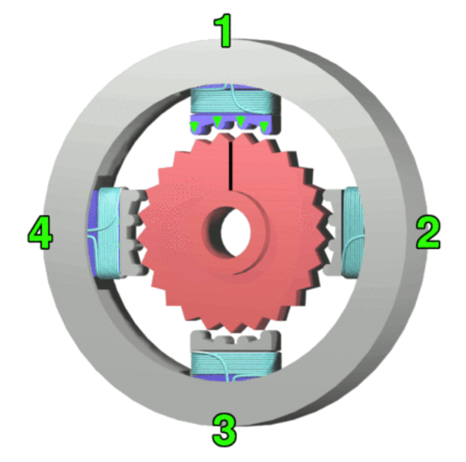

1.  Match the following statements with the correct stepper motor control mode (select from Half, Full or Wave Stepping.

    a.  Alternates between activating one phase and two phases: \_\_\_\_\_\_\_\_\_\_ (Half, Wave, or Full)

    b.  Activates two phases at a time for high torque and high speed: \_\_\_\_\_\_\_\_\_\_ (Half, Wave, or Full)

    c.  Activates one phase at a time for simple, fast action: \_\_\_\_\_\_\_\_\_\_ (Half, Wave, or Full)

2.  For the following coil arrangement, what would be the expected sequence for the next four steps for each of the following types of control? (Select Half, Wave, or Full Stepping; Forward (CW) or Reverse (CCW) direction)?

    {width="300"}

    a.  `1000,0100,0010,0001`: \_\_\_\_\_\_\_\_\_\_ (Half, Wave, or Full) \_\_\_\_\_\_\_\_\_\_ (Forward or Reverse)

    b.  `0001,0011,0010,0110`: \_\_\_\_\_\_\_\_\_\_ (Half, Wave, or Full) \_\_\_\_\_\_\_\_\_\_ (Forward or Reverse)

    c.  `0011,0110,1100,1001`: \_\_\_\_\_\_\_\_\_\_ (Half, Wave, or Full) \_\_\_\_\_\_\_\_\_\_ (Forward or Reverse)

3.  One fairly typical stepper motor design uses 200 steps per rotation.

    a.  What is the angular rotation of a single full step, in degrees? \_\_\_\_\_\_\_\_\_\_ $^\circ$

    b.  What is the angular rotation of fifteen half-steps, in degrees?\_\_\_\_\_\_\_\_\_\_ $^\circ$

4.  The 28BYJ-48 stepper motor in your CNT Year 2 Kit has \_\_\_\_\_\_\_\_\_\_ full steps per rotation of the motor, and a gearhead ratio, to five decimal places, of \_\_\_\_\_\_\_\_\_\_.  The manufacturer's information rounds this to \_\_\_\_\_\_\_\_\_\_ full steps per rotation of the output shaft.  To rotate the output shaft from the gearhead by $47^\circ$, using the more accurate ratio, this would mean you would need \_\_\_\_\_\_\_\_\_\_ steps, and by the rounded value, \_\_\_\_\_\_\_\_\_\_ full steps.

5.  A particular stepper motor is halted during a sequence of events. The motor's temperature does not decrease while the motor is stopped.  This is because \_\_\_\_\_\_\_\_\_\_ (choose one from below).

    a.  stepper motors should never be stopped -- they are designed for continuous operation

    b.  stepper motors do not have sufficient heat dissipation to remove unwanted heat after operation

    c.  stepper motors have constantly-activated rotor electromagnets that draw current even when stalled

    d.  stepper motors may continue to draw current through activated coils to generate holding torque

6.  Unlike permanent magnet DC motors, the rotational velocity of a stepper motor remains constant whether loaded or not, under normal operating conditions. \_\_\_\_\_\_\_\_\_\_ (True or False)

7.  Which one of the following statements is True? \_\_\_\_\_\_\_\_\_(a, b, or c)

    a.  Unipolar Stepper motors have a separate coil for each phase.

    b.  Bipolar Stepper motors require circuitry which can reverse the coil currents.

    c.  Bipolar Stepper motors have three wires per coil, one of which is a centre tap.

8.  On the LMS , you'll find the "main.c" (it is also available below) for a MC9S12XDP512 program.  Your task is to set your microcontroller board up to control your Unipolar Stepper motor using this program.  You'll need to read through the code to determine which port pins you need to connect to the Stepper motor controller board.  While you're at it, determine how the code works.  Here are some hints:

    -   There's one lookup table that's used by all of the routines -- it's the sequence for half-stepping; starting at different points in the table and choosing to increment or decrement by one or by two makes a difference in the actual sequence of operation

    -   Each function call goes through an entire sequence -- four values for Wave Stepping and Full Stepping, eight values for Half Stepping.  There are 32 full steps per rotation of the motor shaft, and approximately 64 rotations of the motor shaft to one rotation of the output shaft---that's 2048 full steps per one complete rotation of the output shaft or 4096 half steps per complete rotation.  Since there are four full steps per sequence or eight half steps per sequence, that means 512 cycles through the chosen sequence should make one complete rotation of the output shaft.

    -   You won't need any additional libraries -- this program is stand-alone.

    -   The routine endlessly and automatically goes through forward and reverse sequences of the three main modes discussed in class.

    -   Make sure you have a common ground connection between your microcontroller and the Stepper controller board.

    -   You can use the +5V rail from your microcontroller kit to power the Stepper motor -- it's capable of producing close to an amp of current.

    Once you've got the system running, ask your instructor to grade your work out of four marks, and enter the grade assigned below.  If your instructor isn't available, take a video of the Stepper going through all the sequences and attach it. \_\_\_\_\_\_\_\_\_\_\_\_\_\_\_\_\_\_\_\_

### Stepper Motor Test Code (main.c)

``` c
/********************************************************************
*HC12 Program:    Repetitive Stepper Motor Test Code
*Processor:       MC9S12XDP512
*Xtal Speed:      16 MHz
*Author:          P Ross Taylor
*Date:            2022
*
*Details: Full rotation each for fwd/rev of Wave, Full, Half step modes
*
********************************************************************/

#include <hidef.h>          // common defines and macros
//#include <stdio.h>        // ANSI C Standard Input/Output functions
//#include <math.h>     // ANSI C Mathematical functions
#include "derivative.h"     // derivative-specific definitions

/********************************************************************
*       Library includes
********************************************************************/


/********************************************************************
*       Prototypes
********************************************************************/
void WaveStepForward(void);   //four Wave Steps
void WaveStepBackward(void);  //four Wave Steps
void FullStepForward(void);   //four Full Steps
void FullStepBackward(void);  //four Full Steps
void HalfStepForward(void);   //eight Half Steps
void HalfStepBackward(void);  //eight Half Steps

/********************************************************************
*       Variables
********************************************************************/

  char PTAHold;
  int ForCount;
  int TickCount;

/********************************************************************
*       Lookups
********************************************************************/
char Sequence[8]={
            0b00010000, 0b00110000, 0b00100000, 0b01100000,
            0b01000000, 0b11000000, 0b10000000, 0b10010000
            };


void main(void)     // main entry point
{
  _DISABLE_COP();
  //EnableInterrupts

  /****Use PLL to increase bus speed to 20 MHz; disable for legacy****/

  SYNR = 4;                // 2.3.2.1,2 div 4/3 becomes 5/4 (1.25) * 16Mhz * 2
                           //                               = 40MHz, /2 = 20MHz
  REFDV = 3;
  CLKSEL_PSTP = 1;         // 2.3.2.6 (pseudo stop, clock runs in stop)
  PLLCTL = 0b11111111;     // 2.3.2.7 (monitor + fast wakeup, AUTO mode)

  while (!CRGFLG_LOCK);    //wait for PLL to lock
  CLKSEL_PLLSEL = 1;       // 2.3.2.6 now that we are locked, use PLLCLK/2 for bus (20MHz)

/********************************************************************
*       Initializations
********************************************************************/

  DDRA|=0b11110000;         //PTA4 - 7 as outputs

  TSCR1 |= 0b10000000;      //enable timer module
  TSCR2 |= 0b00000011;      //set tick to 400 ns
  TIOS  |= 0b00000001;      //IOS0 to output compare for tick clock
  TCTL2 |= 0b00000001;      //set PT0 to toggle mode
  TCTL2 &= 0b11111101;      //...continued  
  TFLG1  = 0b00000001;      //clear flag

  TickCount = 6250;         //2.5 ms, or 400 updates per second
  TC0=TCNT+TickCount;       //first timer interval
  for (;;)                  //endless program loop
  {
/********************************************************************
*       Main Program Code
********************************************************************/
//run a full rotation of each

    for (ForCount=0;ForCount<512;ForCount++){
      WaveStepForward();                        
    }

    for (ForCount=0;ForCount<512;ForCount++){
      WaveStepBackward();  
    }

    for (ForCount=0;ForCount<512;ForCount++){
      FullStepForward();  
    }

    for (ForCount=0;ForCount<512;ForCount++){
      FullStepBackward();  
    }

    for (ForCount=0;ForCount<512;ForCount++){
      HalfStepForward();  
    }

    for (ForCount=0;ForCount<512;ForCount++){
      HalfStepBackward();  
    }
  }
}
/********************************************************************
*       Functions
********************************************************************/
void WaveStepForward(void){
  char Counter;
  for(Counter = 0;Counter<8; Counter+=2){
    PTAHold=PORTA&0b00001111;               //don't mess up lower nibble
    PORTA=PTAHold|Sequence[Counter];
    while(!TFLG1);                          //blocking timer wait
    TFLG1=0b00000001;                       //clear flag
    TC0+=TickCount;
  }
}

void WaveStepBackward(void){
  char Counter;
  for(Counter = 6;Counter>=0; Counter-=2){
    PTAHold=PORTA&0b00001111;               //don't mess up lower nibble
    PORTA=PTAHold|Sequence[Counter];
    while(!TFLG1);                          //blocking timer wait
    TFLG1=0b00000001;                       //clear flag
    TC0+=TickCount;
  }
}

void FullStepForward(void){
  char Counter;
  for(Counter = 1;Counter<8; Counter+=2){
    PTAHold=PORTA&0b00001111;               //don't mess up lower nibble
    PORTA=PTAHold|Sequence[Counter];
    while(!TFLG1);                          //blocking timer wait
    TFLG1=0b00000001;                       //clear flag
    TC0+=TickCount;
  }
}

void FullStepBackward(void){
  char Counter;
  for(Counter = 7;Counter>0; Counter-=2){
    PTAHold=PORTA&0b00001111;               //don't mess up lower nibble
    PORTA=PTAHold|Sequence[Counter];
    while(!TFLG1);                          //blocking timer wait
    TFLG1=0b00000001;                       //clear flag
    TC0+=TickCount;
  }
}

void HalfStepForward(void){
  char Counter;
  for(Counter = 0;Counter<8; Counter++){
    PTAHold=PORTA&0b00001111;               //don't mess up lower nibble
    PORTA=PTAHold|Sequence[Counter];
    while(!TFLG1);                          //blocking timer wait
    TFLG1=0b00000001;                       //clear flag
    TC0+=TickCount;
  }
}

void HalfStepBackward(void){
  char Counter;
  for(Counter = 7;Counter>=0; Counter--){
    PTAHold=PORTA&0b00001111;               //don't mess up lower nibble
    PORTA=PTAHold|Sequence[Counter];
    while(!TFLG1);                          //blocking timer wait
    TFLG1=0b00000001;                       //clear flag
    TC0+=TickCount;
  }
}


/********************************************************************
*       Interrupt Service Routines
********************************************************************/


/*******************************************************************/
```



::: border
### Answers

1.  Half, Full, Wave

2.  Wave Stepping Reverse, Half Stepping Forward, Full Stepping Forward

3.  $1.8^\circ$, $13.5^\circ$

4.  $32$, $63.68395$, $64$, $266$, $267$

5.  d.stepper motors may continue to draw current through activated coils to generate holding torque

6.  True

7.  b\. Bipolar Stepper motors require circuitry which can reverse the coil currents.
:::
