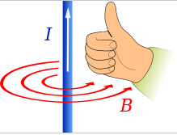
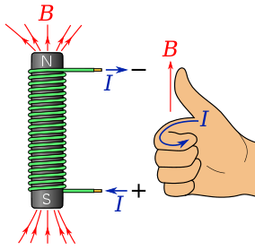
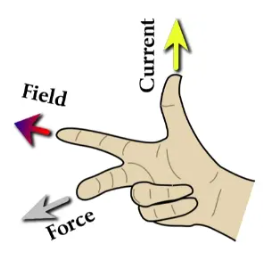
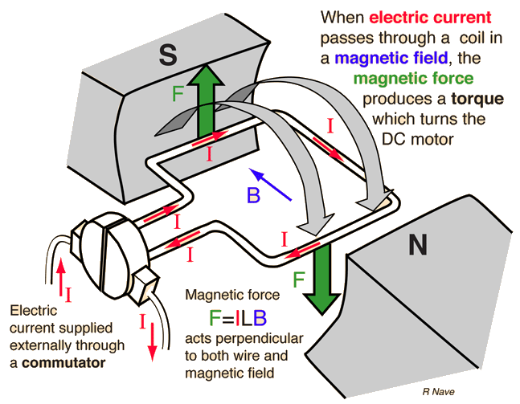
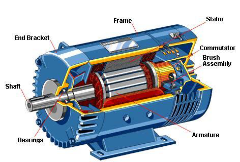
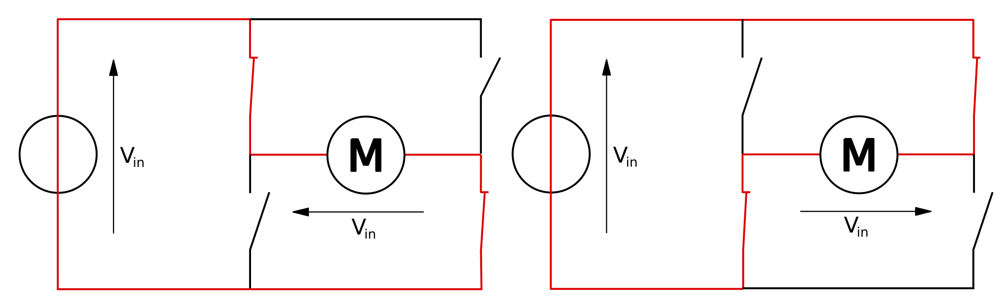

## Electromagnetism

From secondary school: Magnetism and Electricity are inextricably linked.  Because magnets can be used to move things, we can use electric currents to affect the outside world.

{width=30%}
{width=30%}
{width=30%}

## Solenoids

Solenoids are actuators that move linearly a short distance.  They work by inducing a magnetic field in a coil (electromagnet).  The field moves a shaft that is placed in the center of the magnet.

{fig-align=center}

## Motors

Motors use an electric field to rotate a shaft. There are many different types, but the fundamentals of how they work is consistent.

{fig-align=center}

## Motor Parts

{fig-align=center}

# Motor Control

Permanent Magnet DC (PMDC) motors use a permanent (as opposed to electro-) magnet in the stator and take a DC current in windings on the rotor. DC motors operate by switching the polarity of the current in the rotor (otherwise it would only rotate 90° and stop).  Therefore, we need a circuit to control that switching.

# H-Bridges

One common way to control this is with an H-bridge circuit.  You will likely have built one of these in a previous class.

{fig-align=center}